# WordPress Compatibility Visual Tour

This tour is for prospective users evaluating grimoire as a WordPress-schema-
compatible alternative. It compares WordPress and grimoire side by side
against the **same existing local content** — the same posts, categories,
and uploads in the same MySQL/MariaDB database — captured locally for this
comparison only.

These pairs demonstrate **behavioral parity** (same data, same routes, same
publishing semantics), not pixel-identical rendering. Themes, admin chrome,
and styling intentionally differ between the two products.

See [`./compatibility.md`](./compatibility.md) for the full technical
compatibility guide.

---

## Public home

| WordPress | grimoire |
| --- | --- |
|  | 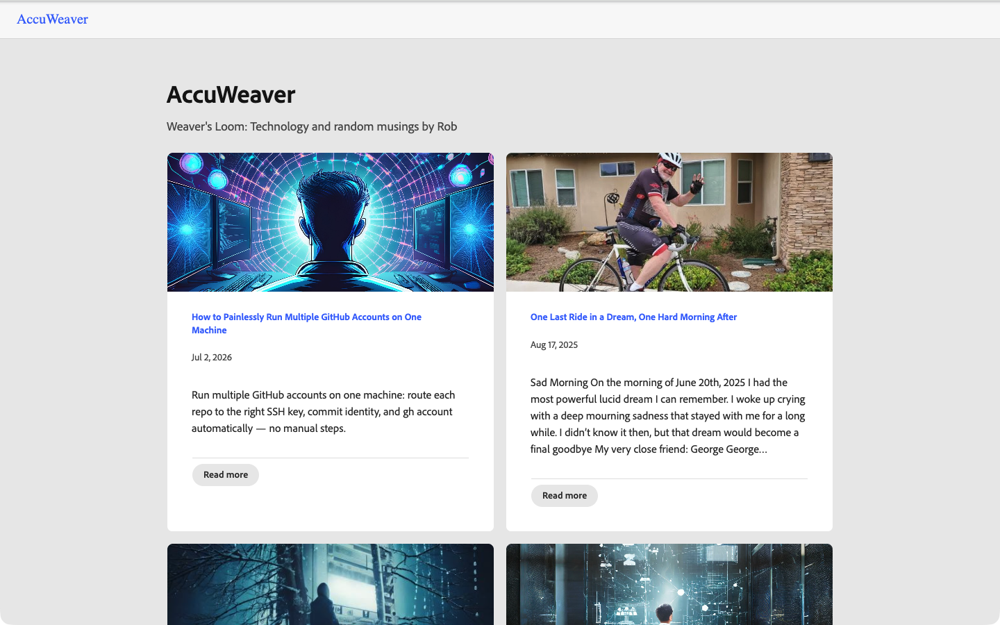 |

**What matches:** Both list the same published posts, in the same order,
with the same titles, links, and excerpt text.

**Intentional differences:** The products use different themes and page
chrome. Excerpt truncation (word count, ellipsis placement) is approximated
per product and may not be byte-identical even when the underlying source
excerpt is the same.

**Current limits:** This pair does not claim plugin or theme-rendering
parity.

## Single published post

| WordPress | grimoire |
| --- | --- |
|  |  |

**What matches:** Same slug, title, body, and publish date.

**Intentional differences:** Typography and theme chrome differ; no plugin
rendering is implied.

**Current limits:** grimoire's public router only supports flat `/{slug}`
routes. It does not implement WordPress's configurable, date-based post
permalink structures (for example WordPress's `/YYYY/MM/DD/slug/`).

## Category archive

| WordPress | grimoire |
| --- | --- |
| 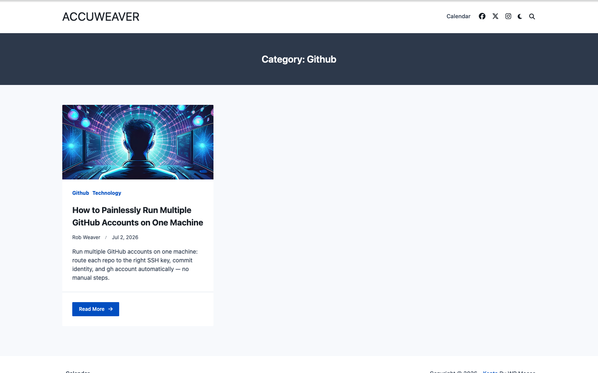 | 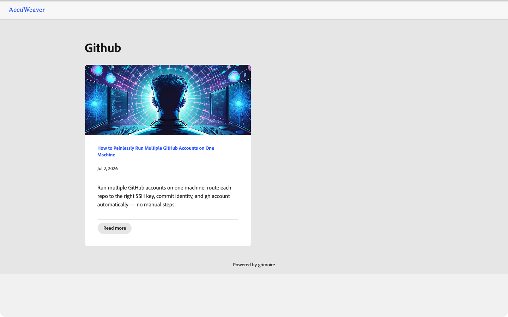 |

**What matches:** Same category membership, order, titles, and post links.

**Intentional differences:** Archive styling and controls differ.

**Current limits:** grimoire's taxonomy model has no parent/child category
relationship. WordPress's `github` category is a child of `technology`, so
its canonical WordPress URL is nested (`/category/technology/github/`);
grimoire only supports a flat `/category/<slug>` route and has no concept of
nested categories.

## Admin dashboard

| WordPress | grimoire |
| --- | --- |
| 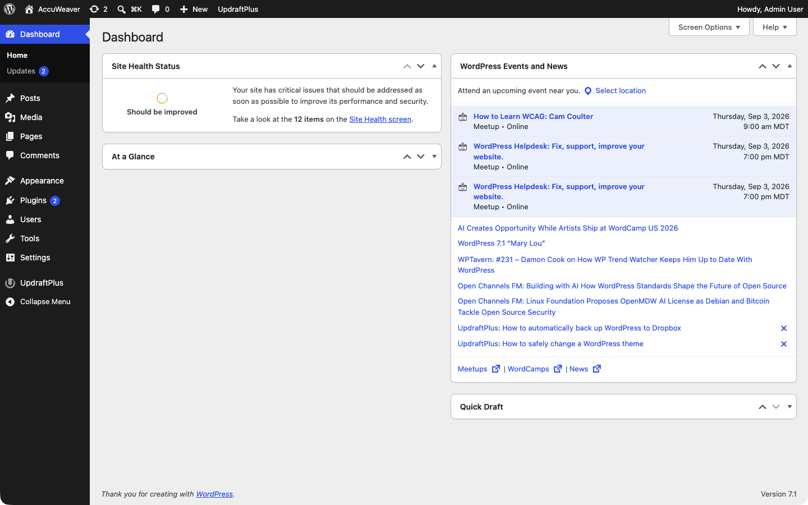 | 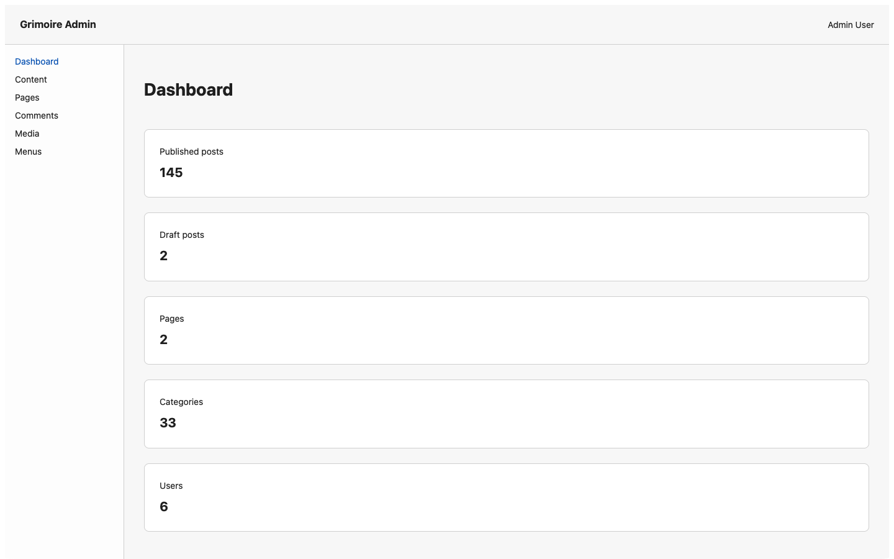 |

**What matches:** Both are the logged-in landing page for managing the same
site's content.

**Intentional differences:** WordPress admin and the embedded Adobe React
Spectrum admin use different navigation, widgets, and visual design.

**Current limits:** Both screenshots have the logged-in user's real display
name replaced with the placeholder "Admin User" before capture, and the
WordPress screenshot has its "Recent Comments" activity widget removed —
both are in-browser redactions to avoid showing real names, not product
differences. The WordPress dashboard's other widgets (At a Glance, Quick
Draft, site health) are otherwise shown unmodified.

## Posts list/editor

| WordPress | grimoire |
| --- | --- |
| 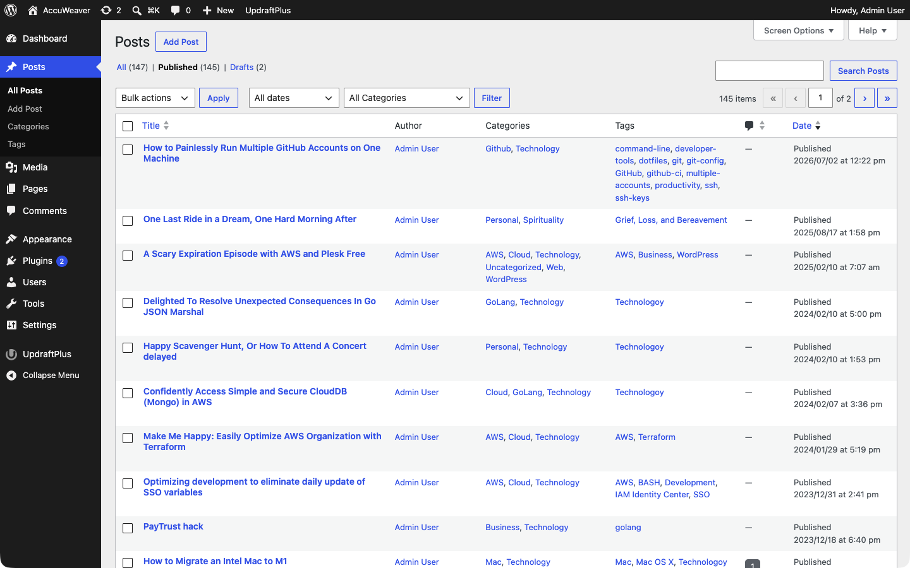 | 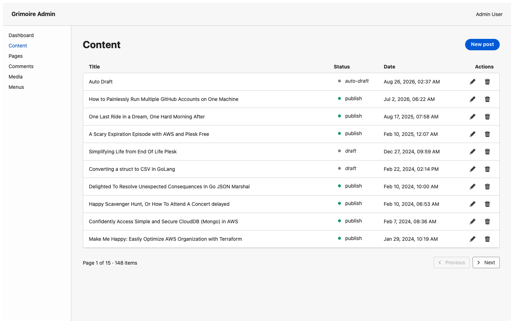 |

**What matches:** Both are the admin list view with entry points to edit the
same underlying posts, backed by the same database.

**Intentional differences:** Editing controls and layout differ; this
capture does not demonstrate saving, autosave, or Gutenberg block-editor
parity.

**Current limits:** These two screenshots show different scopes and are
**not** an apples-to-apples count comparison. The WordPress screenshot uses
its native `?post_status=publish` filter (145 published posts). grimoire's
admin posts list has no equivalent status filter today, so its screenshot
shows the real, unfiltered first page of the list as the product actually
renders it: page 1 of 15, 148 total items, mixing `publish`, `draft`, and
`auto-draft` rows. The logged-in user's display name is replaced with
"Admin User" in both screenshots (redaction only, not a product
difference).

## Media library

| WordPress | grimoire |
| --- | --- |
| 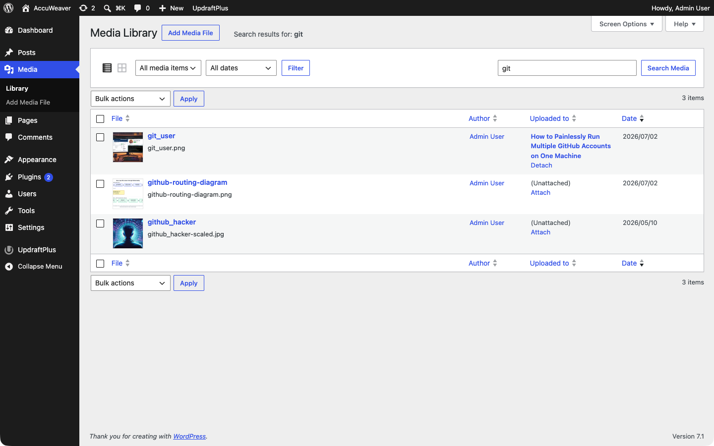 | 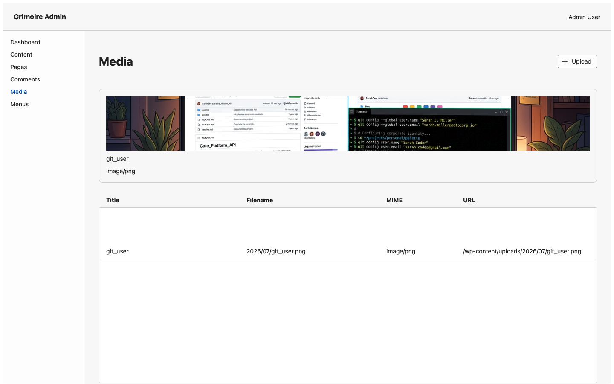 |

**What matches:** Both show real, existing attachments from the same
uploads directory. `git_user` — the one attachment actually parented to the
selected post — appears in both screenshots.

**Intentional differences:** Layout and metadata presentation differ; no
upload or REST-write capability is implied.

**Current limits:** These two screenshots use different, non-equivalent
filters. The WordPress screenshot uses its native free-text admin search
(`?s=git`), which returns 3 attachments matching that text — only one of
them (`git_user`) is attached to the selected post; the other two
(`github-routing-diagram`, `github_hacker`) are unattached. grimoire's admin
media page has no free-text search, and its `parentId` query parameter is
accepted by the backend API but is not read by the admin page, so its
unfiltered media library (well over a thousand attachments in this database)
cannot be narrowed by URL alone. To make a legible, single-attachment
comparison possible, the grimoire screenshot's DOM was edited before capture
to remove every attachment card except `git_user`'s — it is not a working
product filter and is disclosed here as a capture-time adjustment, not a
grimoire feature.

## Representative REST response

| WordPress | grimoire |
| --- | --- |
| 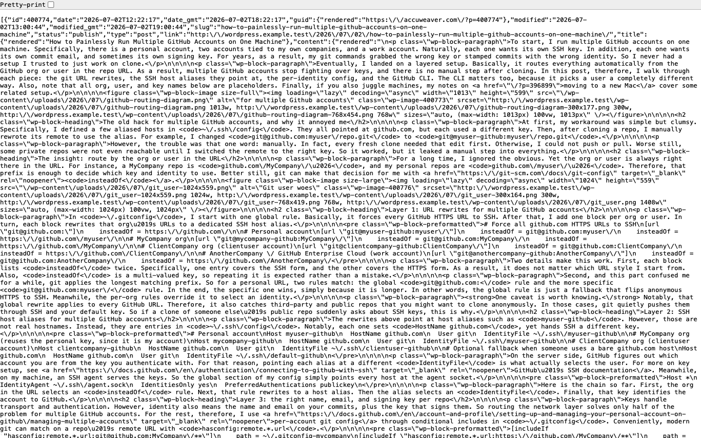 | 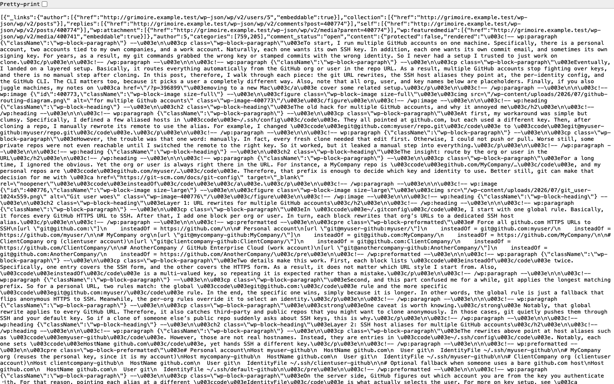 |

**What matches:** Both serve `GET /wp-json/wp/v2/posts?slug=how-to-painlessly-run-multiple-github-accounts-on-one-machine&status=publish`
and return the same post's fields.

**Intentional differences:** Key order and some optional fields may differ.
Both responses have their local capture hostname replaced in-page with a
placeholder domain (`wordpress.example.test` / `grimoire.example.test`)
before capture so no local network detail is shown; only the URL host was
changed, all other JSON structure and values are exactly as returned by each
server.

**Current limits:** One `GET` request is not a claim of total REST API
parity; see [`./compatibility.md`](./compatibility.md) for the full
supported surface.
