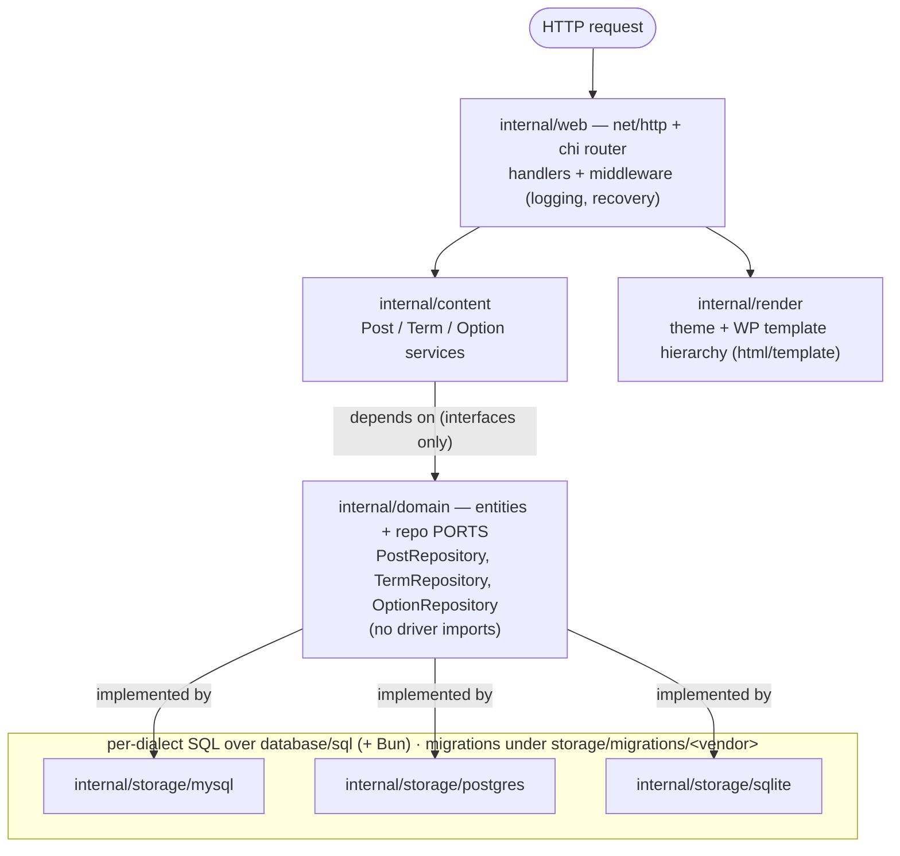
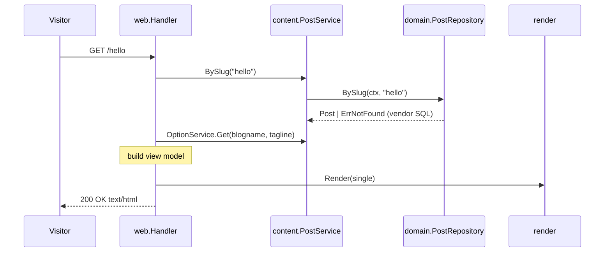

# Design — M1: Content Core & Public Read Rendering

## Architecture Overview

grimoire follows a **ports-and-adapters (hexagonal)** layout. The domain core
defines entities and repository *interfaces* (ports); database vendors and the
HTTP/rendering surface are *adapters* around that core. The database vendor and
the render target are the two things we explicitly make swappable.



**Key property:** `content`, `web`, and `render` depend only on `domain`. Adding
a vendor means adding a package under `internal/storage/` — no upstream change.

## Component Design

### `internal/config`
- Loads YAML (`configs/grimoire.<vendor>.yaml`) plus environment overrides.
- Shape: `server.addr`, `theme`, `database.{vendor,dsn,table_prefix}`.
- Validates `vendor ∈ {mysql, postgres, sqlite}`; redacts DSN credentials for logs.

### `internal/domain`
Entities (plain structs, no tags that bind a driver):
- `Post{ ID, Author, Date, Content, Title, Excerpt, Status, Slug, Type }`
- `Term{ ID, Name, Slug, Taxonomy }`
- `Option{ Name, Value }`

Repository ports:
```go
type PostRepository interface {
    RecentPosts(ctx context.Context, limit, offset int) ([]Post, error)
    BySlug(ctx context.Context, slug string, types ...string) (Post, error)
    ByTermSlug(ctx context.Context, taxonomy, termSlug string, limit, offset int) ([]Post, error)
}
type TermRepository interface {
    BySlug(ctx context.Context, taxonomy, slug string) (Term, error)
}
type OptionRepository interface {
    Get(ctx context.Context, name string) (string, error)
}
```
Domain errors: `ErrNotFound` (sentinel), wrapped by adapters via `%w`.

### `internal/storage/<vendor>`
- Each adapter implements the three repositories using **Bun** for dialect-aware
  SQL over `database/sql`.
- A shared, unexported query-shape lives in each adapter but is compiled per
  dialect; adapters translate `sql.ErrNoRows` → `domain.ErrNotFound`.
- A `storage.Factory(cfg) (Repositories, error)` wires the right adapter set.

### `internal/storage/migrations/<vendor>`
- Ordered, idempotent migration files per vendor. Applied by `grimoire-cli migrate`.
- The M1 migration creates the seven tables (Requirement 2) with the configured
  prefix and dialect-appropriate types.

### `internal/content`
- `PostService`, `TermService`, `OptionService` orchestrate repositories and
  enforce rules like "only `publish` status" and pagination bounds.

### `internal/web`
- `chi` router; routes `/`, `/{slug}`, `/category/{slug}`.
- Middleware: request-scoped `slog`, panic recovery, and error→status mapping.
- Handlers call content services, assemble a view model, hand it to `render`.

### `internal/render`
- Loads the active theme's templates at startup (fail fast if base missing).
- Implements the template-hierarchy subset (see Data Flow). Exposes
  `Render(w, view, kind)` where `kind ∈ {index, single, page, category}`.

### `cmd/grimoire`, `cmd/grimoire-cli`
- `grimoire`: load config → build factory → load theme → serve.
- `grimoire-cli`: `migrate`, `seed`, `admin` (admin bootstrap stubbed until M2).

## WordPress schema mapping (M1 subset)

| WordPress table | grimoire use | Notable columns |
|-----------------|--------------|-----------------|
| `wp_posts` | posts & pages (polymorphic via `post_type`) | `ID`, `post_author`, `post_date`, `post_content`, `post_title`, `post_excerpt`, `post_status`, `post_name`, `post_type` |
| `wp_postmeta` | reserved (read-through later) | `post_id`, `meta_key`, `meta_value` |
| `wp_options` | site settings | `option_name`, `option_value`, `autoload` |
| `wp_terms` | term names/slugs | `term_id`, `name`, `slug` |
| `wp_term_taxonomy` | term ↔ taxonomy | `term_taxonomy_id`, `term_id`, `taxonomy`, `parent`, `count` |
| `wp_term_relationships` | post ↔ term join | `object_id`, `term_taxonomy_id` |
| `wp_users` | author display only (M1) | `ID`, `user_login`, `display_name` |

**Type mapping strategy:** MySQL is the source of truth for column intent.
`LONGTEXT`→`TEXT` (pg/sqlite); `BIGINT(20) UNSIGNED`→`BIGINT` (pg) / `INTEGER`
(sqlite); `DATETIME`→`TIMESTAMP` (pg) / `TEXT`/`TIMESTAMP` (sqlite). Each vendor's
migration owns its exact DDL.

## Sequence Diagram — single post request



## Data Flow — template selection

For a request, the handler determines a `kind`, and `render` resolves the first
existing template in a WordPress-style order, falling back to `index`:

- single post → `single.tmpl` → `index.tmpl`
- page → `page.tmpl` → `single.tmpl` → `index.tmpl`
- category archive → `category.tmpl` → `archive.tmpl` → `index.tmpl`
- home → `index.tmpl`

All content templates compose the theme's `base` template.

## Error Handling

- Adapters translate `sql.ErrNoRows` → `domain.ErrNotFound` (wrapped with `%w`).
- Content services propagate errors unchanged; they add rules, not error types.
- Web middleware maps: `errors.Is(err, domain.ErrNotFound)` → `404`; anything
  else → `500` + `slog.Error` with method, path, and error.
- HTTP responses never contain SQL or internal messages (Requirement 9.4).
- `slog` is the single logging surface; a request-id is attached in middleware.

## Testing Strategy

- **Repository contract suite** (`internal/storage/storagetest`): one table of
  assertions run against every adapter. SQLite runs by default (in-memory);
  MySQL/Postgres run via ephemeral containers, gated by an env opt-out so
  constrained CI can skip them (Requirement 11). Same seed data → identical
  results across vendors.
- **Service unit tests**: fake repositories verify `publish`-only filtering,
  pagination bounds, and not-found propagation.
- **Handler tests**: `net/http/httptest` asserts status codes and content type
  for home / single / 404.
- **Render tests**: golden-file comparison of rendered HTML for the default theme.
- **CLI tests**: `migrate` idempotency and `seed` results on SQLite.

## Traceability

| Requirement | Primary components |
|-------------|--------------------|
| 1 vendor selection | `config`, `storage.Factory` |
| 2 schema/migrations | `storage/migrations/<vendor>` |
| 3 interfaces/adapters | `domain`, `storage/*` |
| 4 posts/pages | `content.PostService`, `PostRepository` |
| 5 taxonomies | `content.TermService`, `TermRepository` |
| 6 options | `content.OptionService`, `OptionRepository` |
| 7 routing/rendering | `web`, `render` |
| 8 theme loading | `render`, `themes/default` |
| 9 errors/observability | `web` middleware, `domain.ErrNotFound` |
| 10 CLI | `cmd/grimoire-cli` |
| 11 cross-vendor tests | `storage/storagetest` |
