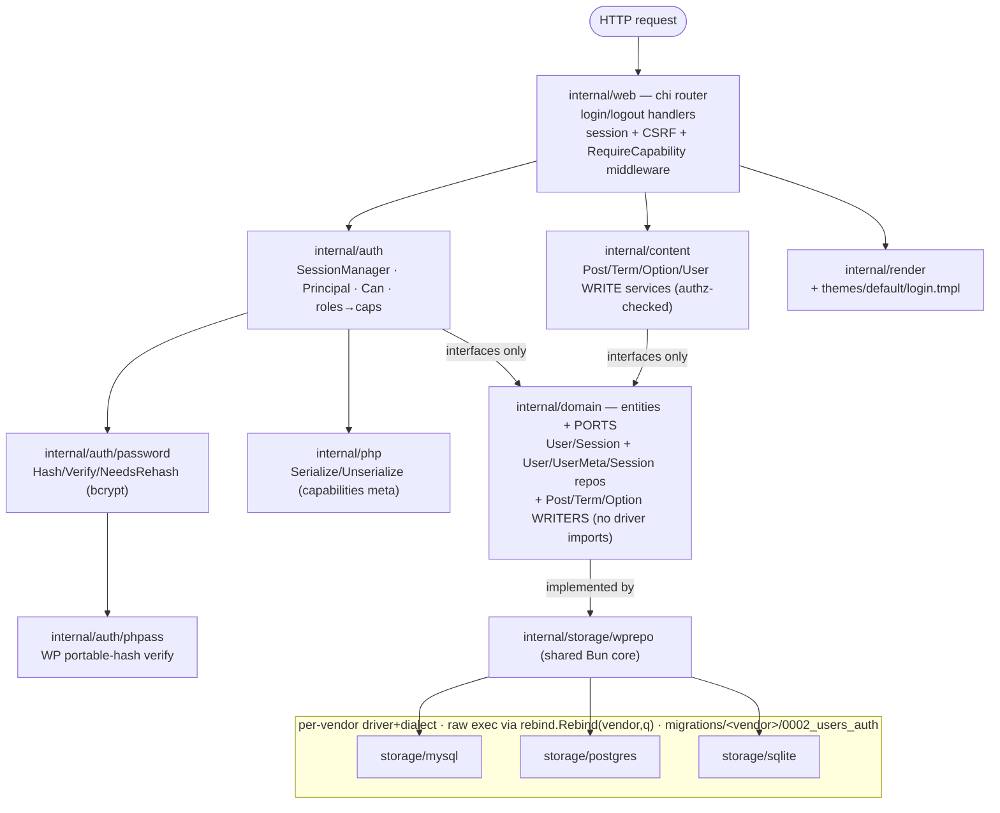
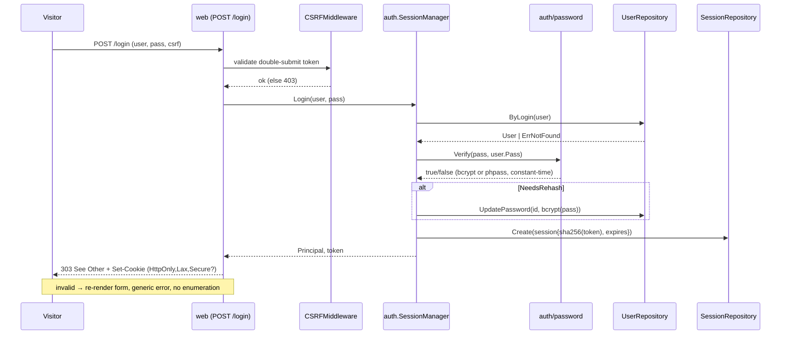
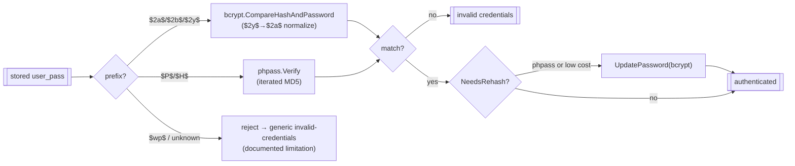
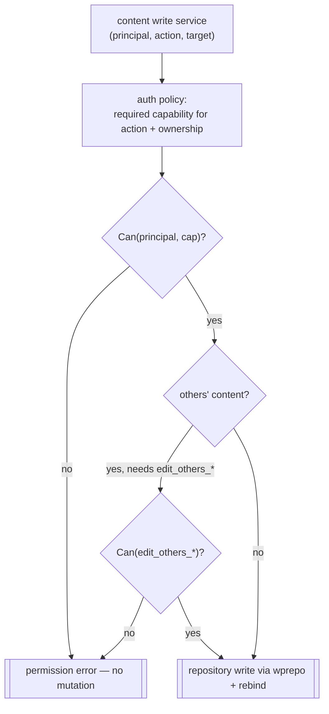

# Design — M2: Users, Authentication & Roles

## Architecture Overview

M2 keeps M1's **ports-and-adapters (hexagonal)** layout intact and adds an
authorization core between the web surface and the domain. The database vendor and
the render target remain the only explicitly swappable things; the new auth logic
is pure Go with **no driver imports**, exactly like `content` and `domain`.



**Key property (unchanged):** `auth`, `content`, `web`, and `render` depend only on
`domain`. Adding a vendor still means adding nothing beyond a `storage/<vendor>`
package; the new user/session repos live in the shared `wprepo` core and are wired
by `storage.New`.

## Component Design

### `internal/php`
Minimal pure-Go PHP serializer for the value shapes WordPress uses in
`{prefix}capabilities` / `{prefix}user_level`.
- `Serialize(v any) (string, error)` and `Unserialize(s string) (any, error)`.
- Supports `bool`, `int`, `string`, and `map[string]any` (associative array `a:`).
- Round-trips `a:1:{s:13:"administrator";b:1;}` ⇄ `map[string]any{"administrator": true}`.
- No driver imports; exhaustively unit-tested against real WordPress strings.

### `internal/auth/phpass`
Pure-Go verifier for WordPress **portable hashes** (`$P$`, `$H$`): the phpass
iterated-MD5 scheme with phpass's custom base-64 alphabet.
- `Verify(password, hash string) bool` — recomputes and compares in constant time.
- `Identify(hash string) bool` — reports whether a hash is a portable hash.
- Tested against known WordPress vectors (password + stored `$P$` hash).

### `internal/auth/password`
The single password entry point used by login, `createadmin`, and user writes.
- `Hash(password string) (string, error)` — bcrypt at the configured cost.
- `Verify(password, stored string) bool` — dispatches by prefix: bcrypt
  (`$2a$`/`$2b$`, normalizing `$2y$`→`$2a$` for Go's bcrypt) or phpass
  (`$P$`/`$H$`); constant-time; generic false on unknown formats.
- `NeedsRehash(stored string) bool` — true for phpass hashes or bcrypt below the
  configured cost, driving transparent upgrade-on-login.

### `internal/auth`
The authorization core (no driver imports).
- `Principal{ UserID int64; Login string; Roles []string; Caps map[string]bool }`.
- `roles` table: the five WordPress roles → capability sets; `Can(p, cap) bool`
  unions role caps with per-user caps.
- `CapabilitiesFromMeta(meta string) (roles []string, caps map[string]bool)` uses
  `internal/php` to parse `{prefix}capabilities`.
- `SessionManager` orchestrates repositories + password + tokens:
  - `Login(ctx, login, password) (Principal, token, error)` — look up user, verify
    hash, rehash-on-success if needed, mint a token, store its SHA-256 + expiry.
  - `Authenticate(ctx, token) (Principal, error)` — hash the token, load the
    session, reject if expired, apply rolling-expiry refresh, load capabilities.
  - `Logout(ctx, token) error` and `GC(ctx) (int, error)`.
  - `RevokeUser(ctx, userID) error` for password-change invalidation.
- A content-authorization policy helper maps `(action, ownerID, principal)` →
  required capability for the write services (ownership rules from Requirement 6).

### `internal/domain` (additions)
Entities (plain structs):
- `User{ ID, Login, Pass, Email, URL, Nicename, DisplayName, Registered, Status }`
- `Session{ ID, UserID, CSRFToken, Created, Expires }`

Ports (no driver imports):
```go
type UserRepository interface {
    ByLogin(ctx, login string) (User, error)
    ByID(ctx, id int64) (User, error)
    Create(ctx, u User) (int64, error)
    UpdatePassword(ctx, id int64, hash string) error
    Update(ctx, u User) error
    Delete(ctx, id int64) error
    List(ctx, limit, offset int) ([]User, error)
}
type UserMetaRepository interface {
    Get(ctx, userID int64, key string) (string, error)
    Set(ctx, userID int64, key, value string) error
    Delete(ctx, userID int64, key string) error
}
type SessionRepository interface {
    Create(ctx, s Session) error
    ByID(ctx, id string) (Session, error)   // id = SHA-256 hex of token
    Touch(ctx, id string, expires time.Time) error
    Delete(ctx, id string) error
    DeleteByUser(ctx, userID int64) (int, error)
    DeleteExpired(ctx, now time.Time) (int, error)
}
```
Post/Term/Option gain **segregated writer ports** (`PostWriter`, `TermWriter`,
`OptionWriter`) so the read ports from M1 stay narrow.

### `internal/storage/wprepo` (additions)
- `UserRepo`, `UserMetaRepo`, `SessionRepo` over the shared `*bun.DB` + prefix,
  translating `sql.ErrNoRows` → `domain.ErrNotFound` (`%w`).
- Post/Term/Option write methods on the existing repos.
- Any raw `database/sql` exec threads `vendor` through `rebind.Rebind(vendor, q)`
  so PostgreSQL `?`→`$N` rebinding holds (M1 rule).
- `storage.Set` and `storage.New` gain `Users`, `UserMeta`, `Sessions`, and the
  writer ports.

### `internal/content` (additions)
Write services that take an `auth.Principal` and enforce capabilities *before*
touching a repository:
- `PostService.Create/Update/Delete` (posts and pages), `TermService` writes,
  `OptionService.Set`, and a new `UserService` (create/update/delete/list).
- Each returns a permission error (no mutation) when `Can`/ownership fails.

### `internal/web` (additions)
- Routes: `GET /login`, `POST /login`, `POST /logout`.
- `SessionMiddleware` loads the principal from the cookie (best-effort; never
  errors on missing/expired).
- `CSRFMiddleware` validates the login double-submit token and the per-session
  synchronizer token.
- `RequireLogin` / `RequireCapability(cap)` guard authenticated routes (foundation
  for M3).
- Handlers keep M1's contract: return `error`; `ErrNotFound`→404 else 500; no SQL
  or hashes in responses.

### `internal/render` + `themes/default`
- New `login` view kind; `themes/default/login.tmpl` composes the base template,
  renders the form, the CSRF hidden field, and a single generic error flag.

### `internal/config` (additions)
- Session/cookie config: cookie name (default `grimoire_session`), TTL
  (default 14d), and secure-cookie mode (auto when TLS). No signing secret needed.

### `cmd/grimoire-cli` (additions)
- `createadmin` — prompt/flags for login, email, password → bcrypt hash + insert
  user + write `administrator` capabilities and `user_level=10`.
- `sessions gc` — delete expired sessions, print the count.

## WordPress schema mapping (M2)

| WordPress table | grimoire use | Notable columns (M2) |
|-----------------|--------------|----------------------|
| `wp_users` | authentication + author identity | `ID`, `user_login`, `user_pass`, `user_email`, `user_url`, `user_nicename`, `display_name`, `user_registered`, `user_activation_key`, `user_status` |
| `wp_usermeta` | roles/capabilities + profile meta | `umeta_id`, `user_id`, `meta_key`, `meta_value` |
| `{prefix}capabilities` (meta_key) | role assignment | PHP-serialized `a:1:{s:13:"administrator";b:1;}` |
| `{prefix}user_level` (meta_key) | legacy numeric level | `10`/`7`/`2`/`1`/`0` for admin/editor/author/contributor/subscriber |
| `{prefix}sessions` (grimoire-native) | server-side sessions | `id` (SHA-256 hex), `user_id`, `csrf_token`, `created`, `expires` |

**Type mapping strategy (unchanged from M1):** MySQL is the source of truth for
column intent; each vendor's `0002` migration owns its exact DDL. `LONGTEXT`→`TEXT`
(pg/sqlite); `BIGINT(20) UNSIGNED`→`BIGINT` (pg) / `INTEGER` (sqlite);
`DATETIME`→`TIMESTAMP` (pg) / `TEXT` (sqlite). PostgreSQL uses
`ADD COLUMN IF NOT EXISTS`; sqlite/mysql use plain `ADD COLUMN`.

**Migration contract:** `migrate` targets a grimoire-provisioned schema (the fresh,
minimal `0001` users table). Pointing grimoire at a *pre-existing full WordPress
database* needs **no** migration — the columns and `usermeta` table already exist
and are read as-is. Only the grimoire-native `{prefix}sessions` table is created in
that case (via `CREATE TABLE IF NOT EXISTS`). This sidesteps MySQL 8's lack of
`ADD COLUMN IF NOT EXISTS`.

## Sequence Diagram — login



## Data Flow — password verification & upgrade



## Data Flow — capability check on a write



## Error Handling

- Adapters translate `sql.ErrNoRows` → `domain.ErrNotFound` (`%w`), unchanged.
- `auth`/`content` return typed permission and credential errors; the web layer
  never surfaces them verbatim — login failures render a single generic message.
- Web middleware mapping is unchanged: `ErrNotFound`→404, else 500 + `slog.Error`.
- HTTP responses never contain SQL, hashes, or raw tokens (Requirement 9.1).
- Structured `slog` logs auth events with request id but never plaintext, full
  hashes, or raw session tokens (Requirement 9.2).

## Testing Strategy

- **Unit** — `internal/php` (round-trips + real capability strings);
  `internal/auth/phpass` (known WordPress vectors); `internal/auth/password`
  (bcrypt + phpass + `$2y$` normalization + `NeedsRehash`); `internal/auth` role
  → capability matrix, `Can`, capabilities-meta parsing; `SessionManager` (login,
  rehash-on-login, rolling expiry, logout, GC, revoke) on fakes/sqlite; content
  authz allow/deny matrix across the five roles + ownership.
- **Contract (`internal/storage/storagetest`, all vendors)** — user create/read,
  usermeta get/set (incl. PHP-serialized capabilities round-trip), session
  create/lookup/touch/delete/expiry, and content create/update/delete. SQLite by
  default; MySQL/Postgres gated on `GRIMOIRE_TEST_MYSQL_DSN` /
  `GRIMOIRE_TEST_POSTGRES_DSN` (`t.Skip` otherwise).
- **Web/handler** — `net/http/httptest` for login GET/POST (valid + generic-error
  path), `Set-Cookie` attributes (HttpOnly/Lax/Secure), CSRF 403, session
  middleware population, and logout clears the session + cookie.
- **CLI** — `createadmin` on SQLite then a login succeeds end-to-end;
  `sessions gc` removes only expired rows.

## Traceability

| Requirement | Primary components |
|-------------|--------------------|
| 1 user/meta/session schema | `storage/migrations/<vendor>/0002`, `wprepo` |
| 2 password + WP hash compat | `auth/password`, `auth/phpass` |
| 3 roles & capabilities | `auth` (roles, `Can`), `php` |
| 4 auth & sessions | `auth.SessionManager`, `SessionRepository`, `web` middleware |
| 5 CSRF | `web` CSRF middleware + login template |
| 6 content write API + authz | `content` write services, `auth` policy, `wprepo` writers |
| 7 login UI | `web` handlers, `render`, `themes/default/login.tmpl` |
| 8 operational CLI | `cmd/grimoire-cli` (`createadmin`, `sessions gc`) |
| 9 errors/security/observability | `web` middleware, `auth`, `slog` |
| 10 cross-vendor tests | `storage/storagetest` |
