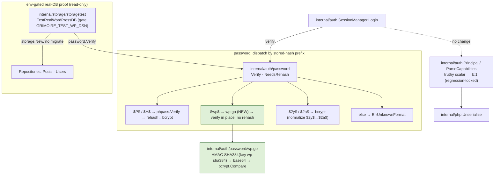
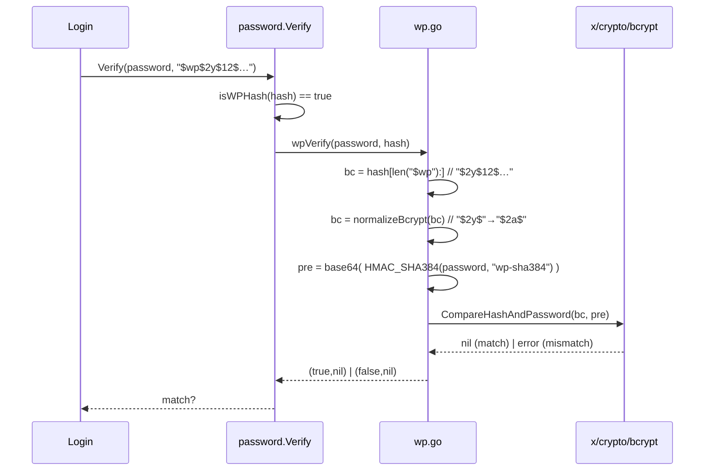

# Design — M2.1: WordPress 6.8 `$wp$` Hashes & Real-DB Validation

## Architecture Overview

M2.1 is a **surgical extension** of M2's authorization core. It adds one password
format to the existing prefix-dispatched verifier and proves it against real data;
it introduces **no new packages, no new dependencies, and no new import edges.**
The login path, session manager, repositories, and web surface are untouched in
behavior — `$wp$` slots into the same `password.Verify` / `password.NeedsRehash`
seam M2 already routes every hash through.



**New code is confined to** `internal/auth/password/wp.go` (verification helper) plus
two small edits to `password.go` (two `switch` arms), and a new gated test file.
Everything else in M2.1 is tests that lock in behavior that already exists.

## The `$wp$` verification algorithm

A stored `$wp$` value is the 3-character literal `$wp` followed by a complete,
standard bcrypt hash (`$2y$12$…`). The bcrypt input is a domain-separated HMAC of
the password, base64-encoded, so passwords longer than bcrypt's 72-byte limit are
not truncated.



Key facts locked in by the design:

- **Prefix arithmetic:** strip `hash[:len("$wp")]` = 3 chars, **keeping** the `$`
  that begins `$2y$`. `strings.TrimPrefix(hash, "$wp$")` would wrongly drop that `$`.
- **HMAC key:** `"wp-sha384"` (WordPress's `HMAC_SHA384_HASH_ALGO` domain string).
  SHA-384 is `crypto/sha512.New384` (there is no `crypto/sha384` package).
- **`$2y$` handling:** Go's `bcrypt` rejects `$2y$`; reuse M2's `normalizeBcrypt`
  to rewrite the identifier to `$2a$` before comparison (same algorithm).
- **No password trimming:** WordPress trims only on the *hashing* path, not on
  verification; grimoire only verifies `$wp$`, so it must not trim.
- **Constant-time:** the sole comparison is bcrypt's own constant-time compare; no
  early return leaks timing beyond what M2's bcrypt path already does.

## Component Design

### `internal/auth/password/wp.go` (new)

Pure Go, no driver imports. Exposes package-internal helpers used by `Verify` /
`NeedsRehash`:

```go
const (
    wpPrefix  = "$wp$"
    wpHMACKey = "wp-sha384"
)

func isWPHash(hash string) bool { return strings.HasPrefix(hash, wpPrefix) }

// wpPreHash reproduces WordPress 6.8's pre-hash:
// base64_encode( hash_hmac('sha384', password, 'wp-sha384', true) ).
func wpPreHash(password string) []byte {
    mac := hmac.New(sha512.New384, []byte(wpHMACKey))
    mac.Write([]byte(password))
    sum := mac.Sum(nil)
    enc := make([]byte, base64.StdEncoding.EncodedLen(len(sum)))
    base64.StdEncoding.Encode(enc, sum)
    return enc
}

// wpVerify verifies password against a "$wp$"-prefixed WordPress 6.8 hash.
func wpVerify(password, hash string) (bool, error) {
    if !isWPHash(hash) {
        return false, ErrUnknownFormat
    }
    bc := normalizeBcrypt(hash[len("$wp"):]) // keep leading '$' of $2y$
    err := bcrypt.CompareHashAndPassword([]byte(bc), wpPreHash(password))
    if err != nil {
        return false, nil
    }
    return true, nil
}
```

### `internal/auth/password/password.go` (edit)

Two `switch` arms, ordered so `$wp$` is matched **before** the generic bcrypt arm
(`$wp$…` also contains `$2y$`, so ordering matters), plus a doc-comment update.

- `Verify`: add `case isWPHash(hash): return wpVerify(password, hash)` ahead of the
  bcrypt case.
- `NeedsRehash`: add `case isWPHash(hash): return false` — **verify in place,
  never rehash** (see Design Decisions). phpass still returns true; low-cost
  bcrypt still returns true.

### `internal/auth` login path — no change

`SessionManager.Login` already calls the injected `verifyPassword` (=
`password.Verify`) and gates the optional upgrade on `password.NeedsRehash`. Since
`NeedsRehash("$wp$…")` is `false`, a `$wp$` user logs in and **no `UpdatePass`
write occurs**. The missing-user dummy-hash compare is untouched, preserving
constant-time + no-enumeration. M2.1 adds a **regression-lock test** here, not code.

### `internal/auth` capabilities — no change, test only

`ParseCapabilities` already routes each role value through `truthy()`, which for a
Go `string` returns `t != "" && t != "0"` — so `"1"` is truthy — and `php.Unserialize`
already decodes `s:1:"1"` → Go `"1"` and `b:1` → Go `true`. M2.1 adds a test with
the `s:1:"1"` variant to lock this in against regressions.

### `internal/storage/storagetest/wprealdb_test.go` (new)

Env-gated integration proof, read-only, no hardcoded real hashes:

- Skips unless `GRIMOIRE_TEST_WP_DSN` is set.
- Opens `storage.New(config.DatabaseConfig{Vendor:"mysql", DSN:…, TablePrefix: prefix})`
  where `prefix = GRIMOIRE_TEST_WP_PREFIX` (default `accuweaver`) — this opens
  **without migrating**.
- (a) `repos.Posts.RecentPosts(ctx, 5, 0)` → asserts ≥1 post.
- (b)/(c) raw read-only `SELECT user_login FROM {prefix}users WHERE user_pass LIKE '$P$%'`
  (and `'$wp$%'`) `LIMIT 1` via `repos.DB()`, then `repos.Users.ByLogin` → assert
  `password.Verify("definitely-wrong", u.Pass)` returns `(false, nil)` (format
  recognized, not `ErrUnknownFormat`).
- (d) optional: if `GRIMOIRE_TEST_WP_LOGIN`/`GRIMOIRE_TEST_WP_PASSWORD` set, load
  that user and assert `password.Verify(pw, u.Pass)` is `(true, nil)`.

Using `password.Verify` directly (not `SessionManager.Login`) keeps the test
read-only — no session insert, no rehash write against the demo DB.

## Design Decisions

1. **Do NOT rehash `$wp$` (recommended, adopted).** `$wp$` is WordPress 6.8+'s
   *current* standard and is strictly stronger than the plain bcrypt grimoire would
   rehash to (HMAC-SHA384 pre-hash removes bcrypt's 72-byte truncation and NUL
   issues). Rehashing would be a security *downgrade* and would churn the
   password column on every real login. `NeedsRehash("$wp$…") = false`.

2. **Do NOT (yet) adopt `$wp$` as grimoire's own new-password format (deferred,
   flagged).** New passwords continue to hash as bcrypt (M2 behavior). Adopting
   `$wp$` for maximum WordPress round-trip compatibility is attractive but is a
   format change with its own migration/verification surface; it is recorded here
   as an explicit **open decision for a later milestone**, not silently enabled.
   Rationale for deferral: keeps M2.1 purely additive/non-behavior-changing for
   existing grimoire-issued hashes, and lets us adopt `$wp$` deliberately (with its
   own tests + `NeedsRehash` upgrade-old-bcrypt→`$wp$` policy) rather than as a
   side effect of this fix.

3. **Constant-time & no-enumeration preserved.** Verification is a single bcrypt
   compare; the login path's dummy-hash guard for unknown users is unchanged, so
   response timing does not reveal whether a `$wp$` (or any) user exists.

4. **Capabilities truthiness already correct — regression-lock only.** No code
   change; the `s:1:"1"` variant is added as a test so a future refactor of
   `truthy()`/`ParseCapabilities` cannot silently break real-DB role parsing.

## Testing Strategy

- **Unit (always on):** `TestVerifyWPHash` (golden vector → correct pw true, wrong
  pw false; malformed `$wp$` inputs false, no panic); `TestNeedsRehashWPHash`
  (`$wp$…` → false); `TestParseCapabilitiesStringOne` (`s:1:"1"` → role granted).
- **Regression lock (always on):** `TestLoginWPHashNoRehash` — a `$wp$` user logs
  in via the real `SessionManager.Login` with in-memory repos and `UpdatePass` is
  never called.
- **Gated integration:** `TestRealWordPressDB` (`GRIMOIRE_TEST_WP_DSN`) — reads
  posts, recognizes `$P$` + `$wp$` on real data, optional real-credential e2e.
- **Gate discipline:** default `go test ./...` runs the unit + regression tests on
  SQLite semantics with no external services; MySQL/Postgres/real-DB stay gated.

## Implementation Deviations

_Populated during implementation._

- **Pre-hash algorithm corrected from the kickoff brief.** The brief specified the
  `$wp$` pre-hash as `base64_encode(sha384_raw(password))` (plain SHA-384). The
  authoritative WordPress 6.8 source (`wp-includes/pluggable.php`,
  `wp_hash_password` / `wp_check_password`) instead uses **HMAC-SHA384** keyed with
  the domain string `"wp-sha384"`:
  `base64_encode( hash_hmac('sha384', $password, 'wp-sha384', true) )`. Verified by
  (1) reading the WP source, (2) confirming the golden vector against a live
  `wp_check_password`, and (3) reproducing HMAC-SHA384 → base64 → bcrypt in Go and
  matching the golden vector (correct pw true, wrong pw false). The golden vector
  string in the brief is genuine and unchanged; only the algorithm description was
  corrected.

- **Real-DB validation results (read-only, MariaDB 12.3.2, DB `wordpress`, prefix
  `accuweaver`, 118,958 users / 148 posts).** Ran `TestRealWordPressDB` with
  `GRIMOIRE_TEST_WP_DSN` set:
  - reads real posts ✅ (newest: _"How to Painlessly Run Multiple GitHub Accounts on
    One Machine"_);
  - phpass `$P$` format recognized ✅ (sampled user `mpower`; wrong password rejected,
    no `ErrUnknownFormat`);
  - WordPress 6.8 `$wp$` format recognized ✅ (sampled user `oDRIHZWmfe`; wrong
    password rejected) — the core M2.1 win, closing the ~84% of real users that M2
    could not verify.
  - Full gate stayed green with the DB gate off (`go test ./...` all `ok`; the real-DB
    test SKIPs without the env var).

- **Optional known-plaintext e2e left skip-by-default.** The always-on unit test in
  `internal/auth/password` already proves the synthetic golden vector round-trips
  (`grimoire-test-123` → verify true). A real end-to-end login would require a real
  account's known plaintext, which we do not have, and inserting a test user into the
  live demo `wordpress` DB would violate the read-only guardrail. The e2e subtest is
  therefore wired but gated behind `GRIMOIRE_TEST_WP_LOGIN` / `GRIMOIRE_TEST_WP_PASSWORD`
  and skips unless both are supplied.

- **Capabilities scalar-truthiness needed no production change.** `truthy()` already
  treated a non-empty, non-`"0"` string as enabled, so `s:1:"1"` grants identically to
  `b:1` and `s:1:"0"` does not grant. M2.1 adds `TestParseCapabilitiesStringOne` as a
  regression lock only.
