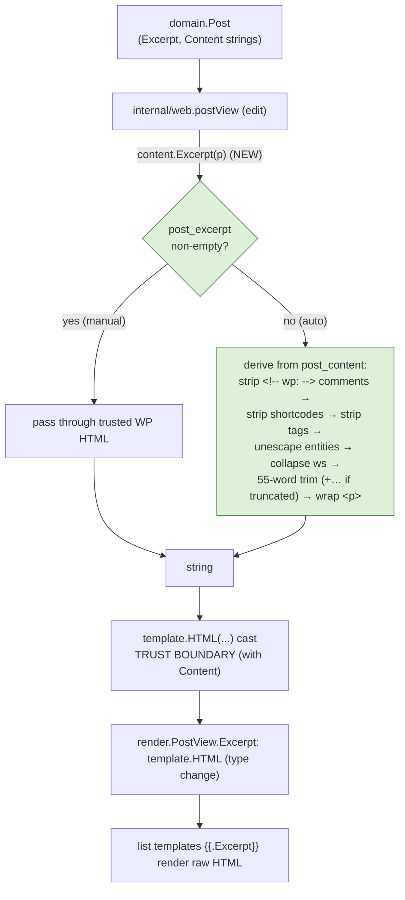

# Design — M2.2: WordPress-faithful excerpts (fix escaped HTML in list views)

## Architecture Overview

M2.2 is a **surgical content-rendering fix**. It changes one field type, adds one
small pure-Go derivation helper, and re-wires one mapping function. No new package
(the helper lives in the existing `internal/content`), no new dependency, and no
new import edge into `internal/render`.

The defect and fix live entirely at the view seam between `domain.Post` and the
templates:



**New code is confined to** `internal/content/excerpt.go` (the derivation helper)
plus small edits to `internal/render/view.go` (one field type), `internal/web/view.go`
(the cast + extended trust comment), and new tests. The templates are unchanged —
`{{.Excerpt}}` already emits the field; making the field `template.HTML` is what
lets it render raw.

## Why the bug happens

`html/template` context-auto-escapes `{{.Excerpt}}` because the field is a
`string`. Auto-escaping is correct for untrusted strings but wrong here: the
excerpt is trusted WordPress-authored HTML, exactly like `Content` (which is
already `template.HTML` and therefore renders raw). The fix aligns `Excerpt` with
`Content`'s trust treatment, and additionally fills the empty-excerpt case that
WordPress fills via `wp_trim_excerpt`.

## Component Design

### `render.PostView.Excerpt` — type change

`string` → `template.HTML`.

```go
type PostView struct {
    Slug    string
    Title   string
    Excerpt template.HTML // trusted excerpt HTML — see web.postView trust boundary
    Content template.HTML
    Date    time.Time
    Author  int64
}
```

Existing golden fixtures assign untyped string constants (`Excerpt: "First post."`),
which convert to `template.HTML` at compile time; a plain-text excerpt renders
byte-identically as `string` or `template.HTML`, so `testdata/golden/index.html`
and `category.html` are **unchanged** (no `-update` regen).

### `internal/content/excerpt.go` (new)

A single exported free function — not a new service method — because there is one
real caller today (the web view). A future API can reuse the same function without
a new abstraction (honoring "≥2 real callers before abstracting").

```go
// Excerpt returns the list-view summary for a post, matching WordPress
// the_excerpt() semantics:
//   - manual (post_excerpt non-empty): the excerpt as-is (trusted WP HTML).
//   - auto (post_excerpt empty): a plain-text summary derived from post_content
//     (block comments, shortcodes, and tags stripped; whitespace collapsed;
//     trimmed to excerptWords with an ellipsis when truncated) wrapped in <p>.
//   - empty excerpt AND empty content: "".
//
// The returned string is HTML destined for template.HTML at the web view
// TRUST BOUNDARY; this package deliberately does NOT import html/template.
func Excerpt(p domain.Post) string
```

Constants and helpers (pure `regexp`/`strings`/`html`):

- `excerptWords = 55` — WordPress default.
- `ellipsis = "…"` — appended only when truncation occurs.
- `blockCommentRE = (?s)<!--\s*/?\s*wp:.*?-->` — strips Gutenberg delimiters.
- `shortcodeRE = \[[^\]]*\]` — strips shortcodes (minimal; not a full shortcode parser).
- `tagRE = <[^>]*>` — strips remaining HTML tags.
- Entity unescape via `html.UnescapeString`; whitespace collapse via `\s+ → " "`.

Auto path (order matters — comments first so their inner text is dropped, then
shortcodes, then tags):

```
content := blockCommentRE.ReplaceAllString(p.Content, " ")
content = shortcodeRE.ReplaceAllString(content, " ")
content = tagRE.ReplaceAllString(content, " ")
content = html.UnescapeString(content)
content = collapseWS(content)            // trim + \s+→" "
if content == "" { return "" }           // empty stays empty
words := strings.Fields(content)
if len(words) > excerptWords {
    content = strings.Join(words[:excerptWords], " ") + ellipsis
} else {
    content = strings.Join(words, " ")
}
return "<p>" + content + "</p>"           // minimal wpautop
```

Manual path: `if strings.TrimSpace(p.Excerpt) != "" { return p.Excerpt }` — the
excerpt is returned verbatim (already HTML from WordPress). This is the minimal
faithful behavior for Requirement 1; see Design Decision 2.

### `internal/web/view.go` — wiring + extended trust boundary

`postView` sets the excerpt via the helper and casts at the boundary, next to the
existing `Content` cast, under one `TRUST BOUNDARY` comment now covering **both**
fields:

```go
return render.PostView{
    Slug:    p.Slug,
    Title:   p.Title,
    Excerpt: template.HTML(content.Excerpt(p)), // trusted excerpt HTML — see trust boundary
    Content: template.HTML(p.Content),          // trusted DB HTML — see trust boundary
    ...
}
```

The package-level `TRUST BOUNDARY` doc comment is extended to state that both
`post_content` and the derived excerpt are emitted verbatim, safe only under M1's
trusted read-only WordPress DB assumption, and that any future untrusted/admin
write path MUST sanitize (e.g. bluemonday) before **either** cast.

### Templates — unchanged

`index.tmpl`, `category.tmpl`, `archive.tmpl` already emit `{{.Excerpt}}`. With
`Excerpt` now `template.HTML`, the same directive renders raw HTML.

## Design Decisions

1. **Cast to `template.HTML` at the web boundary, not in `content`.** The
   derivation helper returns a `string`; the single `template.HTML` cast stays in
   `internal/web/view.go` beside the `Content` cast. This keeps all trust
   reasoning in one auditable place and keeps `internal/content` free of an
   `html/template` import — mirroring how M1 already localizes the `Content`
   trust boundary.

2. **Manual excerpts pass through as-is (minimal `wpautop` not applied to
   manual).** WordPress runs manual excerpts through `wpautop`, which would wrap a
   tag-less manual excerpt in `<p>`. grimoire returns the manual excerpt verbatim:
   it already satisfies "render as HTML, not escaped" (Requirement 1), matches the
   author's stored markup, and avoids double-wrapping excerpts that already
   contain block tags (the real-DB case, `<p>Run multiple GitHub accounts…`).
   Full `wpautop` fidelity for manual excerpts is deferred as unnecessary
   complexity for the observed data. Auto excerpts **are** wrapped in `<p>` to
   match WordPress paragraph rendering.

3. **Empty excerpt AND empty content → `""` (empty stays empty).** Rather than
   emit `<p></p>`, the helper returns an empty string so list views show nothing
   for a truly empty post, and the `{{else}}`/blank rendering stays clean. Asserted
   by test.

4. **`internal/content` for the helper, as a free function.** The derivation is
   content semantics over `domain.Post`; `internal/content` already houses the
   post/term/option services and is imported by the web layer. A free function
   (not a `PostService` method) keeps it trivially reusable by a future API without
   introducing a premature abstraction.

5. **Minimal shortcode/tag/entity handling, not a full WP text pipeline.**
   `wp_trim_excerpt` runs the full shortcode engine and filters; grimoire uses
   regex-based stripping sufficient for producing a clean plain-text summary. This
   is a pragmatic subset (consistent with M1's template-hierarchy subset), not a
   port of WordPress's text stack. Broader fidelity is deferred.

6. **55-word limit, single `…`.** Matches WordPress's default `excerpt_length`
   (55). WordPress's default `excerpt_more` is ` […]`; grimoire appends a single
   `…` per the milestone brief, applied **only** when truncation occurs.

## Testing Strategy

Strict TDD, red → green → refactor.

- **Unit (always on)** — `internal/content/excerpt_test.go`:
  - Manual excerpt with HTML (`<p>x</p>`) → returned unchanged (HTML preserved).
  - Empty excerpt + content with `<!-- wp:paragraph -->…<!-- /wp:paragraph -->`
    and tags → clean plain text, comments + tags stripped, wrapped in `<p>`, no
    `wp:` token.
  - Truncation boundary: content < 55 words → no trailing `…`; content > 55 words
    → 55 words + `…`.
  - Empty content AND empty excerpt → `""` (no panic, no `<p></p>`).
- **Template (always on)** — `internal/render`: render `index` with a `PostView`
  whose `Excerpt` is `template.HTML("<p>x</p>")`; assert output contains `<p>x</p>`
  and NOT `&lt;p&gt;`. Reverting `Excerpt` to `string` (re-introducing escaping)
  makes this fail.
- **Wiring (always on)** — `internal/web/view_test.go`: `postView` maps a manual
  HTML excerpt to raw-HTML `Excerpt`, and an empty-excerpt post to the
  auto-generated `<p>…</p>` summary.
- **Gate discipline:** default `go test ./...` runs all of the above on SQLite
  semantics with no external services; MySQL/Postgres/real-DB tests stay gated and
  skip without env vars.

## Implementation Deviations

None of substance — the implementation followed the approved design. Notes:

- **Golden files unchanged.** Changing `render.PostView.Excerpt` from `string` to
  `template.HTML` did not require regenerating `index.html` / `category.html`. The
  existing fixtures use plain-text excerpts (`"First post."`) which render
  byte-identically under either type, so no `-update` run was needed.
- **Regex set.** Final helper uses four regexes — block comments
  `(?s)<!--\s*/?\s*wp:.*?-->`, shortcodes `\[[^\]]*\]`, tags `(?s)<[^>]*>`, and
  whitespace `\s+` — applied in that order so shortcode/tag attributes never leak
  before entity unescaping and word-trim.
- **Ellipsis.** Uses the single `…` glyph (per the M2.2 brief) rather than
  WordPress's default ` […]`; captured as a named constant `ellipsis`.
- **Cast site.** The `template.HTML` cast stays in `internal/web/view.go` beside
  the existing `Content` cast; `internal/content` imports only `html` (for
  `UnescapeString`), never `html/template`, keeping the trust decision in one
  place.
