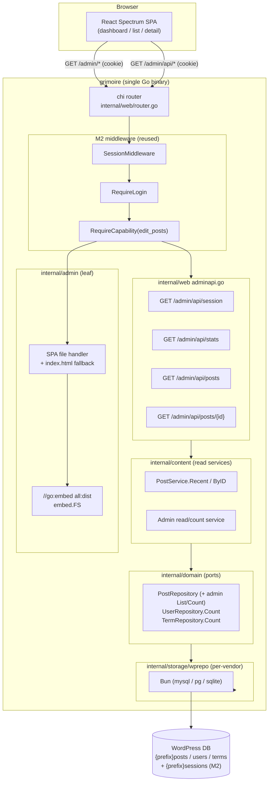
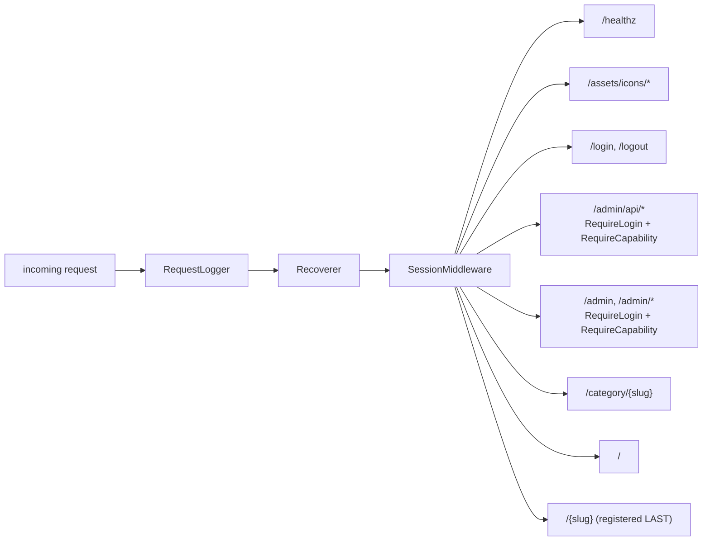
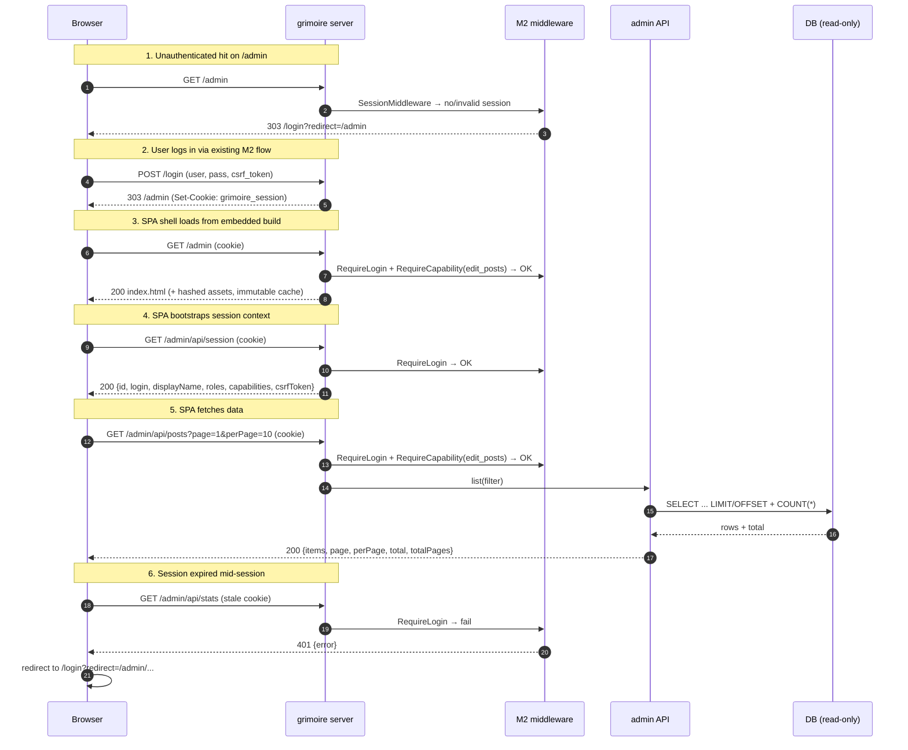
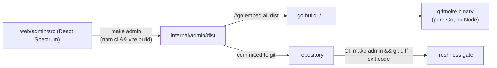

# Design — M3: Adobe React Spectrum Admin UI

## Overview

M3 layers a single-page **admin** onto the existing server without disturbing the
public site or the M2 auth substrate. The design has four moving parts:

1. **An embedded SPA** (`internal/admin`) — a React Spectrum build embedded with
   `go:embed` and served with SPA-fallback routing under `/admin`. This package is
   a *leaf*: it contains only the embedded filesystem and an `http.Handler`; it
   imports no domain, storage, or web code.
2. **A JSON API** (`internal/web/adminapi*.go`) — read-only handlers under
   `/admin/api` that reuse the M2 middleware (`SessionMiddleware`, `RequireLogin`,
   `RequireCapability`) and the existing content read services.
3. **Additive read/count ports** (`internal/domain` + `internal/storage/wprepo`)
   — new pure-`SELECT`/`COUNT` methods for admin listing (drafts + pages) and
   dashboard counts. No schema change, no migration.
4. **A build pipeline** (`web/admin/` → `make admin` → `internal/admin/dist`) —
   Vite + `@adobe/react-spectrum` producing the embedded build, committed to the
   repo, with a CI freshness check. Node.js is a *build-time-only* dependency.

The guiding constraints from M1/M2 are preserved: **pure-Go runtime**, **switchable
DB** (MySQL/PostgreSQL/SQLite), and **existing-WP-DB overlay** (no destructive
migrations). Because M3 is read-only, it can be demonstrated against a live
118k-user WordPress database with only the additive M2 `{prefix}sessions` table
present.

## Architecture

### Component view



### Request routing (where `/admin` sits in the chain)

The public catch-all `/{slug}` is registered **last** in `Routes()`. The `/admin`
prefix and `/admin/api` group are registered **before** it, so admin paths win.
The admin shell and API subrouters carry `RequireLogin` and
`RequireCapability("edit_posts")`; the SPA static handler and the API handlers sit
behind that gate.



### Auth + SPA bootstrap + authenticated API call (sequence)



## Directory layout

```
web/admin/                     # React source — NOT in the Go build graph
  package.json
  vite.config.ts               # base: "/admin/", build.outDir: ../../internal/admin/dist
  tsconfig.json
  index.html
  src/
    main.tsx                   # Spectrum <Provider theme={defaultTheme}>
    api/client.ts              # fetch wrapper: same-origin, credentials, 401/403 handling
    routes/
      Dashboard.tsx            # GET /admin/api/stats
      PostsList.tsx            # GET /admin/api/posts (paginated)
      PostDetail.tsx           # GET /admin/api/posts/{id}
    components/                # Spectrum-composed shell (nav, layout)

internal/admin/
  admin.go                     # //go:embed all:dist ; Handler(prefix) http.Handler
  admin_test.go                # fallback + asset + 404 behavior (fake FS)
  dist/                        # BUILT, COMMITTED assets
    index.html                 # placeholder until `make admin` runs (Req 1.6)

internal/web/
  adminapi.go                  # JSON handlers (session/stats/posts/post)
  adminapi_test.go             # httptest + fakes, per-endpoint + auth/cap/error
  adminroutes.go               # registers /admin and /admin/api on the chi router
  router.go                    # (edit) mount admin before catch-all; WithAdmin(...)

internal/content/
  adminread.go                 # admin read/count service (drafts+pages, counts)

internal/domain/
  repository.go                # (edit) add admin List/Count ports

internal/storage/wprepo/
  posts.go / users.go / terms.go  # (edit) implement new SELECT/COUNT methods

Makefile                       # (edit) `admin` target + wire into `build`/CI
```

**Why this split:** `internal/admin` stays a pure leaf (embed + serve), so the
runtime dependency graph never touches frontend concerns; `internal/web`
orchestrates routing and JSON exactly as it already does for M1/M2; business reads
live in `internal/content`/`internal/domain`/`internal/storage` following the
existing hexagonal boundaries (no driver import above storage).

## API surface

All endpoints are **`GET`**, JSON, same-origin, cookie-authenticated, under
`/admin/api`. All except `session` require the `edit_posts` capability.

| Method | Path | Capability | Purpose | Success body (shape) |
|---|---|---|---|---|
| GET | `/admin/api/session` | login only | Current user + CSRF token | `{ id, login, displayName, roles[], capabilities[], csrfToken }` |
| GET | `/admin/api/stats` | `edit_posts` | Dashboard counts | `{ posts:{published,draft}, pages, categories, users }` |
| GET | `/admin/api/posts?page&perPage&type&status` | `edit_posts` | Paginated content list (incl. drafts/pages) | `{ items:[{id,title,slug,type,status,author,date}], page, perPage, total, totalPages }` |
| GET | `/admin/api/posts/{id}` | `edit_posts` | Single item detail | `{ id,title,slug,type,status,author,date,excerpt,content }` |

Error body (all failures): `{ "error": { "code": string, "message": string } }`
with status `400/401/403/404/405/500`. `401` for unauthenticated API calls (never
a redirect); `403` for authenticated-but-uncapable; `404` for missing item;
`405` for non-`GET`.

## New additive read/count ports

These are the only new data-access surfaces. Each is a pure read; none alters
schema, so the existing-WP-DB overlay (issue #4) is unaffected.

```go
// internal/domain/repository.go (additions)

// AdminPostFilter selects content for the admin list, unlike the public read
// path it is not limited to published posts.
type AdminPostFilter struct {
    Types    []string // e.g. {"post","page"}; empty = both
    Statuses []string // e.g. {"publish","draft","pending","private"}; empty = all
    Limit    int
    Offset   int
}

type AdminPostRepository interface {
    ListForAdmin(ctx context.Context, f AdminPostFilter) ([]Post, error)
    CountForAdmin(ctx context.Context, f AdminPostFilter) (int, error)
}

// Counts for the dashboard. Additive; pure COUNT(*).
type PostCounter interface {
    CountByStatus(ctx context.Context, typ, status string) (int, error)
}
type UserCounter interface {
    CountUsers(ctx context.Context) (int, error)
}
type TermCounter interface {
    CountTerms(ctx context.Context, taxonomy string) (int, error) // taxonomy="category"
}
```

`internal/content` composes these into an admin read service that the web handlers
call; `PostService.ByID` (already present on the write port as `ByID`) backs the
detail endpoint. Vendor implementations live in `internal/storage/wprepo` using
Bun, mirroring existing queries, so dialect differences never reach shared code.

## Build and embed pipeline



- **Toolchain:** Vite + React + `@adobe/react-spectrum`. `vite.config.ts` sets
  `base: "/admin/"` (so hashed asset URLs resolve under the prefix) and
  `build.outDir` to `internal/admin/dist`.
- **`make admin`:** `cd web/admin && npm ci && npm run build`. Produces
  `internal/admin/dist/{index.html, assets/*}`.
- **Committed build:** `dist` is committed so `go build`/`go install ./...` work
  with no Node.js. A placeholder `internal/admin/dist/index.html` is committed
  first (Req 1.6) so `//go:embed all:dist` compiles before the first real build.
- **CI freshness:** a CI job runs `make admin` then `git diff --exit-code
  internal/admin/dist`; drift fails the build, guaranteeing committed assets match
  source. `go test ./...` never needs Node.
- **Runtime:** the server only reads the embedded FS — no Node process, pure Go.

## Serving details (`internal/admin`)

`Handler(prefix)` returns an `http.Handler` that, for a request path under
`prefix`:

1. Strips the prefix and cleans the path.
2. If the path maps to an existing embedded file → serve it. Files under
   `assets/` (content-hashed by Vite) get `Cache-Control: public, max-age=31536000,
   immutable` (Req 1.3).
3. If the path is under `assets/` but the file is missing → `404` (Req 1.5).
4. Otherwise (a client route like `/admin/posts/42`) → serve `index.html` with
   `Cache-Control: no-cache` (Req 1.4 SPA fallback).

This mirrors `assets/assets.go` (`//go:embed` + `fs.Sub`) and
`internal/web/static.go` (`http.FileServer(http.FS(...))`), extended with the
fallback rule.

## Security considerations

- **Reused session cookie.** `HttpOnly`, `SameSite=Lax`, `Secure` when TLS —
  unchanged from M2 (Req 7.4). Same-origin serving means `fetch` sends the cookie
  automatically (Req 7.1).
- **CSRF.** M3 serves only safe `GET` methods, so no token validation is required
  now (Req 7.2). The SPA still reads `csrfToken` from `/admin/api/session` and the
  design fixes the milestone 06 contract: unsafe requests send `X-CSRF-Token`, validated in
  constant time against `domain.Session.CSRFToken`. Milestone 06 will extend the existing
  `requireSessionCSRF` (today form-field only) to also accept that header.
- **Capability gate.** `edit_posts` admits contributor+; subscribers get a clean
  "insufficient permissions" state rather than data (Req 2.4–2.5).
- **No leakage.** JSON errors are generic; SQL/driver text, hashes, and
  session/CSRF secrets never appear in responses (Req 11.2). The session endpoint
  omits the hash, session token, and cookie value (Req 3.4).
- **XSS on content detail.** `content` is trusted author HTML stored in
  `{prefix}posts`. The API returns it as *data*; React escapes by default when
  rendering as text. If a future preview renders it as HTML, it must be sandboxed
  or sanitized — noted for milestone 06's editor, out of scope for M3's read view (which
  displays content as text/preformatted).
- **Content Security Policy.** React Spectrum injects styles at runtime; an
  overly strict `style-src` can break it. M3 documents a starting CSP for `/admin`
  (`default-src 'self'`; `style-src 'self' 'unsafe-inline'` or a nonce;
  `img-src 'self' data:`) and treats CSP tightening (nonces) as a follow-up.

## DB-overlay compatibility note

M3 adds **zero** migrations and **zero** schema changes. Every new data path is an
additive, read-only `SELECT`/`COUNT` port implemented per vendor. Consequently the
admin runs against an existing, populated WordPress database with only the additive
M2 `{prefix}sessions` table present — sidestepping the greenfield-only migration
limitation tracked in issue #4. The write path that *would* need migrations is
deliberately in **milestone 06**.

## Scope boundary: M3 (read-only) vs Milestone 06 (CRUD)

| Concern | M3 (this milestone) | Milestone 06 (deferred) |
|---|---|---|
| Content | List (incl. drafts/pages), detail, dashboard counts | Create / update / delete posts, pages, terms |
| HTTP methods | `GET` only | `POST` / `PUT` / `PATCH` / `DELETE` |
| CSRF | Token exposed, not validated (no unsafe methods) | `X-CSRF-Token` header validated (extend `requireSessionCSRF`) |
| DB writes | None (overlay-safe on live WP DB) | Reuse M2 `internal/content` write services |
| Editor / media | None | Rich editor, media library |

**Justification:** read-only M3 is immediately demoable against the real WP DB
with no write-migrations and minimal blast radius, while the write path (CSRF-header
handling, optimistic concurrency, editor UX, media) is substantial enough to own its
own milestone. The auth substrate (capabilities, per-session CSRF token) and the
Go-internal write services already exist from M2, so milestone 06 is additive.

## Spectrum implementation decision

Per the `adobe-spectrum` guidance, the admin uses **`@adobe/react-spectrum`** (the
mature v3 React implementation) with `@spectrum-icons/workflow` and Spectrum design
tokens — the default for a new internal React tool. React Spectrum **S2**
(`@react-spectrum/s2`) is noted as a forward-looking alternative but is not adopted
in M3 to keep the first admin on the most stable, best-documented base. No custom
component library, hardcoded palette, bundled Adobe Clean font, or scraped brand
logo is introduced (Req 8.1, 8.6).

## Testing strategy

- **`internal/admin`:** table tests over a fake `fs.FS` — asset hit (cache
  header), SPA fallback to `index.html`, missing `assets/*` → 404.
- **`internal/web` admin API:** `httptest` handlers with fakes for the read
  services and a fake `Sessions`/principal — assert JSON shapes, pagination math,
  `401` (unauth), `403` (no `edit_posts`), `404` (missing), `405` (non-GET),
  and no-leakage of secrets/SQL.
- **Ports:** vendor-agnostic tests for `ListForAdmin`/`Count*` against SQLite;
  MySQL/PostgreSQL parity via the existing storage test harness; any real-WP-DB
  check is environment-gated like M2.1.
- **Frontend:** minimal component/interaction tests are optional in M3; the Go
  side is the correctness boundary. CI freshness check covers the embedded build.

## Requirements traceability

| Requirement | Design elements |
|---|---|
| 1 — Embedded SPA serving | `internal/admin` (`//go:embed all:dist`, `Handler`), routing view, serving-details, placeholder `index.html` |
| 2 — Auth + capability gate | Routing chain, sequence steps 1–3 & 6, `RequireLogin`/`RequireCapability(edit_posts)` |
| 3 — Session endpoint | API table row `session`, sequence step 4, no-leakage note |
| 4 — Dashboard counts | API table row `stats`, `PostCounter`/`UserCounter`/`TermCounter` ports |
| 5 — Posts listing | API table row `posts`, `AdminPostRepository.ListForAdmin`/`CountForAdmin`, pagination metadata |
| 6 — Post detail | API table row `posts/{id}`, `PostService.ByID` reuse |
| 7 — CSRF & same-origin | Security §CSRF, sequence step 5, milestone 06 contract |
| 8 — React Spectrum UX | Directory layout `web/admin/src`, Spectrum implementation decision |
| 9 — Build/embed pipeline | Build pipeline §, Makefile, CI freshness gate |
| 10 — Vendor/overlay compat | Additive ports §, DB-overlay note, testing strategy |
| 11 — Error handling/observability | API error body, security no-leakage, `slog` logging |

## Implementation deviations

See `requirements.md` §"Implementation deviations". In summary: post content is
shown as escaped preformatted text (not rendered HTML) in the read-only view;
the SPA uses `react-router` bridged into the Spectrum `Provider` router prop;
the shared empty state uses `@spectrum-icons/workflow/Document`; and CI verifies
embedded-asset freshness in a dedicated Node job while the Go build/test job
stays Node-free.
