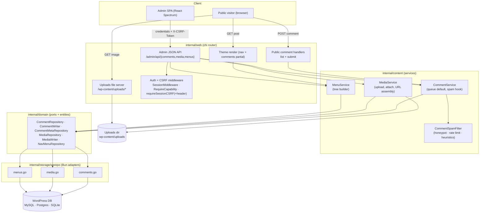
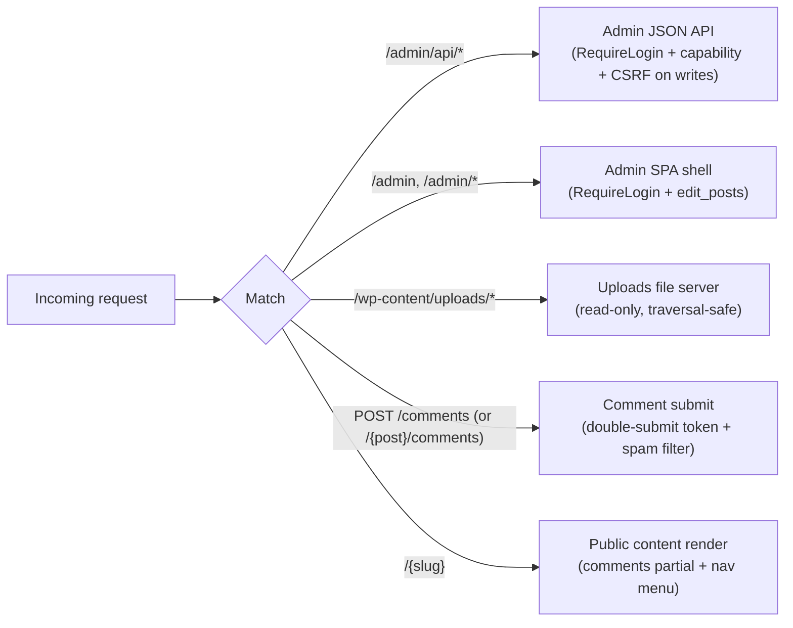
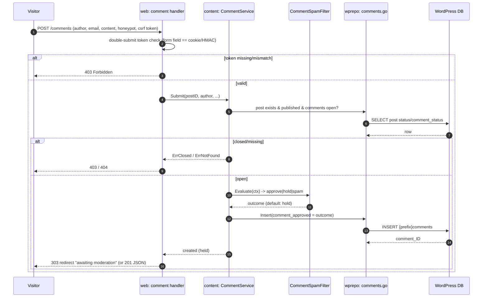
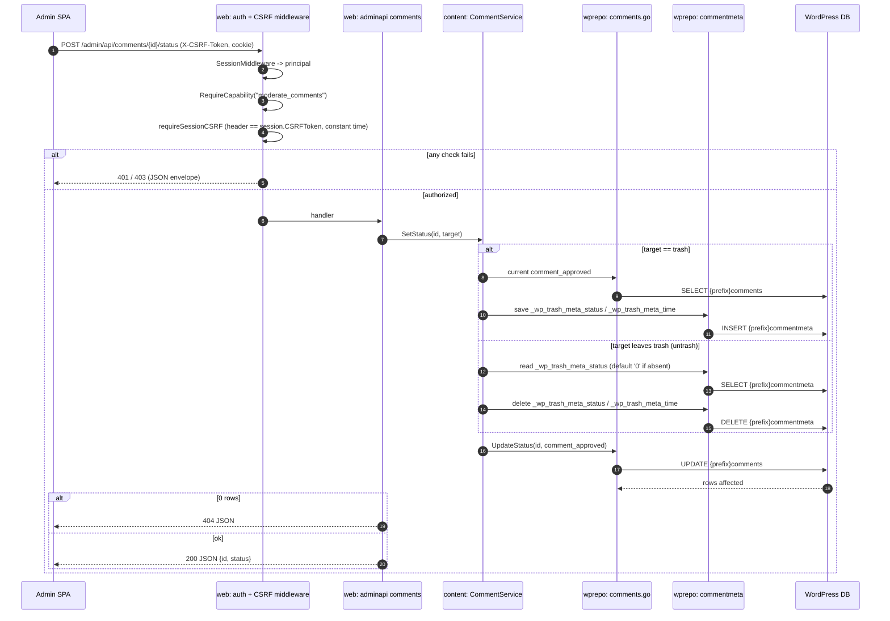
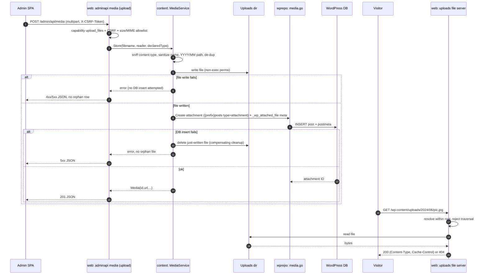

# Design — M4: Comments, Media Library, Navigation Menus

## Overview

M4 turns grimoire into a site that handles the three feature areas that make a
WordPress read of a real database feel complete: **comments**, a **media library**,
and **navigation menus**. It is the first milestone to serve write requests, so it
keeps the hexagonal discipline of M1–M3 intact while carefully adding the smallest
possible surface for state change.

The design keeps the layering unchanged:

- `internal/domain` gains **ports** (interfaces) and **entities** for comments,
  media, and menus — pure Go, no driver imports.
- `internal/storage/wprepo` gains three adapters — `comments.go`, `media.go`,
  `menus.go` — implementing those ports once with Bun, threading the vendor through
  `rebind.Rebind` at any raw exec/JOIN site and mapping `sql.ErrNoRows` →
  `domain.ErrNotFound`. `storage.Set`/`storage.New` wires the new repos per vendor.
- `internal/content` composes the ports into services (`CommentService`,
  `MediaService`, `MenuService`) that hold domain logic (moderation-queue default,
  spam-filter invocation, attachment path assembly, menu-tree building).
- `internal/render` gains a comments partial and a nav-menu renderer for the public
  theme; `internal/web` adds public handlers (comment list/submit, uploads file
  serving) and admin JSON API handlers (comments moderation, media list/upload,
  menus read), reusing the M2 auth/CSRF middleware and the M3 admin API envelope.
- `internal/config` gains a `Media` section (uploads dir, base URL, size/MIME
  limits, serve mode).
- `web/admin` (the Spectrum SPA) gains **Comments**, **Media**, and **Menus** views
  plus nav-rail entries and typed API-client methods.

Two cross-cutting decisions define the milestone:

1. **Overlay-first schema.** Comments read/write the real `{prefix}comments` /
   `{prefix}commentmeta`; media are `{prefix}posts` (`post_type='attachment'`) +
   `{prefix}postmeta`; menus are the `nav_menu` taxonomy. Against a live WordPress
   DB there is **zero** migration — every column and table M4 touches already
   exists. Only a greenfield DB receives the additive `0003` migration, which (a)
   creates `IF NOT EXISTS` `{prefix}comments`/`{prefix}commentmeta` — the same
   contract as M2's `{prefix}sessions` table — **and** (b) `ALTER TABLE
   {prefix}posts ADD COLUMN`s the four columns the M1 greenfield schema omits but
   M4 needs (`comment_status`, `post_parent`, `post_mime_type`, `menu_order`),
   the same contract as M2's `{prefix}users` column migration (see
   [Migrations](#migrations)). Media and menus need **no** new table.
2. **First write paths, explicit CSRF.** Authenticated admin writes validate the
   per-session token via an `X-CSRF-Token` header (activating the contract M3
   designed but never exercised). The anonymous public comment form uses a
   double-submit token plus a pluggable spam filter, and every anonymous comment
   defaults to the moderation queue (`comment_approved='0'`).

## Architecture

### Component view



### Routing and precedence

New routes must be registered so specific paths win over the public catch-all
`/{slug}`, and so uploads and admin API never collide.



### Sequence — anonymous comment submission into the moderation queue



### Sequence — authenticated moderation with CSRF header



`trash`/`untrash` are the only side-effecting transitions: trashing snapshots the
prior `comment_approved` into commentmeta before overwriting it, and untrashing
restores that exact value and clears the meta, mirroring WordPress's
`wp_trash_comment()`/`wp_untrash_comment()`. `trash` remains a soft-delete only —
M4 exposes no hard-delete endpoint (Req 4.9).

### Sequence — media upload and public serving



File-write and DB-insert are never both left half-done: a file-write failure
never reaches the DB insert (no orphan row), and a DB-insert failure after a
successful file write triggers a compensating delete of that file (no orphan
file) — `MediaService.Store` owns this cleanup, not the repository (Req 8.7).

### Sequence — nav-menu read and public render

```mermaid
sequenceDiagram
  autonumber
  participant V as Visitor
  participant H as web: public render
  participant NS as content: MenuService
  participant R as wprepo: menus.go
  participant DB as WordPress DB

  V->>H: GET /some-page
  H->>NS: Menu(location or slug)
  alt by theme location
    NS->>R: option theme_mods_{theme}
    R->>DB: SELECT {prefix}options
    NS->>NS: php.Unserialize(option_value), lookup nav_menu_locations[location]
    Note over NS: missing row/key/undecodable value -> empty menu, no error
  else by slug
    NS->>R: term by nav_menu slug
    R->>DB: SELECT terms + term_taxonomy (taxonomy='nav_menu')
  end
  NS->>R: items for menu term
  R->>DB: SELECT nav_menu_item posts JOIN term_relationships
  NS->>R: postmeta (_menu_item_* keys) for items
  R->>DB: SELECT {prefix}postmeta
  R-->>NS: flat items + meta
  NS->>NS: build parent/child tree via _menu_item_menu_item_parent
  NS->>NS: resolve label/URL per item type (custom: own title + _menu_item_url; post_type/taxonomy: title falls back to target, URL from target's permalink/term link)
  NS-->>H: NavMenu (tree)
  H->>H: render nested <ul>/<li>, escape labels/URLs
  H-->>V: HTML with navigation
```

Theme-location resolution decodes `theme_mods_{active theme}` with the existing
`internal/php` unserializer (built for M2's `{prefix}capabilities`) and looks up
`nav_menu_locations[location]`; any missing option, missing key, or decode
failure degrades to an empty menu (Req 10.7), never an error. Label/URL
derivation follows WordPress's `wp_setup_nav_menu_item()`: only `type=custom`
items trust their own `_menu_item_url` verbatim; `post_type`/`taxonomy` items
resolve the URL from the referenced object's current permalink/term link, since
WordPress does not keep `_menu_item_url` in sync for those types (Req 10.8).

## Directory layout

New and touched files (⊕ new, ✎ modified):

```
internal/
  domain/
    entities.go            ✎ add Comment, CommentMeta, Media, NavMenu, NavMenuItem
    repository.go          ✎ add Comment/Media/Menu ports + filter structs
  content/
    comments.go            ⊕ CommentService (queue default, spam hook)
    media.go               ⊕ MediaService (store, attach, URL assembly)
    menus.go               ⊕ MenuService (tree builder)
    spam.go                ⊕ CommentSpamFilter interface + default filter
  render/
    comments.go            ⊕ CommentView / comments partial data
    menus.go               ⊕ NavMenuView data for templates
  storage/
    factory.go             ✎ wire Comments/CommentWriter/CommentMeta/Media/NavMenus
    wprepo/
      comments.go          ⊕ CommentRepo (reads + writer + meta)
      media.go             ⊕ MediaRepo (attachment reads + writer)
      menus.go             ⊕ NavMenuRepo (nav_menu term + item reads)
    storagetest/
      comments_contract.go ⊕ runCommentsContract
      media_contract.go    ⊕ runMediaContract
      menus_contract.go    ⊕ runMenusContract
      contract.go          ✎ seed comment/media/menu fixtures; call new subcontracts
    migrations/
      mysql/0003_comments_media_menus.up.sql      ⊕ {prefix}comments + commentmeta; ALTER {prefix}posts +4 cols
      postgres/0003_comments_media_menus.up.sql   ⊕
      sqlite/0003_comments_media_menus.up.sql     ⊕
  web/
    handlers.go            ✎ public comment list wiring into single/page render
    comments.go            ⊕ public comment list + submit handlers
    uploads.go             ⊕ read-only uploads file server (traversal-safe)
    adminapi_comments.go   ⊕ GET list + POST status moderation
    adminapi_media.go      ⊕ GET list + POST upload + POST attach
    adminapi_menus.go      ⊕ GET menus + GET menu by id
    adminroutes.go         ✎ mount new admin API groups + uploads route
    authmiddleware.go      ✎ requireSessionCSRF accepts X-CSRF-Token header
    router.go              ✎ register uploads + public comment routes before catch-all
  config/
    config.go              ✎ add Media config (uploads dir, base URL, limits, mode)
themes/default/templates/
  single.tmpl              ✎ include comments partial + nav menu
  page.tmpl               ✎ include nav menu
  partials/comments.tmpl   ⊕ approved list + submit form (honeypot + token)
  partials/nav-menu.tmpl   ⊕ nested <ul>/<li>
web/admin/src/
  api/types.ts             ✎ Comment, Media, NavMenu types
  api/client.ts            ✎ listComments/moderate, listMedia/upload/attach, listMenus
  components/AppShell.tsx   ✎ add Comments/Media/Menus nav entries
  App.tsx                  ✎ add routes
  views/Comments.tsx       ⊕ TableView + moderation actions
  views/Media.tsx          ⊕ grid + DropZone/FileTrigger upload
  views/Menus.tsx          ⊕ read-only tree
cmd/grimoire/main.go       ✎ construct services, thread uploads dir + spam filter
```

## API surface

### Public

| Method | Path | Auth | Purpose |
| --- | --- | --- | --- |
| GET | `/{post-slug}` | none | Post render now includes approved comments + nav menu |
| POST | `/comments` (or `/{post}/comments`) | none + double-submit token | Submit a comment into the moderation queue |
| GET | `/wp-content/uploads/*` | none | Read-only serve of upload files (traversal-safe) |

### Admin JSON API (`/admin/api`, session cookie + envelope `{error:{code,message}}`)

| Method | Path | Capability | CSRF | Purpose |
| --- | --- | --- | --- | --- |
| GET | `/admin/api/comments` | `moderate_comments` | — | Paginated moderation list (filter by status/post) |
| POST | `/admin/api/comments/{id}/status` | `moderate_comments` | `X-CSRF-Token` | Approve / unapprove / spam / trash |
| GET | `/admin/api/media` | `upload_files` | — | Paginated attachment list |
| POST | `/admin/api/media` | `upload_files` | `X-CSRF-Token` | Multipart upload → attachment row |
| POST | `/admin/api/media/{id}/attach` | `upload_files` | `X-CSRF-Token` | Set attachment `post_parent` |
| GET | `/admin/api/menus` | `edit_posts` | — | List nav menus |
| GET | `/admin/api/menus/{id}` | `edit_posts` | — | One menu with its item tree |

Status codes reuse the M3 mapping: `ErrNotFound`→`404`, bad request→`400`,
oversized upload→`413`, unauthenticated→`401`, missing capability/CSRF→`403`,
non-allowed method→`405`, else `500`; dates formatted `2006-01-02T15:04:05Z07:00`.

## New additive domain entities

```go
// Comment maps a {prefix}comments row. Status is the raw WordPress enum
// ('0','1','spam','trash') so round-trips are lossless.
type Comment struct {
	ID          int64
	PostID      int64
	Author      string
	AuthorEmail string
	AuthorURL   string
	AuthorIP    string
	Date        time.Time
	DateGMT     time.Time
	Content     string
	Status      string // comment_approved: "0","1","spam","trash"
	Agent       string
	Parent      int64
	UserID      int64
}

// CommentMeta maps a {prefix}commentmeta row (single-valued semantics like
// UserMeta: last write wins per key).
type CommentMeta struct {
	CommentID int64
	Key       string
	Value     string
}

// Media is a {prefix}posts row with post_type='attachment', resolved together
// with its file path and public URL.
type Media struct {
	ID       int64
	Title    string
	Filename string // relative path from _wp_attached_file, e.g. 2024/06/pic.jpg
	URL      string // uploads base URL + Filename
	MimeType string
	Date     time.Time
	ParentID int64 // post_parent (0 = unattached)
}

// NavMenu is a nav_menu taxonomy term plus its assembled item tree.
type NavMenu struct {
	ID    int64
	Name  string
	Slug  string
	Items []NavMenuItem // top-level items; children nested
}

// NavMenuItem is a nav_menu_item post resolved from its _menu_item_* postmeta.
type NavMenuItem struct {
	ID        int64
	Label     string
	URL       string
	Type      string // custom | post_type | taxonomy
	Object    string // e.g. "page", "category"
	ObjectID  int64
	ParentID  int64 // _menu_item_menu_item_parent (0 = top level)
	Order     int
	Children  []NavMenuItem
}
```

## New additive ports

```go
// CommentFilter selects comments for the public list or the admin moderation
// queue. All fields are additive read filters; nothing alters schema.
type CommentFilter struct {
	PostID   int64    // 0 = across all posts (admin)
	Statuses []string // e.g. {"1"} public, {"0"} queue; empty = all (admin)
	Limit    int
	Offset   int
}

// CommentRepository reads comments (public list + admin queue). Pure reads.
type CommentRepository interface {
	// List returns comments matching the filter, oldest-first for a single post
	// (public thread order) and newest-first across posts (admin).
	List(ctx context.Context, f CommentFilter) ([]Comment, error)
	// Count returns the number of comments matching the filter (ignores Limit/Offset).
	Count(ctx context.Context, f CommentFilter) (int, error)
	// ByID returns a single comment or ErrNotFound.
	ByID(ctx context.Context, id int64) (Comment, error)
}

// CommentWriter inserts and moderates comments ({prefix}comments).
type CommentWriter interface {
	// Create inserts a comment (Status set by the service to the spam-filter
	// outcome, default "0") and returns its comment_ID.
	Create(ctx context.Context, c Comment) (int64, error)
	// UpdateStatus sets comment_approved for a comment, or ErrNotFound.
	UpdateStatus(ctx context.Context, id int64, status string) error
}

// CommentMetaRepository reads/writes {prefix}commentmeta (single-valued).
type CommentMetaRepository interface {
	Get(ctx context.Context, commentID int64, key string) (string, error)
	Set(ctx context.Context, commentID int64, key, value string) error
	ByComment(ctx context.Context, commentID int64) (map[string]string, error)
}

// MediaFilter selects attachments for the admin library.
type MediaFilter struct {
	ParentID int64 // 0 = any
	Limit    int
	Offset   int
}

// MediaRepository lists/reads attachments (post_type='attachment'). Pure reads.
type MediaRepository interface {
	List(ctx context.Context, f MediaFilter) ([]Media, error)
	Count(ctx context.Context, f MediaFilter) (int, error)
	ByID(ctx context.Context, id int64) (Media, error)
}

// MediaWriter creates attachment rows and re-parents them. File bytes are
// written by the content-layer MediaService, not the repo.
type MediaWriter interface {
	// Create inserts a {prefix}posts attachment row plus its _wp_attached_file
	// postmeta and returns the attachment ID.
	Create(ctx context.Context, m Media) (int64, error)
	// SetParent updates post_parent for an attachment, or ErrNotFound.
	SetParent(ctx context.Context, id, parentID int64) error
}

// NavMenuRepository reads nav_menu taxonomy menus and their items. Pure reads;
// no schema change (reuses terms/term_taxonomy/term_relationships/posts/postmeta).
type NavMenuRepository interface {
	// Menus lists all nav_menu terms.
	Menus(ctx context.Context) ([]NavMenu, error)
	// MenuBySlug returns a menu (with items) by term slug, or an empty menu when
	// missing (graceful degradation for unconfigured locations).
	MenuBySlug(ctx context.Context, slug string) (NavMenu, error)
	// MenuByID returns a menu (with items) by term_id, or ErrNotFound.
	MenuByID(ctx context.Context, id int64) (NavMenu, error)
	// MenuByLocation resolves a theme location to a menu via the
	// theme_mods_{theme} option's nav_menu_locations map (decoded with
	// internal/php), returning an empty menu when the option row, the
	// location key, or the decode itself is missing/invalid.
	MenuByLocation(ctx context.Context, location string) (NavMenu, error)
}

// CommentSpamFilter screens a submission before it is stored. Implementations
// live in internal/content; the port keeps the handler strategy-agnostic.
type CommentSpamFilter interface {
	// Evaluate returns the intended comment_approved value: "1" (approve),
	// "0" (hold), or "spam".
	Evaluate(ctx context.Context, sub CommentSubmission) (string, error)
}
```

Concrete `wprepo` repos follow the existing pattern: `New*Repo(db *bun.DB, prefix
string)`, a `*Columns` var, a `*Row` struct with `bun:"..."` tags + `toDomain()`,
raw JOIN/exec sites wrapped in `rebind.Rebind(vendorOf(r.db), q)`, and compile-time
assertions `var _ domain.CommentRepository = (*CommentRepo)(nil)`. A single
`CommentRepo` satisfies `CommentRepository` + `CommentWriter` +
`CommentMetaRepository`; a single `MediaRepo` satisfies `MediaRepository` +
`MediaWriter`; `NavMenuRepo` satisfies `NavMenuRepository`.

## Configuration

```go
// MediaConfig controls how uploads are stored and served. Additive; existing
// Server/Theme/Database/Session config is unchanged.
type MediaConfig struct {
	UploadsDir string   // on-disk root, default "wp-content/uploads"
	BaseURL    string   // public URL prefix, default "/wp-content/uploads"
	MaxBytes   int64    // per-file upload cap
	AllowMIME  []string // allowlist, e.g. image/jpeg, image/png, image/gif, image/webp, application/pdf
	ServeMode  string   // "file" (serve UploadsDir) | "proxy" (reverse-proxy BaseURL to an origin)
	ProxyOrigin string  // used when ServeMode=="proxy"
}
```

`ServeMode:"file"` is the default reference deployment (serve from `UploadsDir`,
traversal-safe). `ServeMode:"proxy"` documents the alternative for object-store/CDN
deployments — the public `/wp-content/uploads/` contract is identical either way.

## Migrations

`0003_comments_media_menus` is **greenfield-only** and **additive**, mirroring the
M2 `{prefix}sessions`/`{prefix}users` contracts:

- Creates `{{prefix}}comments` and `{{prefix}}commentmeta` with `IF NOT EXISTS`,
  WordPress-compatible columns and indexes (`comment_post_ID`, `comment_approved`,
  `comment_parent`, plus `comment_id` on commentmeta), templated per vendor
  (MySQL/Postgres/SQLite; SQLite quotes `"comment_ID"` and maps DATETIME→TEXT
  ISO-8601 like `0001`/`0002`).
- **Also** `ALTER TABLE {{prefix}}posts ADD COLUMN`s the four core `wp_posts`
  columns the M1 greenfield schema omits but M4 depends on:
  `comment_status` (`'open'` default), `post_parent` (`0`), `post_mime_type`
  (`''`), `menu_order` (`0`). This mirrors M2's `0002_users_auth` column-addition
  contract exactly: Postgres uses `ADD COLUMN IF NOT EXISTS`; MySQL and SQLite
  (neither supports that clause portably) use a plain `ADD COLUMN`, which would
  **error** if the column already exists. Per the same M2 operational contract,
  `migrate` is therefore only ever run against a grimoire-provisioned greenfield
  schema — it is never invoked against an overlaid live WordPress DB, which
  already has every one of these `wp_posts` columns and needs no migration at
  all.
- Creates **no** media or menu tables — attachments reuse `{prefix}posts` /
  `{prefix}postmeta` and menus reuse `{prefix}terms` / `{prefix}term_taxonomy` /
  `{prefix}term_relationships` / `{prefix}posts` / `{prefix}postmeta`, all of which
  a live WordPress DB already has.
- A live, populated WordPress DB already has `{prefix}comments`/`{prefix}commentmeta`
  and every `{prefix}posts` column above, so `migrate` is never pointed at it —
  reads/writes overlay existing data unchanged.

## Security

- **CSRF (authenticated writes).** `requireSessionCSRF` is extended to accept the
  session token from an `X-CSRF-Token` header in addition to the M2 `csrf_token`
  form field, compared in constant time to `domain.Session.CSRFToken`. M4 is the
  first milestone to actually exercise this on comment moderation, media upload, and
  media attach. No M2 cookie attribute is weakened.
- **CSRF (anonymous comment form).** The public comment form is protected by a
  double-submit token: a per-render value placed in both a hidden field and a
  short-lived cookie (or an HMAC-signed token bound to the post + a timestamp);
  mismatch → `403`. This closes the first anonymous write path without inventing a
  session for logged-out visitors.
- **Comment content is untrusted.** Unlike post content (trusted, cast to
  `template.HTML`), comment author/content/URL are HTML-escaped or allowlist-
  sanitized before rendering — no stored XSS from a stranger.
- **Spam / abuse.** The `CommentSpamFilter` runs before persistence (honeypot,
  per-IP rate limit, link/keyword heuristics); spam is quarantined as
  `comment_approved='spam'` and the client still gets a success-shaped response.
  Bodies over a configured size are rejected.
- **Uploads path safety.** The uploads file server resolves every request within
  the configured root using `filepath.Clean` + a root-prefix check (and rejects
  symlink escape), returning `404`/`400` for any traversal; it never serves outside
  `UploadsDir`. It is strictly read-only.
- **Upload validation.** Server-side content-type sniffing (not the client MIME),
  an extension/MIME allowlist, a max-size cap, filename sanitization, `YYYY/MM`
  bucketing, de-duplicated names, and non-executable file permissions.
- **No leakage.** All admin errors use the JSON envelope; no SQL, driver text,
  filesystem paths, hashes, or CSRF/session secrets ever reach a client. `slog`
  logs ids and outcomes, not raw bodies or file contents.

## Testing strategy

- **Contract tests (storagetest).** Vendor-parameterized (`SQLite` unconditional;
  MySQL/Postgres gated on `GRIMOIRE_TEST_MYSQL_DSN` / `GRIMOIRE_TEST_POSTGRES_DSN`).
  `SeedFixtures` gains deterministic comment rows (across statuses), attachment
  posts + `_wp_attached_file` meta, a `theme_mods_{theme}` option row with a
  PHP-serialized `nav_menu_locations` array, and a `nav_menu` term with mixed
  `nav_menu_item` posts (`custom` items with their own title/URL, and
  `post_type`/`taxonomy` items whose referenced object's title/permalink
  differs from their stale `_menu_item_url`/title) plus `_menu_item_*` meta.
  New subcontracts `runCommentsContract` (list by status/post, count, create
  defaults to `'0'`, `UpdateStatus`, `ErrNotFound`, plus basic
  `CommentMetaRepository` get/set/delete round-trip), `runMediaContract`
  (list/count, URL assembly, create attachment, `SetParent`), and
  `runMenusContract` (menus, `MenuBySlug`/`MenuByLocation` tree assembly —
  including `theme_mods` option parsing via `internal/php.Unserialize` and
  empty-menu degradation when the option row, key, or decode is missing/invalid
  — and per-item-type label/URL resolution: `custom` keeps its own title/URL
  verbatim, `post_type`/`taxonomy` fall back to the referenced object's title
  and always recompute the URL from its current permalink/term link) are
  invoked from `RunContract`, matching `runAdminContract` style.
- **Content-service tests.** Moderation-queue default, spam-filter outcomes routed
  to the right `comment_approved`, closed/missing-post rejection,
  `CommentService.SetStatus` trash/untrash orchestration (snapshots
  `comment_approved` to `_wp_trash_meta_status`/`_wp_trash_meta_time` on trash,
  restores and deletes both keys on untrash — Req 4.7-4.9), attachment path
  assembly + de-dup, `MediaService.Store` deleting the on-disk file when the
  follow-up DB insert fails and never inserting a row when the file write
  fails first (Req 8.7), menu tree building from flat items with
  theme-location resolution and label/URL mapping (Req 10.7-10.8).
- **Web handler tests (`httptest`).** Public comment submit (double-submit token
  pass/fail, honeypot, held-by-default, escaped output); uploads server
  (serve/traversal-reject/404); admin comments list + status (401/403/CSRF-403/404);
  media list + upload (allowlist/size/CSRF) + attach; menus read. Error bodies
  assert no secret/SQL leakage.
- **Frontend.** SPA builds with Spectrum-only components; the three views render
  loading/empty/error and handle 401/403; the client attaches `X-CSRF-Token` on
  unsafe calls.
- **End-to-end (SQLite).** Seed a capable user + post → submit a public comment
  (held) → moderator approves via API (with CSRF) → comment appears in the public
  render; upload a file → served at its `/wp-content/uploads/...` URL; a seeded
  `nav_menu` renders in the theme header.
- **Overlay safety.** Media/menu reads and comment moderation run against a DB with
  only the additive migrations; optionally env-gated against a real WP DB like M2.1.

## Requirements traceability

| Requirement | Design elements |
| --- | --- |
| 1 Public comment list | `CommentRepository.List`, `render/comments.go`, `partials/comments.tmpl`, escaping |
| 2 Comment submission | `web/comments.go` submit, `CommentService.Submit`, moderation-queue default, submit sequence |
| 3 Spam hook | `CommentSpamFilter` port, `content/spam.go` default filter |
| 4 Admin moderation | `adminapi_comments.go`, `CommentWriter.UpdateStatus`, moderation sequence (trash/untrash meta), `moderate_comments` |
| 5 Comments schema/overlay | `Comment`/`CommentMeta` entities, `wprepo/comments.go`, `0003` migration |
| 6 Media library listing | `MediaRepository`, `adminapi_media.go` GET, URL assembly |
| 7 Uploads serving | `web/uploads.go`, `MediaConfig`, traversal safety, proxy alternative |
| 8 Media upload | `adminapi_media.go` POST, `MediaService.Store` (write-then-insert, rollback-on-insert-failure), allowlist/size, `MediaWriter.Create` |
| 9 Attach media | `MediaWriter.SetParent`, `adminapi_media.go` attach |
| 10 Read nav menus | `NavMenuRepository` (incl. `MenuByLocation`), `wprepo/menus.go`, tree builder, per-item-type label/URL resolution |
| 11 Nav render + admin view | `render/menus.go`, `partials/nav-menu.tmpl`, `adminapi_menus.go`, `views/Menus.tsx` |
| 12 CSRF/anti-abuse | `authmiddleware.go` header path, double-submit token, spam filter, rate limit |
| 13 Vendor-agnostic/overlay | domain ports + `wprepo` adapters, contract suite, additive-only schema, `0003` posts-column ALTERs |
| 14 Spectrum UX | `views/{Comments,Media,Menus}.tsx`, `AppShell.tsx`, `App.tsx`, `api/*` |
| 15 Errors/observability | JSON envelope reuse, `slog`, no-leakage assertions |

## Implementation deviations

_None yet — populated during implementation to record spec-consistent decisions
(e.g. final comment endpoint shape, spam thresholds, chosen Spectrum upload
primitive, and whether the reference deployment serves or proxies uploads)._
