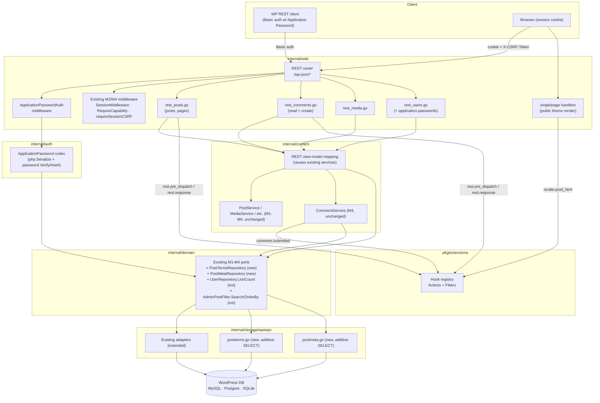
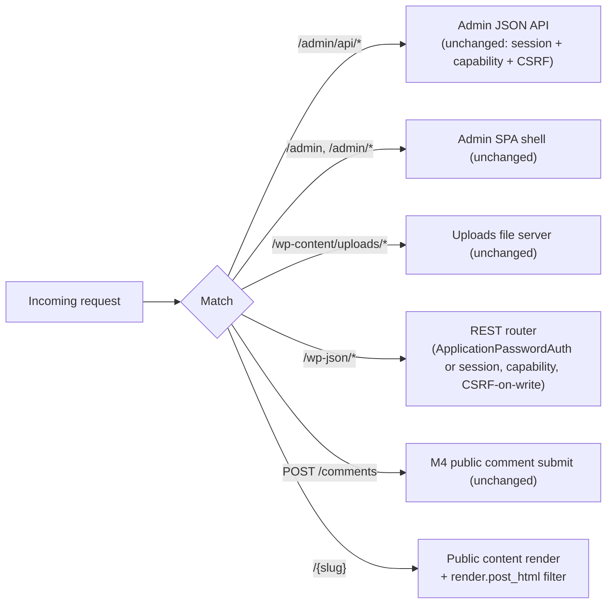
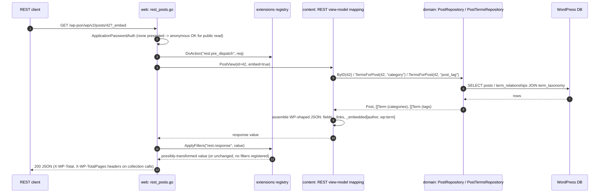
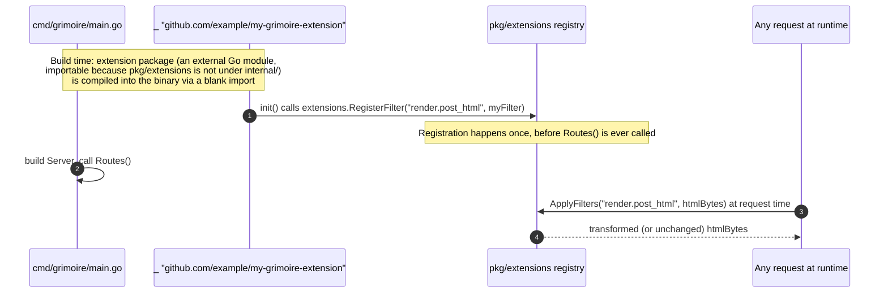

# Design — M5: Extensions & REST API Parity

## Overview

M5 adds two largely independent surfaces on top of M1–M4's content core,
auth/CSRF substrate, and comments/media/menus:

1. **A `/wp-json/wp/v2/*` REST API** — read parity for posts, pages,
   comments, media, and users, plus one write endpoint (comment creation)
   that is a thin REST adapter over the existing M4 `CommentService`.
2. **A native Go extension mechanism** (`pkg/extensions`) — a
   compile-time hook registry (actions + filters) wired into three concrete
   points: post-render, REST request/response, and comment-submit.

The design keeps the layering unchanged:

- `internal/domain` gains: `PostTermsRepository` (new port, for the REST
  `categories`/`tags` fields); `List`/`Count` added to the existing
  `UserRepository` interface (for the `users` collection endpoint);
  `Search`/`OrderBy`/`Order` added to the existing `AdminPostFilter` struct
  (for `posts`/`pages` search/ordering); a new `PostMetaRepository` port (for
  `_thumbnail_id`/`_wp_attachment_metadata` postmeta, backing
  `featured_media`/`media_details`); and six new fields on `domain.Post`
  (`DateGMT`, `Modified`, `ModifiedGMT`, `PingStatus`, `Password`, `GUID`).
  `ApplicationPassword` is modeled as usermeta — no new domain **port**
  beyond reusing the existing `UserMetaRepository`.
- `internal/storage/migrations/{sqlite,mysql,postgres}` gains **one** new
  additive, greenfield-only migration, `0004_rest_post_fields`, adding the
  six `domain.Post` columns above — following the exact M4 `0003`
  column-migration contract (see "Migrations" below). This is the **only**
  schema change in M5.
- `internal/storage/wprepo` gains small adapter files implementing
  `PostTermsRepository` and `PostMetaRepository` as additive `SELECT`s over
  `{prefix}term_relationships`/`{prefix}term_taxonomy` and
  `{prefix}postmeta` respectively, and extends the existing post/user
  adapters with the new filter fields and `List`/`Count` methods — no new
  table anywhere in M5, only the one column migration above.
- `internal/auth` gains an `ApplicationPassword` type, a codec
  (PHP-serialize/unserialize round-trip via the existing `internal/php`
  package, extended to support PHP `null` — see "Application Passwords"
  below) for the `_application_passwords` usermeta value, and a dedicated
  verifier: `$generic$`-prefixed hashes (WordPress 6.8+'s `wp_fast_hash()`)
  are verified with a keyed-BLAKE2b recomputation; anything else falls back
  to the existing `internal/auth/password.Verify` (phpass/`$wp$`/bcrypt, for
  pre-6.8 WordPress-authored Application Passwords).
- `pkg/extensions` is a new, small, dependency-free package — grimoire's
  first `pkg/` directory — holding the hook registry itself, so it is
  importable by external Go modules as well as grimoire-internal code
  (a package under `internal/` cannot be imported outside
  `github.com/roboweaver/grimoire`, Go's own import-visibility rule, which
  is why the registry cannot live at `internal/extensions`). It imports
  nothing from `domain`/`content`/`web` — other packages import
  `extensions`, never the reverse, so the registry has no knowledge of what
  it is hooked into.
- `internal/content` gains a `RESTService` (or a set of thin composition
  functions) that maps existing services (`PostService`, `CommentService`,
  `MediaService`, `UserService`-equivalent reads) into WordPress REST view
  models — the REST layer is a **presentation adapter**, not a new business
  layer; it calls the same services M3/M4 already call.
- `internal/web` gains a `rest/` cluster of handler files
  (`rest_posts.go`, `rest_comments.go`, `rest_media.go`, `rest_users.go`,
  `rest_apppasswords.go`, `rest_router.go`, `rest_envelope.go`) mounted under
  `/wp-json`, reusing the M2 `SessionMiddleware`/`RequireCapability` where
  relevant and adding a new `ApplicationPasswordAuth` middleware.
- `internal/render` and `internal/web/handlers.go` (the `single`/`page`
  handlers) gain one hook invocation each (post-render filter), and
  `internal/content/comments.go` gains one hook invocation (comment-submit
  action) — both **additive single-line call sites**, not restructuring.

Two cross-cutting decisions define the milestone:

1. **REST is a read-mostly adapter, not a new write surface.** Every REST GET
   maps to storage/content-layer capability M1–M4 already built. The **only**
   new write path is `POST /wp-json/wp/v2/comments`, which calls the exact
   same `CommentService.Create` that M4's server-rendered form already calls.
   Every other
   REST write method returns `501 Not Implemented` with an explicit "deferred
   to M6" error body (Req 7.5) rather than a bare `404`/`405`, so a client can
   tell "not built yet" from "does not exist".
2. **Extensions are compiled Go, not loaded PHP.** `pkg/extensions` has
   no filesystem scanning, no dynamic symbol loading, no subprocess/RPC
   boundary. An extension is a Go package that calls
   `extensions.RegisterAction`/`RegisterFilter` from `init()` and is imported
   (usually via a blank `_` import in `cmd/grimoire/main.go` or a build-tag'd
   file) so it is linked into the binary. This keeps the hexagonal
   architecture's compiled-binary, no-runtime-surprises property intact.

## Architecture

### Component view



### Routing and precedence

New routes must sit ahead of the public catch-all and must not collide with
existing `/admin`, `/admin/api`, or `/wp-content/uploads/` paths.



### Sequence — anonymous REST read with `?_embed`



### Sequence — REST comment creation (Application Password vs session+CSRF)

```mermaid
sequenceDiagram
  autonumber
  participant C as REST client
  participant W as web: rest_comments.go
  participant AA as ApplicationPasswordAuth
  participant MW as SessionMiddleware + requireSessionCSRF
  participant CS as content: CommentService (M4, unchanged)
  participant Ext as extensions registry

  C->>W: POST /wp-json/wp/v2/comments (JSON body)
  alt Authorization: Basic present
    W->>AA: verify login:app-password ($generic$/wp_fast_hash, else password.Verify fallback)
    alt verifies
      AA-->>W: Principal (no CSRF required)
    else fails
      AA-->>W: 401 rest_invalid_credentials (always — even if a valid session<br/>cookie is ALSO present on this request; a presented-but-invalid<br/>credential is never silently ignored in favor of session auth, Req 8.6)
    end
  else no Basic auth (Authorization header absent)
    W->>MW: SessionMiddleware (may resolve anonymous or a logged-in principal)
    alt principal present (session cookie)
      W->>MW: requireSessionCSRF (X-CSRF-Token header)
      alt missing/mismatched
        MW-->>W: 403 rest_forbidden
      end
    else anonymous
      Note over W: no CSRF check applies (no session to forge); spam filter + rate limit are the safety net
    end
  end
  W->>W: authorIP := commentClientIP(r) (same helper M4's public form path uses)
  W->>CS: Create(ctx, domain.Comment{PostID, Author, Email, URL, Content, AuthorIP: authorIP})
  CS->>CS: spam filter (uses AuthorIP for per-IP rate limit), moderation-queue default (unchanged M4 logic)
  CS->>Ext: DoAction("comment.submitted", comment, post)
  CS-->>W: created Comment, parent Post (any status, including spam)
  W-->>C: 201 JSON (WP comment shape) or REST error body
```

### Sequence — extension registration (compile-time, not runtime)



## Directory layout

New and touched files (⊕ new, ✎ modified):

```
pkg/
  extensions/
    registry.go            ⊕ Hook registry: RegisterAction/RegisterFilter, DoAction/ApplyFilters
    registry_test.go        ⊕ registration order, error short-circuit, panic recovery (actions AND filters), concurrency
    doc.go                  ⊕ package doc: explicit "not PHP-plugin-compatible" statement; first pkg/ package in the repo
internal/
  domain/
    entities.go            ✎ add Post.{DateGMT,Modified,ModifiedGMT,PingStatus,Password,GUID}
    repository.go          ✎ add PostTermsRepository, PostMetaRepository ports;
                              add List/Count to UserRepository;
                              add Search/OrderBy/Order to AdminPostFilter
  storage/
    migrations/
      sqlite/0004_rest_post_fields.up.sql   ⊕ greenfield-only additive ALTER (Migrations section below)
      mysql/0004_rest_post_fields.up.sql    ⊕ same, MySQL dialect
      postgres/0004_rest_post_fields.up.sql ⊕ same, ADD COLUMN IF NOT EXISTS
    factory.go             ✎ wire PostTerms/PostMeta into Set
    wprepo/
      postterms.go         ⊕ PostTermsRepo (additive SELECT over term_relationships/term_taxonomy)
      postmeta.go          ⊕ PostMetaRepo (additive SELECT over postmeta: _thumbnail_id, _wp_attachment_metadata)
      posts.go             ✎ map new Post fields; implement Search/OrderBy/Order on the existing filter
      users.go             ✎ implement List/Count
    storagetest/
      postterms_contract.go ⊕ runPostTermsContract
      postmeta_contract.go  ⊕ runPostMetaContract
      contract.go           ✎ seed post<->term relationships + postmeta fixtures; call new subcontracts
  auth/
    apppassword.go          ⊕ ApplicationPassword type, php.Serialize/Unserialize codec (extended for PHP null),
                                $generic$/wp_fast_hash verify (keyed BLAKE2b) with password.Verify fallback,
                                create/revoke
    apppassword_test.go     ⊕ round-trip against WP-6.8-authored ($generic$) and pre-6.8 ($wp$) fixtures,
                                plus a new-password $generic$ path
  php/
    serialize.go            ✎ add PHP null (`N;`) support
    unserialize.go          ✎ add PHP null (`N;`) support
  content/
    rest.go                 ⊕ REST view-model mapping (posts/pages/comments/media/users -> WP-shaped structs)
    comments.go             ✎ CommentService.Create fires "comment.submitted" action after persist
  web/
    rest_router.go          ⊕ mounts /wp-json/*, index + namespace-index handlers
    rest_envelope.go        ⊕ WP-shaped {code,message,data:{status}} error writer, _links/_embedded helpers
    rest_posts.go           ⊕ GET posts/pages collection + single
    rest_comments.go        ⊕ GET comments collection + single, POST comments (create)
    rest_media.go           ⊕ GET media collection + single
    rest_users.go           ⊕ GET users collection + single + /users/me/application-passwords (GET/POST/DELETE)
    apppasswordauth.go       ⊕ ApplicationPasswordAuth middleware (HTTP Basic -> Principal)
    handlers.go             ✎ single/page handlers apply "render.post_html" filter before writing response
    router.go               ✎ mount /wp-json/* before the public catch-all
  render/
    engine.go                (unchanged; filter applies to the buffered bytes in handlers.go, not inside Render)
cmd/grimoire/
  main.go                   ✎ wire PostTerms repo, ApplicationPasswordAuth, REST router; document extension blank-import point
```

## API surface

### REST API (`/wp-json`, WordPress error shape `{code,message,data:{status}}`)

| Method | Path | Auth | CSRF | Purpose |
| --- | --- | --- | --- | --- |
| GET | `/wp-json/` | none | — | API index (namespaces, routes) |
| GET | `/wp-json/wp/v2/` | none | — | `wp/v2` namespace index |
| GET | `/wp-json/wp/v2/posts` | none (drafts require capability) | — | Paginated published posts |
| GET | `/wp-json/wp/v2/posts/{id}` | none (drafts require capability) | — | Single post |
| GET | `/wp-json/wp/v2/pages` | none (drafts require capability) | — | Paginated published pages |
| GET | `/wp-json/wp/v2/pages/{id}` | none (drafts require capability) | — | Single page |
| GET | `/wp-json/wp/v2/comments` | none (status filter needs `moderate_comments`) | — | Paginated approved comments |
| GET | `/wp-json/wp/v2/comments/{id}` | none (non-approved needs `moderate_comments`) | — | Single comment |
| POST | `/wp-json/wp/v2/comments` | none, session+CSRF, or Application Password | `X-CSRF-Token` iff session-cookie-authenticated | Create a comment (M4 `CommentService.Create`) |
| GET | `/wp-json/wp/v2/media` | none | — | Paginated attachments |
| GET | `/wp-json/wp/v2/media/{id}` | none | — | Single attachment |
| GET | `/wp-json/wp/v2/users` | none (edit-context fields need capability) | — | Paginated users (view context) |
| GET | `/wp-json/wp/v2/users/{id}` | none (edit-context fields need capability) | — | Single user |
| GET | `/wp-json/wp/v2/users/me/application-passwords` | session cookie | — | List own Application Passwords |
| POST | `/wp-json/wp/v2/users/me/application-passwords` | session cookie | `X-CSRF-Token` | Create Application Password (returns secret once) |
| DELETE | `/wp-json/wp/v2/users/me/application-passwords/{uuid}` | session cookie | `X-CSRF-Token` | Revoke Application Password |
| ANY | `/wp-json/wp/v2/{posts,pages,media,users}/*` write methods | — | — | `501 Not Implemented`, deferred-to-M6 body |
| PUT/PATCH/DELETE | `/wp-json/wp/v2/comments/{id}` | — | — | `501 Not Implemented`, deferred-to-M6 body (moderation via REST is out of scope; use `/admin/api`) |

Status codes: `404`→`rest_post_invalid_id`/`rest_comment_invalid_id`/etc.,
`403`→`rest_forbidden`, `401`→`rest_not_logged_in` /
`rest_invalid_credentials`, unknown route→`404 rest_no_route`, unsupported
method on a known route→`405`, `501`→`rest_not_implemented` (M5-specific,
deferred-write marker), else `500 rest_internal_error`. Dates formatted
`2006-01-02T15:04:05` (naive, matching WordPress's `date`/`date_gmt` fields,
which are not timezone-suffixed).

The `users` `501` catch-all above applies **only** to
`/wp-json/wp/v2/users` and `/wp-json/wp/v2/users/{id}` write methods; it does
**not** shadow `/wp-json/wp/v2/users/me/application-passwords*`, which is a
distinct, more-specific route matched first by the router and fully
implemented in this milestone (Req 9). Route registration order (specific
before catch-all) is what guarantees this, the same pattern M3/M4 already
use for nested admin routes.

The existing `/admin/api/*` envelope (`{error:{code,message}}`) is
**unchanged** — REST and admin-API errors are intentionally different shapes,
matching their different client audiences (WP REST tooling vs. the grimoire
Spectrum SPA).

## New additive domain entities

```go
// internal/domain/entities.go — extended, not new: six fields added to the
// existing Post struct to back the REST-only fields in Req 2.2. A greenfield
// database backs them via the new 0004 migration (Migrations section
// below); an overlaid WordPress database already has them populated.
type Post struct {
	// ... existing fields (ID, Author, Date, Content, Title, Excerpt,
	// Status, Slug, Type, CommentStatus, ...) unchanged ...

	DateGMT      time.Time // post_date_gmt
	Modified     time.Time // post_modified
	ModifiedGMT  time.Time // post_modified_gmt
	PingStatus   string    // ping_status ("open" | "closed")
	Password     string    // post_password (empty = not password-protected)
	GUID         string    // guid
}
```

```go
// PostTerm is a minimal (term_id, taxonomy) pair — just enough to populate
// the REST categories/tags fields without a full Term fetch per relation.
type PostTerm struct {
	TermID   int64
	Taxonomy string // "category" | "post_tag"
}
```

```go
// internal/auth/apppassword.go

// ApplicationPassword is one revocable, named REST credential for a user.
// It is never a domain.Entity: it is stored as an opaque usermeta value
// (meta_key "_application_passwords"), matching WordPress's own storage
// location and PHP-serialized-array structure so an application password
// created by real WordPress verifies unchanged on an overlaid database.
type ApplicationPassword struct {
	UUID   string
	AppID  string // app_id: an opaque application identifier, WP's own field
	Name   string
	Hash   string // "$generic$..." (wp_fast_hash, grimoire-issued and WP 6.8+)
	        // or phpass/"$wp$" (WP-authored, pre-6.8)
	Created  time.Time
	LastUsed *time.Time // nil until first use (PHP `null` before use)
	LastIP   *string    // nil until first use (PHP `null` before use)
}
```

## New additive ports

```go
// PostTermsRepository resolves the category/tag term IDs attached to a post,
// via the existing {prefix}term_relationships / {prefix}term_taxonomy
// tables. Pure read; introduces no schema change.
type PostTermsRepository interface {
	// TermsForPost returns the term IDs related to postID under the given
	// taxonomy ("category" or "post_tag"), ORDERed BY the related term's
	// name ascending — matching WordPress's own default term ordering —
	// so results are deterministic and identical across MySQL, PostgreSQL,
	// and SQLite (Req 14.3), unlike an unordered JOIN whose row order is
	// vendor- and plan-dependent.
	TermsForPost(ctx context.Context, postID int64, taxonomy string) ([]int64, error)
}

// PostMetaRepository resolves specific, well-known postmeta values needed
// for REST fields that have no dedicated column — a pure read over the
// existing {prefix}postmeta table (no schema change), scoped to only the
// keys M5 actually needs rather than a general-purpose meta API.
type PostMetaRepository interface {
	// FeaturedMediaID returns the _thumbnail_id postmeta value for postID
	// (the REST featured_media field), or 0 if unset.
	FeaturedMediaID(ctx context.Context, postID int64) (int64, error)
	// AttachmentMetadata returns the raw _wp_attachment_metadata postmeta
	// value for an attachment postID (the REST media_details field's
	// source), or "" if unset — parsed into media_details.width/height by
	// the REST view-model mapping in internal/content/rest.go.
	AttachmentMetadata(ctx context.Context, postID int64) (string, error)
}
```

`PostTermsRepo`/`PostMetaRepo` follow the existing `wprepo` pattern:
`NewPostTermsRepo`/`NewPostMetaRepo(db *bun.DB, prefix string)`, a raw
JOIN/`SELECT` wrapped in `rebind.Rebind(vendorOf(db), q)`, and compile-time
assertions `var _ domain.PostTermsRepository = (*PostTermsRepo)(nil)` /
`var _ domain.PostMetaRepository = (*PostMetaRepo)(nil)`.

```go
// internal/domain/repository.go — extended, not new interfaces.

// UserRepository gains List/Count to back the REST users collection
// endpoint's pagination (Req 5.4); both are additive SELECTs/COUNTs over
// the existing {prefix}users table.
type UserRepository interface {
	// ... existing methods (ByLogin, ByID, Create, UpdatePass) unchanged ...
	List(ctx context.Context, limit, offset int) ([]User, error)
	Count(ctx context.Context) (int64, error)
}

// AdminPostFilter gains Search/OrderBy/Order to back the REST
// posts/pages collection endpoints' search/orderby/order query parameters
// (Req 2.3); all three are additive filter fields on the existing struct,
// requiring no schema change.
type AdminPostFilter struct {
	Types     []string
	Statuses  []string
	Limit     int
	Offset    int
	Search    string // matched against post_title/post_content, WP's own scope
	OrderBy   string // "date" | "id" (Req 2.3)
	Order     string // "asc" | "desc"
}
```

### `pkg/extensions` API

```go
// pkg/extensions/registry.go

// ActionFunc is a side-effecting hook callback. Payload is hook-specific
// (documented per hook name); callbacks must not assume a concrete type
// beyond what the firing call site's doc comment promises.
type ActionFunc func(ctx context.Context, payload any)

// FilterFunc transforms a value of type T, returning the (possibly
// unchanged) value or an error that short-circuits the remaining chain.
type FilterFunc[T any] func(ctx context.Context, value T) (T, error)

// RegisterAction registers fn to run (in registration order, alongside any
// other registered actions) whenever hook fires via DoAction. Intended to be
// called from an extension's package-level init().
func RegisterAction(hook string, fn ActionFunc)

// RegisterFilter registers fn into the chain for hook. Intended to be called
// from an extension's package-level init(). T must match the type used at
// the corresponding ApplyFilters call site (enforced via a type-asserting
// internal wrapper since the registry itself is stored untyped per hook
// name).
func RegisterFilter[T any](hook string, fn FilterFunc[T])

// DoAction invokes every action registered for hook, in registration order.
// A panicking callback is recovered and logged (with the hook name) so it
// cannot crash the caller; DoAction never returns an error.
func DoAction(ctx context.Context, hook string, payload any)

// ApplyFilters runs value through every filter registered for hook, in
// registration order, each filter's output feeding the next filter's input.
// A filter returning an error stops the chain immediately and ApplyFilters
// returns that error (and the pre-error value is discarded by the caller).
// A panicking filter callback is recovered the same way DoAction recovers a
// panicking action (Req 10.5): the chain short-circuits, the pre-panic value
// is returned alongside a non-nil error, and the panic is logged with the
// hook name — a broken filter can never crash the request or the process.
func ApplyFilters[T any](ctx context.Context, hook string, value T) (T, error)
```

Defined hook names (documented as constants in `registry.go` alongside their
payload/value type):

| Hook | Kind | Payload / value type | Fired from |
| --- | --- | --- | --- |
| `render.post_html` | Filter | `[]byte` (rendered HTML) | `web/handlers.go` `renderHTML`, single/page paths only |
| `rest.pre_dispatch` | Action | `*RESTRequestContext` (method, path, resolved principal) | `web/rest_router.go`, after auth resolves, before the route handler |
| `rest.response` | Filter | `any` (the assembled JSON-serializable value) | `web/rest_router.go`, after the handler returns, before marshal+write |
| `comment.submitted` | Action | `CommentSubmittedPayload{Comment domain.Comment; Post domain.Post}` | `content/comments.go` `CommentService.Create`, after successful persist |

## Configuration

```go
// internal/config/config.go — one new section, following the exact
// operator-declared-trust pattern SessionConfig.CookieSecure already
// establishes (grimoire cannot itself detect TLS terminated by a reverse
// proxy in front of it, so this is a declared setting, not an auto-detected
// one).
type RESTConfig struct {
	// RequireTLSForApplicationPasswords rejects an Authorization: Basic
	// Application-Password credential presented over a connection that is
	// neither TLS (r.TLS != nil) nor addressed to a loopback host, before
	// attempting verification (Req 8.9). Default true, matching real
	// WordPress's own refusal to accept Application Passwords over a
	// non-https, non-local request.
	RequireTLSForApplicationPasswords bool `yaml:"require_tls_for_application_passwords"`
	// TrustedProxyHeader, if set (e.g. "X-Forwarded-Proto"), is honored as
	// an additional TLS signal — an operator-declared trust boundary for
	// deployments behind a TLS-terminating reverse proxy, same posture as
	// CookieSecure.
	TrustedProxyHeader string `yaml:"trusted_proxy_header"`
	// PerPageMax caps the REST `per_page` query parameter (Req 2.3).
	// Default 100, matching WordPress's own ceiling.
	PerPageMax int `yaml:"per_page_max"`
}
```

Application Password hashing itself (bcrypt cost, etc.) needs no new
configuration: `$generic$`/`wp_fast_hash` verification uses a fixed,
WordPress-core-literal key (not a per-site secret, see "Application
Passwords" below), and the phpass/`$wp$` fallback path reuses the existing
`internal/auth/password` constants. Extensions are wired at compile time via
blank imports (documented in `cmd/grimoire/main.go`), not configuration.

## Migrations

M5 adds **one** new additive migration, `0004_rest_post_fields`, following
the exact greenfield-only, additive-`ALTER TABLE` contract M4's `0003`
established: it adds six columns to `{prefix}posts` —
`post_date_gmt`/`post_modified`/`post_modified_gmt` (matching `post_date`'s
own `1970-01-01 00:00:00` default), `ping_status` (default `'open'`,
matching `comment_status`'s pattern), `post_password` (default `''`), and
`guid` (default `''`) — needed to back the REST-only
`date_gmt`/`modified`/`modified_gmt`/`ping_status`/`content.protected`/
`guid.rendered` fields (Req 2.2). A **greenfield** grimoire database never
populated these columns because nothing before M5 read them; an **overlaid,
populated WordPress database already has every one of these columns** (real
WordPress has written them since its earliest schema), so the migration is
a pure no-op there — Postgres's dialect uses `ADD COLUMN IF NOT EXISTS`
(safe to re-run against a populated database); MySQL/SQLite use plain `ADD
COLUMN` under the same "runs only against grimoire-provisioned schemas"
contract M4's `0003` already documents in its own file header, since neither
dialect supports `IF NOT EXISTS` on `ADD COLUMN`.

Every other M5 storage need is satisfiable by tables M1–M4 already created:
`{prefix}term_relationships`/`{prefix}term_taxonomy` (post→term IDs),
`{prefix}postmeta` (`_thumbnail_id`/`_wp_attachment_metadata`),
`{prefix}users` (the new `List`/`Count` methods), and `{prefix}usermeta`
(Application Passwords, via the existing `UserMetaRepository.Set`/`Get` —
the same table M2 already migrates). This is the M2/M4 additive contract
taken to its logical conclusion: **one** small column migration where a
genuine gap exists, **zero** additional SQL everywhere else.

## Security

- **Application Password hashing.** New Application Passwords (grimoire- or
  WordPress-6.8+-issued) are hashed with `wp_fast_hash()`: a keyed BLAKE2b
  hash (`sodium_crypto_generichash(secret, "wp_fast_hash_6.8+", 30)`,
  base64url-no-pad encoded, prefixed `$generic$`) — the exact algorithm real
  WordPress 6.8+ uses for this specific purpose (distinct from
  `wp_hash_password()`, which is reserved for login passwords). Critically,
  its key is the **fixed literal string** `"wp_fast_hash_6.8+"` baked into
  WordPress core — not a per-site secret derived from `wp-config.php` — so
  grimoire reproduces it deterministically with no additional
  configuration or imported secret material. Verification: a
  `$generic$`-prefixed stored hash is checked by recomputing `wp_fast_hash`
  over the presented secret and comparing in constant time
  (`crypto/subtle.ConstantTimeCompare`), matching WordPress's own
  `wp_verify_fast_hash()`; any other stored hash falls back to the existing
  layered `internal/auth/password.Verify` (phpass/`$wp$`/bcrypt), covering
  Application Passwords created by WordPress installs older than 6.8 (which
  hashed them the same way as login passwords). This means an Application
  Password already present in an **overlaid, populated WordPress database**
  verifies correctly regardless of which WordPress version created it,
  without any migration or imported secret.
- **Transport security for Application Passwords.** Because a presented
  Application Password is a long-lived bearer credential sent on every
  request (unlike a session cookie, which is short-lived and
  `HttpOnly`/`SameSite`-scoped), `ApplicationPasswordAuth` rejects a
  `Authorization: Basic` credential outright, with `401` before attempting
  verification, when the connection is neither TLS nor addressed to a
  loopback host — configurable via `RESTConfig.RequireTLSForApplicationPasswords`
  (default `true`), matching real WordPress's own refusal to accept
  Application Passwords over a non-`https`, non-local request (Req 8.9).
- **Invalid Basic credentials are never silently ignored.** A presented
  `Authorization: Basic` pair that fails verification (Req 8.4) always
  yields `401 rest_invalid_credentials`, on every endpoint, even one that
  would otherwise be reachable anonymously, and even when the same request
  also carries a valid session cookie — grimoire never falls back to
  session auth after rejecting a presented credential (Req 8.6). This is a
  single rule stated once here and referenced (not restated differently) by
  the requirements and the comment-creation sequence diagram above.
- **Application Password auth is not CSRF-scoped.** Basic-auth requests carry
  no ambient browser credential, so there is nothing for a CSRF attack to
  ride on; the M4 `X-CSRF-Token` contract therefore applies **only** when a
  request is authenticated via the M2 session cookie (the REST comment-create
  endpoint and the Application-Password self-service endpoints), matching
  WordPress's own model.
- **No secret ever round-trips.** An Application Password's plaintext secret
  is returned exactly once, in the creation response, and is never logged,
  never included in a list/read response, and never recoverable from its
  stored hash.
- **Extension isolation.** `DoAction` recovers a panicking action callback,
  and `ApplyFilters` likewise recovers a panicking filter callback (Req
  10.5), so one broken extension cannot take down a request or the process;
  `ApplyFilters` also propagates a filter's returned **error** (as opposed to
  a panic) rather than silently continuing with a stale/partial value, so a
  broken filter fails loudly (an observable `500`) instead of corrupting
  output silently.
- **No dynamic code loading.** `pkg/extensions` never reads a plugin
  file from disk, never `dlopen`s a shared object, and never shells out to
  an interpreter. Every registered callback is Go code that was compiled into
  the running binary — the attack surface a PHP plugin runtime would open
  (arbitrary uploaded/dropped-in code execution) does not exist in M5.
- **REST error hygiene.** The `wp-json` error envelope never includes SQL
  text, driver errors, filesystem paths, or any secret (password hash,
  Application Password hash, session/CSRF token) — mirroring the M3/M4
  admin-API contract, just in the WordPress REST shape.
- **Comment-create via REST reuses M4's abuse posture unchanged.** Spam
  filtering, per-IP rate limiting (via `AuthorIP`, populated by the REST
  adapter the same way M4's server-rendered form populates it), and the
  moderation-queue default are identical whether the write arrives via the
  server-rendered form or the REST endpoint — M5 does not introduce a
  second, weaker comment-creation code path.

## Testing strategy

- **`pkg/extensions` unit tests.** Registration order for both actions
  and filters; a filter error short-circuits the chain and the pre-error
  value is not observed by later filters or the caller; a panicking action
  **and** a panicking filter are each recovered and logged, and neither
  stops other registered actions/filters from running; concurrent
  `DoAction`/`ApplyFilters` calls against a fixed registered set are
  race-free (`go test -race`).
- **Migration tests.** The new `0004_rest_post_fields` migration is exercised
  by the existing per-vendor migration test harness (SQLite unconditionally,
  MySQL/Postgres when their DSNs are set): applying it to a fresh
  `0001`-`0003`'d schema adds the six columns with the documented defaults;
  applying it a second time (Postgres) or to a schema that already has the
  columns (simulating an overlaid WordPress database) is a no-op/error-free.
- **`internal/php` codec tests.** `Serialize`/`Unserialize` round-trip a PHP
  `null` value (`N;`) both standalone and nested inside a serialized array
  (matching a real `_application_passwords` entry's `last_used`/`last_ip`
  before first use), alongside the existing bool/int/string/array cases.
- **Contract tests (`storagetest`).** A new `runPostTermsContract` seeds a
  post related to two categories and one tag via `term_relationships` (with
  term names chosen so alphabetical order differs from insertion order) and
  asserts `TermsForPost` returns the right IDs for each taxonomy in
  name-ascending order (Req 14.2), on SQLite unconditionally and
  MySQL/Postgres when their DSNs are set. A new `runPostMetaContract` seeds
  `_thumbnail_id`/`_wp_attachment_metadata` postmeta rows and asserts
  `FeaturedMediaID`/`AttachmentMetadata` read them back, including the unset
  (zero-value) case. The existing post/user contract suites are extended to
  cover `Search`/`OrderBy`/`Order` and `List`/`Count` respectively.
- **`internal/auth/apppassword_test.go`.** Round-trips a grimoire-created
  Application Password (create → `$generic$`/`wp_fast_hash` → PHP-serialize
  → store via a fake `UserMetaRepository` → unserialize → verify with the
  plaintext secret, including the `last_used`/`last_ip` PHP-`null`-before-use
  case); separately, two **fixtures** verify via the same code path with no
  format-specific branching in the caller: a value shaped exactly like a
  real WordPress-**6.8+**-authored entry (`$generic$` hash) and one shaped
  like a **pre-6.8** WordPress-authored entry (phpass/`$wp$` hash); a wrong
  secret fails to verify against both fixtures; `last_used`/`last_ip` update
  from `nil` to a real value after a successful verify; a revoked (removed)
  UUID no longer verifies.
- **Transport-security tests.** An Application-Password-authenticated request
  over a plain (non-TLS, non-loopback) connection is rejected with `401`
  before verification is attempted, when `RequireTLSForApplicationPasswords`
  is at its default (`true`); the same request succeeds when the connection
  is TLS, is loopback, or the setting is explicitly disabled.
- **REST handler tests (`httptest`).** Each collection/single endpoint:
  response shape (WP field names, `_links`, `X-WP-Total`/`X-WP-TotalPages`),
  `?_embed` producing `_embedded`, `404` for a missing/unpublished id
  (`400`/status-gated visibility for drafts), pagination params, and the
  `wp-json` error envelope shape (never the admin `{error:{...}}` shape).
  Comment creation: anonymous accepted (with `AuthorIP` populated and the
  spam filter's per-IP rate limit observably enforced), session+CSRF
  enforced when cookie-authenticated (missing/mismatched → `403`),
  Application-Password path skips the CSRF check, closed/missing post →
  `403`/`404`, spam outcome quarantines as `spam` (same assertions as M4's
  existing comment tests, exercised through the REST path too). An invalid
  `Authorization: Basic` credential always returns `401`, including when a
  valid session cookie is also present on the same request (Req 8.6).
  Application-Password self-service endpoints: list never includes the
  hash/secret; create returns the secret exactly once; delete revokes
  (subsequent auth with the old secret fails); all three require
  session-cookie auth (an Application-Password-authenticated request to
  these endpoints is rejected). `GET /users/me` returns the edit-context
  record for the authenticated user. Deferred writes (`POST`/`PUT`/`DELETE`
  on posts/pages/media/users, `PUT`/`PATCH`/`DELETE` on comments/{id}) return
  `501` with the deferred-to-M6 body, never a bare `404`/`405`; the
  `/users/me/application-passwords*` routes are unaffected by the `users`
  `501` catch-all.
- **Extension-point integration tests.** A test extension registered against
  `render.post_html` observably changes the rendered HTML of a public page
  request; a test extension registered against `rest.response` observably
  changes a REST JSON response body; a test action registered against
  `comment.submitted` observably fires (exactly once, with the right
  `Comment`/`Post`) after a REST **and** a server-rendered form comment
  submission each succeed; with **no** extension registered, all three code
  paths behave byte-for-byte as they did before M5 (regression guard against
  the hook points becoming required participants).
- **Overlay safety.** REST reads, REST comment creation, and Application
  Password verification are exercised against a database seeded to look like
  an existing WordPress export (which already has every M5-referenced
  column, including the six added by `0004` for a greenfield schema);
  optionally env-gated against a real WP DB like M2.1.
- **Frontend.** None — M5 adds no Spectrum admin UI (Application Password
  self-service is REST-only in M5; an admin UI for managing them, if wanted,
  is a candidate for a later milestone alongside other user-management UI).

## Requirements traceability

| Requirement | Design elements |
| --- | --- |
| 1 Discovery/routing | `rest_router.go` index handlers, routing precedence diagram |
| 2 Posts/pages read | `rest_posts.go`, `content/rest.go`, `AdminPostRepository` (extended: `Search`/`OrderBy`/`Order`), `PostMetaRepository`, 0004 migration |
| 3 Comments read | `rest_comments.go` GET, existing `CommentRepository` |
| 4 Media read | `rest_media.go`, existing `MediaRepository`, `PostMetaRepository` (`media_details`) |
| 5 Users read | `rest_users.go`, `UserRepository` (extended: `List`/`Count`), `UserMetaRepository`, view/edit context, `/users/me` |
| 6 Pagination/links/embedding | `rest_envelope.go` `_links`/`_embedded` + header helpers, absolute-URL construction |
| 7 Comment creation via REST | `rest_comments.go` POST, unchanged `CommentService.Create`, `AuthorIP` population, `501` deferred-write bodies |
| 8 Application Password storage/verify | `auth/apppassword.go` (`$generic$`/`wp_fast_hash` + `password.Verify` fallback), `internal/php` codec (+ null support), TLS gate |
| 9 Application Password self-service | `rest_users.go` `/users/me/application-passwords` endpoints |
| 10 Hook registry | `pkg/extensions/registry.go` |
| 11 Concrete extension points | `render.post_html` in `handlers.go`, `rest.pre_dispatch`/`rest.response` in `rest_router.go`, `comment.submitted` in `content/comments.go` |
| 12 Extensibility boundary (non-goals) | `pkg/extensions/doc.go`, this design's Overview + Security sections |
| 13 REST error handling | `rest_envelope.go` WP-shaped error writer |
| 14 Vendor-agnostic/overlay | `PostTermsRepository`/`PostMetaRepository` + `wprepo/postterms.go`/`postmeta.go`, the `0004` migration, contract suite |

## Implementation deviations

_None yet — this milestone is spec-only; deviations will be recorded here
once implementation begins._
