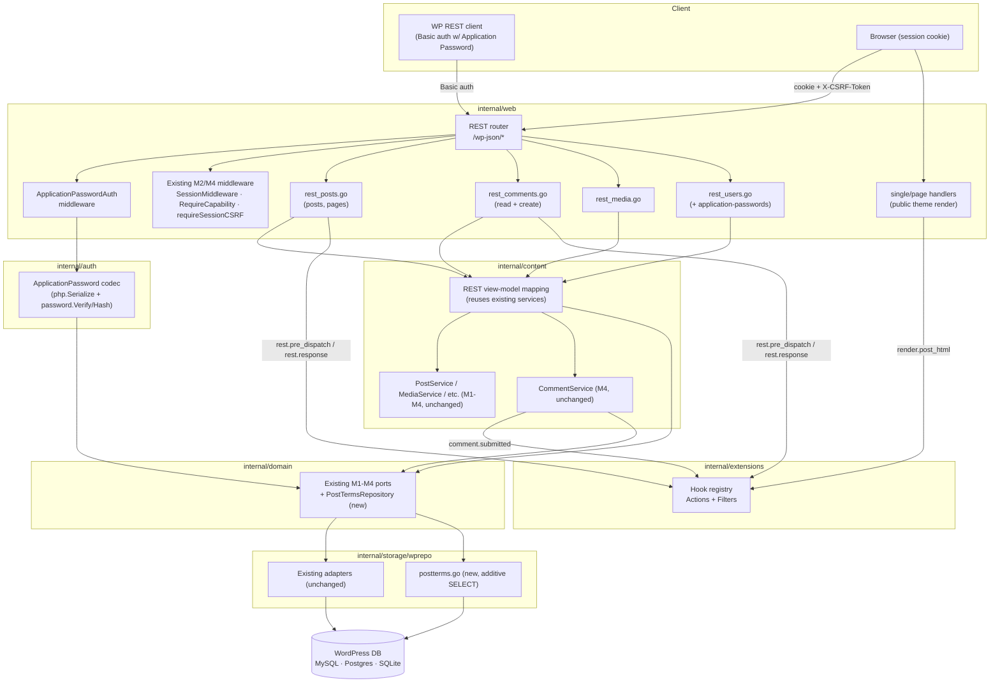
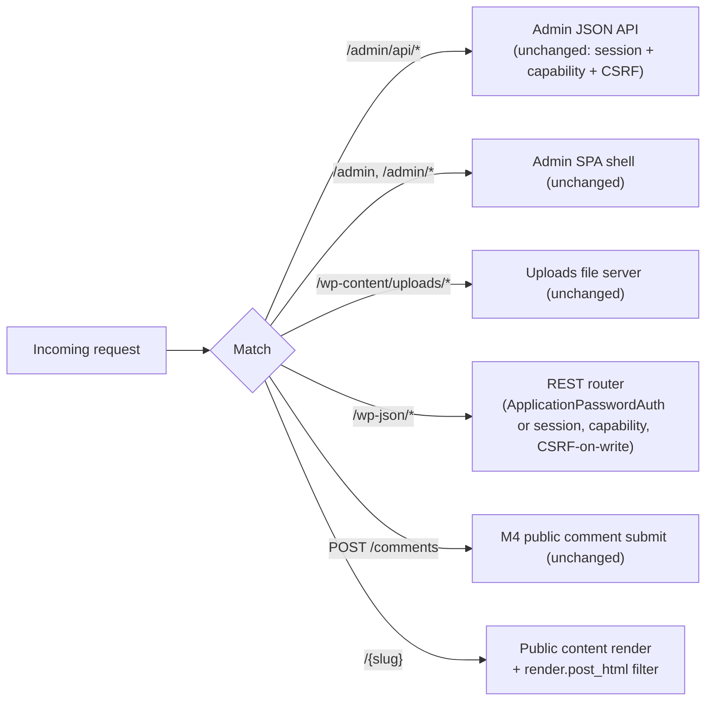
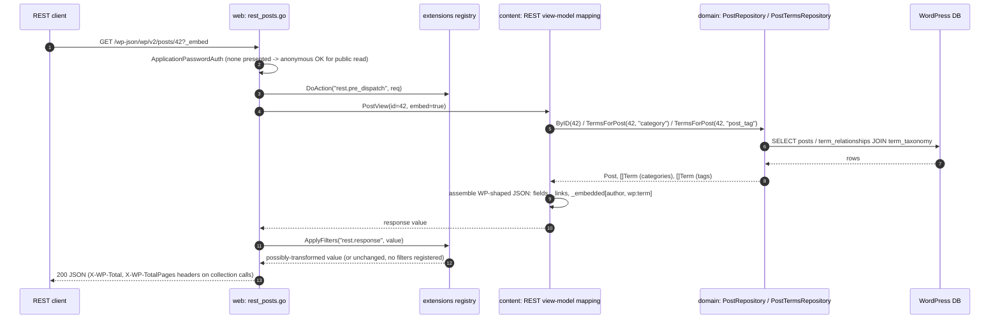
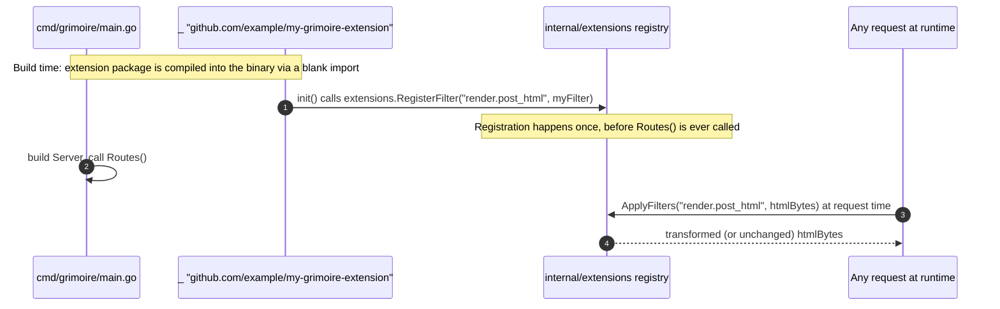

# Design — M5: Extensions & REST API Parity

## Overview

M5 adds two largely independent surfaces on top of M1–M4's content core,
auth/CSRF substrate, and comments/media/menus:

1. **A `/wp-json/wp/v2/*` REST API** — read parity for posts, pages,
   comments, media, and users, plus one write endpoint (comment creation)
   that is a thin REST adapter over the existing M4 `CommentService`.
2. **A native Go extension mechanism** (`internal/extensions`) — a
   compile-time hook registry (actions + filters) wired into three concrete
   points: post-render, REST request/response, and comment-submit.

The design keeps the layering unchanged:

- `internal/domain` gains one new read port (`PostTermsRepository`, for the
  REST `categories`/`tags` fields) and one new entity-adjacent concept
  (`ApplicationPassword`, modeled as usermeta — no new domain **port** beyond
  reusing the existing `UserMetaRepository`).
- `internal/storage/wprepo` gains a single small adapter file
  (`postterms.go`) implementing `PostTermsRepository` as an additive `SELECT`
  over `{prefix}term_relationships`/`{prefix}term_taxonomy`; **no migration,
  no new table** anywhere in M5.
- `internal/auth` gains an `ApplicationPassword` type, a codec
  (PHP-serialize/unserialize round-trip via the existing `internal/php`
  package) for the `_application_passwords` usermeta value, and verification
  reusing the existing `internal/auth/password.Verify`/`Hash`.
- `internal/extensions` is a new, small, dependency-free package: the hook
  registry itself. It imports nothing from `domain`/`content`/`web` — other
  packages import `extensions`, never the reverse, so the registry has no
  knowledge of what it is hooked into.
- `internal/content` gains a `RESTService` (or a set of thin composition
  functions) that maps existing services (`PostService`, `CommentService`,
  `MediaService`, `UserService`-equivalent reads) into WordPress REST view
  models — the REST layer is a **presentation adapter**, not a new business
  layer; it calls the same services M3/M4 already call.
- `internal/web` gains a `rest/` cluster of handler files
  (`rest_posts.go`, `rest_comments.go`, `rest_media.go`, `rest_users.go`,
  `rest_apppasswords.go`, `rest_router.go`, `rest_envelope.go`) mounted under
  `/wp-json`, reusing the M2 `SessionMiddleware`/`RequireCapability` where
  relevant and adding a new `ApplicationPasswordAuth` middleware.
- `internal/render` and `internal/web/handlers.go` (the `single`/`page`
  handlers) gain one hook invocation each (post-render filter), and
  `internal/content/comments.go` gains one hook invocation (comment-submit
  action) — both **additive single-line call sites**, not restructuring.

Two cross-cutting decisions define the milestone:

1. **REST is a read-mostly adapter, not a new write surface.** Every REST GET
   maps to storage/content-layer capability M1–M4 already built. The **only**
   new write path is `POST /wp-json/wp/v2/comments`, which calls the exact
   same `CommentService.Create` that M4's server-rendered form already calls.
   Every other
   REST write method returns `501 Not Implemented` with an explicit "deferred
   to M6" error body (Req 7.5) rather than a bare `404`/`405`, so a client can
   tell "not built yet" from "does not exist".
2. **Extensions are compiled Go, not loaded PHP.** `internal/extensions` has
   no filesystem scanning, no dynamic symbol loading, no subprocess/RPC
   boundary. An extension is a Go package that calls
   `extensions.RegisterAction`/`RegisterFilter` from `init()` and is imported
   (usually via a blank `_` import in `cmd/grimoire/main.go` or a build-tag'd
   file) so it is linked into the binary. This keeps the hexagonal
   architecture's compiled-binary, no-runtime-surprises property intact.

## Architecture

### Component view



### Routing and precedence

New routes must sit ahead of the public catch-all and must not collide with
existing `/admin`, `/admin/api`, or `/wp-content/uploads/` paths.



### Sequence — anonymous REST read with `?_embed`



### Sequence — REST comment creation (Application Password vs session+CSRF)

```mermaid
sequenceDiagram
  autonumber
  participant C as REST client
  participant W as web: rest_comments.go
  participant AA as ApplicationPasswordAuth
  participant MW as SessionMiddleware + requireSessionCSRF
  participant CS as content: CommentService (M4, unchanged)
  participant Ext as extensions registry

  C->>W: POST /wp-json/wp/v2/comments (JSON body)
  alt Authorization: Basic present
    W->>AA: verify login:app-password (internal/auth/password.Verify)
    alt verifies
      AA-->>W: Principal (no CSRF required)
    else fails
      AA-->>W: 401 rest_invalid_credentials
    end
  else no Basic auth
    W->>MW: SessionMiddleware (may resolve anonymous or a logged-in principal)
    alt principal present (session cookie)
      W->>MW: requireSessionCSRF (X-CSRF-Token header)
      alt missing/mismatched
        MW-->>W: 403 rest_forbidden
      end
    else anonymous
      Note over W: no CSRF check applies (no session to forge); spam filter + rate limit are the safety net
    end
  end
  W->>CS: Submit(postID, author, email, url, content, authorIP)
  CS->>CS: spam filter, moderation-queue default (unchanged M4 logic)
  CS->>Ext: DoAction("comment.submitted", comment, post)
  CS-->>W: created Comment (any status, including spam)
  W-->>C: 201 JSON (WP comment shape) or REST error body
```

### Sequence — extension registration (compile-time, not runtime)



## Directory layout

New and touched files (⊕ new, ✎ modified):

```
internal/
  extensions/
    registry.go            ⊕ Hook registry: RegisterAction/RegisterFilter, DoAction/ApplyFilters
    registry_test.go        ⊕ registration order, error short-circuit, panic recovery, concurrency
    doc.go                  ⊕ package doc: explicit "not PHP-plugin-compatible" statement
  domain/
    repository.go          ✎ add PostTermsRepository port
  storage/
    factory.go             ✎ wire PostTerms into Set
    wprepo/
      postterms.go         ⊕ PostTermsRepo (additive SELECT over term_relationships/term_taxonomy)
    storagetest/
      postterms_contract.go ⊕ runPostTermsContract
      contract.go           ✎ seed post<->term relationships fixture; call new subcontract
  auth/
    apppassword.go          ⊕ ApplicationPassword type, php.Serialize/Unserialize codec, verify/create/revoke
    apppassword_test.go     ⊕ round-trip against a WP-authored _application_passwords fixture + new-password bcrypt path
  content/
    rest.go                 ⊕ REST view-model mapping (posts/pages/comments/media/users -> WP-shaped structs)
    comments.go             ✎ CommentService.Create fires "comment.submitted" action after persist
  web/
    rest_router.go          ⊕ mounts /wp-json/*, index + namespace-index handlers
    rest_envelope.go        ⊕ WP-shaped {code,message,data:{status}} error writer, _links/_embedded helpers
    rest_posts.go           ⊕ GET posts/pages collection + single
    rest_comments.go        ⊕ GET comments collection + single, POST comments (create)
    rest_media.go           ⊕ GET media collection + single
    rest_users.go           ⊕ GET users collection + single + /users/me/application-passwords (GET/POST/DELETE)
    apppasswordauth.go       ⊕ ApplicationPasswordAuth middleware (HTTP Basic -> Principal)
    handlers.go             ✎ single/page handlers apply "render.post_html" filter before writing response
    router.go               ✎ mount /wp-json/* before the public catch-all
  render/
    engine.go                (unchanged; filter applies to the buffered bytes in handlers.go, not inside Render)
cmd/grimoire/
  main.go                   ✎ wire PostTerms repo, ApplicationPasswordAuth, REST router; document extension blank-import point
```

## API surface

### REST API (`/wp-json`, WordPress error shape `{code,message,data:{status}}`)

| Method | Path | Auth | CSRF | Purpose |
| --- | --- | --- | --- | --- |
| GET | `/wp-json/` | none | — | API index (namespaces, routes) |
| GET | `/wp-json/wp/v2/` | none | — | `wp/v2` namespace index |
| GET | `/wp-json/wp/v2/posts` | none (drafts require capability) | — | Paginated published posts |
| GET | `/wp-json/wp/v2/posts/{id}` | none (drafts require capability) | — | Single post |
| GET | `/wp-json/wp/v2/pages` | none (drafts require capability) | — | Paginated published pages |
| GET | `/wp-json/wp/v2/pages/{id}` | none (drafts require capability) | — | Single page |
| GET | `/wp-json/wp/v2/comments` | none (status filter needs `moderate_comments`) | — | Paginated approved comments |
| GET | `/wp-json/wp/v2/comments/{id}` | none (non-approved needs `moderate_comments`) | — | Single comment |
| POST | `/wp-json/wp/v2/comments` | none, session+CSRF, or Application Password | `X-CSRF-Token` iff session-cookie-authenticated | Create a comment (M4 `CommentService.Create`) |
| GET | `/wp-json/wp/v2/media` | none | — | Paginated attachments |
| GET | `/wp-json/wp/v2/media/{id}` | none | — | Single attachment |
| GET | `/wp-json/wp/v2/users` | none (edit-context fields need capability) | — | Paginated users (view context) |
| GET | `/wp-json/wp/v2/users/{id}` | none (edit-context fields need capability) | — | Single user |
| GET | `/wp-json/wp/v2/users/me/application-passwords` | session cookie | — | List own Application Passwords |
| POST | `/wp-json/wp/v2/users/me/application-passwords` | session cookie | `X-CSRF-Token` | Create Application Password (returns secret once) |
| DELETE | `/wp-json/wp/v2/users/me/application-passwords/{uuid}` | session cookie | `X-CSRF-Token` | Revoke Application Password |
| ANY | `/wp-json/wp/v2/{posts,pages,media}/*` write methods | — | — | `501 Not Implemented`, deferred-to-M6 body |

Status codes: `404`→`rest_post_invalid_id`/`rest_comment_invalid_id`/etc.,
`403`→`rest_forbidden`, `401`→`rest_not_logged_in` /
`rest_invalid_credentials`, unknown route→`404 rest_no_route`, unsupported
method on a known route→`405`, `501`→`rest_not_implemented` (M5-specific,
deferred-write marker), else `500 rest_internal_error`. Dates formatted
`2006-01-02T15:04:05` (naive, matching WordPress's `date`/`date_gmt` fields,
which are not timezone-suffixed).

The existing `/admin/api/*` envelope (`{error:{code,message}}`) is
**unchanged** — REST and admin-API errors are intentionally different shapes,
matching their different client audiences (WP REST tooling vs. the grimoire
Spectrum SPA).

## New additive domain entities

```go
// (No new domain.Entity struct for Application Passwords — they are modeled
// entirely within internal/auth as a usermeta-backed value type, since they
// are an auth concern, not core WordPress content. See internal/auth/apppassword.go.)
```

```go
// PostTerm is a minimal (term_id, taxonomy) pair — just enough to populate
// the REST categories/tags fields without a full Term fetch per relation.
type PostTerm struct {
	TermID   int64
	Taxonomy string // "category" | "post_tag"
}
```

```go
// internal/auth/apppassword.go

// ApplicationPassword is one revocable, named REST credential for a user.
// It is never a domain.Entity: it is stored as an opaque usermeta value
// (meta_key "_application_passwords"), matching WordPress's own storage
// location and PHP-serialized-array structure so an application password
// created by real WordPress verifies unchanged on an overlaid database.
type ApplicationPassword struct {
	UUID     string
	Name     string
	Hash     string // bcrypt for grimoire-issued; may be phpass/$wp$ if WP-authored
	Created  time.Time
	LastUsed time.Time
	LastIP   string
}
```

## New additive ports

```go
// PostTermsRepository resolves the category/tag term IDs attached to a post,
// via the existing {prefix}term_relationships / {prefix}term_taxonomy
// tables. Pure read; introduces no schema change.
type PostTermsRepository interface {
	// TermsForPost returns the term IDs related to postID under the given
	// taxonomy ("category" or "post_tag"), in {prefix}term_relationships
	// insertion order (matching WordPress's own unordered-but-stable
	// behavior for this field).
	TermsForPost(ctx context.Context, postID int64, taxonomy string) ([]int64, error)
}
```

`PostTermsRepo` follows the existing `wprepo` pattern: `NewPostTermsRepo(db
*bun.DB, prefix string)`, a raw JOIN over `term_relationships` ⋈
`term_taxonomy` filtered by `taxonomy`, wrapped in `rebind.Rebind(vendorOf(db),
q)`, and a compile-time assertion `var _ domain.PostTermsRepository =
(*PostTermsRepo)(nil)`.

### `internal/extensions` API

```go
// internal/extensions/registry.go

// ActionFunc is a side-effecting hook callback. Payload is hook-specific
// (documented per hook name); callbacks must not assume a concrete type
// beyond what the firing call site's doc comment promises.
type ActionFunc func(ctx context.Context, payload any)

// FilterFunc transforms a value of type T, returning the (possibly
// unchanged) value or an error that short-circuits the remaining chain.
type FilterFunc[T any] func(ctx context.Context, value T) (T, error)

// RegisterAction registers fn to run (in registration order, alongside any
// other registered actions) whenever hook fires via DoAction. Intended to be
// called from an extension's package-level init().
func RegisterAction(hook string, fn ActionFunc)

// RegisterFilter registers fn into the chain for hook. Intended to be called
// from an extension's package-level init(). T must match the type used at
// the corresponding ApplyFilters call site (enforced via a type-asserting
// internal wrapper since the registry itself is stored untyped per hook
// name).
func RegisterFilter[T any](hook string, fn FilterFunc[T])

// DoAction invokes every action registered for hook, in registration order.
// A panicking callback is recovered and logged (with the hook name) so it
// cannot crash the caller; DoAction never returns an error.
func DoAction(ctx context.Context, hook string, payload any)

// ApplyFilters runs value through every filter registered for hook, in
// registration order, each filter's output feeding the next filter's input.
// A filter returning an error stops the chain immediately and ApplyFilters
// returns that error (and the pre-error value is discarded by the caller).
func ApplyFilters[T any](ctx context.Context, hook string, value T) (T, error)
```

Defined hook names (documented as constants in `registry.go` alongside their
payload/value type):

| Hook | Kind | Payload / value type | Fired from |
| --- | --- | --- | --- |
| `render.post_html` | Filter | `[]byte` (rendered HTML) | `web/handlers.go` `renderHTML`, single/page paths only |
| `rest.pre_dispatch` | Action | `*RESTRequestContext` (method, path, resolved principal) | `web/rest_router.go`, after auth resolves, before the route handler |
| `rest.response` | Filter | `any` (the assembled JSON-serializable value) | `web/rest_router.go`, after the handler returns, before marshal+write |
| `comment.submitted` | Action | `CommentSubmittedPayload{Comment domain.Comment; Post domain.Post}` | `content/comments.go` `CommentService.Create`, after successful persist |

## Configuration

```go
// No new top-level config section. Application Password behavior (bcrypt
// cost, max count per user) reuses existing auth/password constants;
// extensions are wired at compile time via blank imports (documented in
// cmd/grimoire/main.go), not configuration.
```

## Migrations

**M5 adds no migration file.** Every M5 read is an additive `SELECT` over
tables M1–M4 already created (`{prefix}posts`, `{prefix}term_relationships`,
`{prefix}term_taxonomy`, `{prefix}comments`, `{prefix}users`,
`{prefix}usermeta`), and Application Passwords are stored as a single
usermeta row (meta_key `_application_passwords`) via the existing
`UserMetaRepository.Set`/`Get` — the same table M2 already migrates
(`{prefix}usermeta` already exists on both a greenfield grimoire schema and
any real WordPress database). This is consistent with the M2/M4 additive
contract taken to its logical conclusion: when a milestone's storage needs
are fully satisfiable by existing tables, it adds **zero** SQL.

## Security

- **Application Password hashing.** New Application Passwords are hashed
  with **bcrypt** on creation (M2's precedent for newly issued secrets,
  consistent with M2.1's decision to keep issuing bcrypt while still
  *verifying* legacy formats). Verification uses the same layered
  `internal/auth/password.Verify` used for login passwords, so a
  WordPress-authored Application Password (hashed with WordPress's own
  `wp_hash_password`, i.e. phpass or `$wp$`) verifies unchanged when grimoire
  overlays a live WordPress database.
- **Application Password auth is not CSRF-scoped.** Basic-auth requests carry
  no ambient browser credential, so there is nothing for a CSRF attack to
  ride on; the M4 `X-CSRF-Token` contract therefore applies **only** when a
  request is authenticated via the M2 session cookie (the REST comment-create
  endpoint and the Application-Password self-service endpoints), matching
  WordPress's own model.
- **No secret ever round-trips.** An Application Password's plaintext secret
  is returned exactly once, in the creation response, and is never logged,
  never included in a list/read response, and never recoverable from its
  stored hash.
- **Extension isolation.** `DoAction` recovers a panicking action callback so
  one broken extension cannot take down a request or the process;
  `ApplyFilters` propagates a filter's error rather than silently continuing
  with a stale/partial value, so a broken filter fails loudly (an
  observable `500`) instead of corrupting output silently.
- **No dynamic code loading.** `internal/extensions` never reads a plugin
  file from disk, never `dlopen`s a shared object, and never shells out to
  an interpreter. Every registered callback is Go code that was compiled into
  the running binary — the attack surface a PHP plugin runtime would open
  (arbitrary uploaded/dropped-in code execution) does not exist in M5.
- **REST error hygiene.** The `wp-json` error envelope never includes SQL
  text, driver errors, filesystem paths, or any secret (password hash,
  Application Password hash, session/CSRF token) — mirroring the M3/M4
  admin-API contract, just in the WordPress REST shape.
- **Comment-create via REST reuses M4's abuse posture unchanged.** Spam
  filtering, per-IP rate limiting, and the moderation-queue default are
  identical whether the write arrives via the server-rendered form or the
  REST endpoint — M5 does not introduce a second, weaker comment-creation
  code path.

## Testing strategy

- **`internal/extensions` unit tests.** Registration order for both actions
  and filters; a filter error short-circuits the chain and the pre-error
  value is not observed by later filters or the caller; a panicking action
  is recovered and logged, and does not stop other registered actions from
  running; concurrent `DoAction`/`ApplyFilters` calls against a fixed
  registered set are race-free (`go test -race`).
- **Contract tests (`storagetest`).** A new `runPostTermsContract` seeds a
  post related to two categories and one tag via `term_relationships` and
  asserts `TermsForPost` returns the right IDs for each taxonomy, on SQLite
  unconditionally and MySQL/Postgres when their DSNs are set.
- **`internal/auth/apppassword_test.go`.** Round-trips a grimoire-created
  Application Password (create → PHP-serialize → store via a fake
  `UserMetaRepository` → unserialize → verify with the plaintext secret);
  separately, a **fixture** `_application_passwords` value shaped exactly
  like a real WordPress-authored one (phpass/`$wp$` hash) verifies via the
  same code path with no format-specific branching in the caller; a wrong
  secret fails to verify; `last_used`/`last_ip` update after a successful
  verify; a revoked (removed) UUID no longer verifies.
- **REST handler tests (`httptest`).** Each collection/single endpoint:
  response shape (WP field names, `_links`, `X-WP-Total`/`X-WP-TotalPages`),
  `?_embed` producing `_embedded`, `404` for a missing/unpublished id
  (`400`/status-gated visibility for drafts), pagination params, and the
  `wp-json` error envelope shape (never the admin `{error:{...}}` shape).
  Comment creation: anonymous accepted, session+CSRF enforced when
  cookie-authenticated (missing/mismatched → `403`), Application-Password
  path skips the CSRF check, closed/missing post → `403`/`404`, spam outcome
  quarantines as `spam` (same assertions as M4's existing comment tests,
  exercised through the REST path too). Application-Password self-service
  endpoints: list never includes the hash/secret; create returns the secret
  exactly once; delete revokes (subsequent auth with the old secret fails);
  all three require session-cookie auth (an Application-Password-authenticated
  request to these endpoints is rejected). Deferred writes (`POST`/`PUT`/
  `DELETE` on posts/pages/media) return `501` with the deferred-to-M6 body,
  never a bare `404`/`405`.
- **Extension-point integration tests.** A test extension registered against
  `render.post_html` observably changes the rendered HTML of a public page
  request; a test extension registered against `rest.response` observably
  changes a REST JSON response body; a test action registered against
  `comment.submitted` observably fires (exactly once, with the right
  `Comment`/`Post`) after a REST **and** a server-rendered form comment
  submission each succeed; with **no** extension registered, all three code
  paths behave byte-for-byte as they did before M5 (regression guard against
  the hook points becoming required participants).
- **Overlay safety.** REST reads, REST comment creation, and Application
  Password verification are exercised against a database seeded to look like
  an existing WordPress export (no M5-specific schema present beyond what
  M1–M4 already require); optionally env-gated against a real WP DB like
  M2.1.
- **Frontend.** None — M5 adds no Spectrum admin UI (Application Password
  self-service is REST-only in M5; an admin UI for managing them, if wanted,
  is a candidate for a later milestone alongside other user-management UI).

## Requirements traceability

| Requirement | Design elements |
| --- | --- |
| 1 Discovery/routing | `rest_router.go` index handlers, routing precedence diagram |
| 2 Posts/pages read | `rest_posts.go`, `content/rest.go`, existing `PostRepository`/`AdminPostRepository` |
| 3 Comments read | `rest_comments.go` GET, existing `CommentRepository` |
| 4 Media read | `rest_media.go`, existing `MediaRepository` |
| 5 Users read | `rest_users.go`, existing `UserRepository`/`UserMetaRepository`, view/edit context |
| 6 Pagination/links/embedding | `rest_envelope.go` `_links`/`_embedded` + header helpers |
| 7 Comment creation via REST | `rest_comments.go` POST, unchanged `CommentService.Create`, `501` deferred-write bodies |
| 8 Application Password storage/verify | `auth/apppassword.go`, `internal/php` codec, `internal/auth/password.Verify` |
| 9 Application Password self-service | `rest_users.go` `/users/me/application-passwords` endpoints |
| 10 Hook registry | `extensions/registry.go` |
| 11 Concrete extension points | `render.post_html` in `handlers.go`, `rest.pre_dispatch`/`rest.response` in `rest_router.go`, `comment.submitted` in `content/comments.go` |
| 12 Extensibility boundary (non-goals) | `extensions/doc.go`, this design's Overview + Security sections |
| 13 REST error handling | `rest_envelope.go` WP-shaped error writer |
| 14 Vendor-agnostic/overlay | `PostTermsRepository` + `wprepo/postterms.go`, no-new-migration decision, contract suite |

## Implementation deviations

_None yet — this milestone is spec-only; deviations will be recorded here
once implementation begins._
