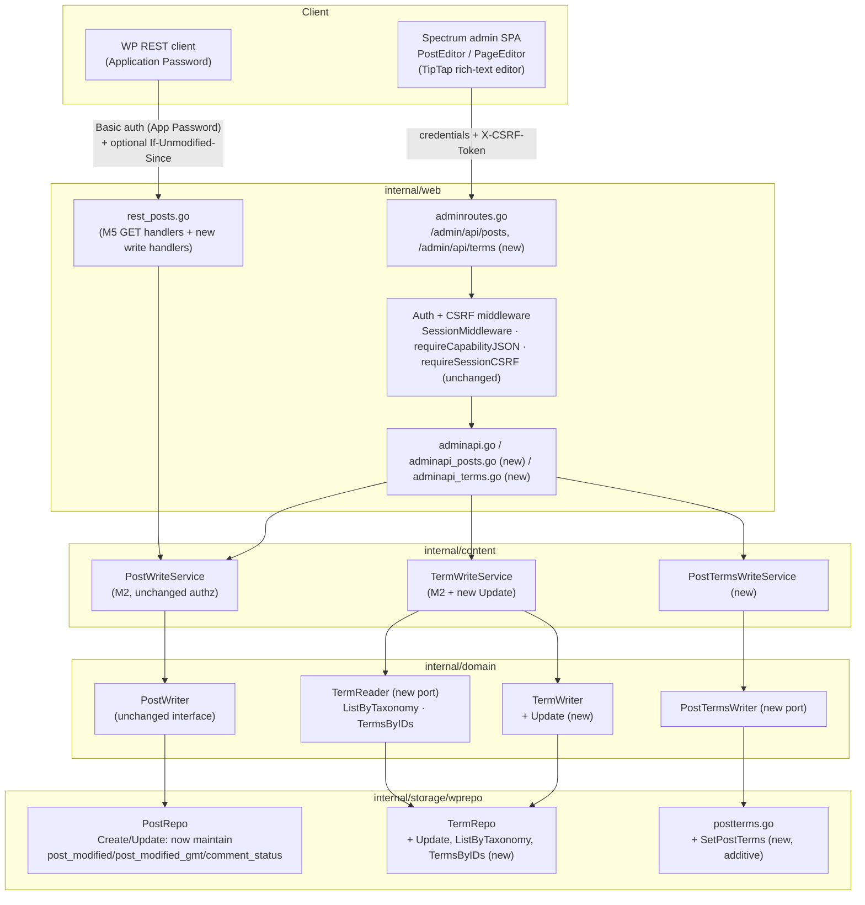
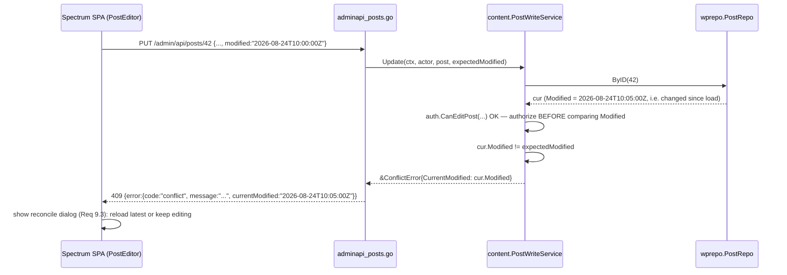
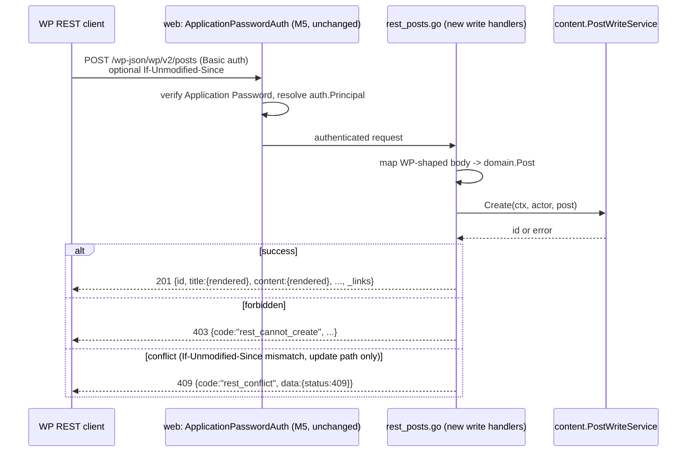
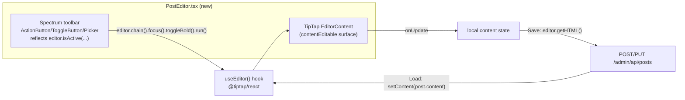

# Design — M6: Admin CRUD Editor

## Overview

M6 turns grimoire's read-only admin (M3) and read-mostly REST API (M5) into a
full write path for posts and pages. It is deliberately a **wiring and
gap-filling** milestone, not a from-scratch write layer: `internal/content`
already has `PostWriteService`/`TermWriteService` from M2, already enforcing
WordPress's own meta-capability rules. What M6 adds:

1. **Admin JSON API writes** — `POST`/`PUT`/`DELETE /admin/api/posts[/{id}]`
   and `/admin/api/terms[/{id}]`, CSRF-protected exactly like M4's comment
   moderation and media upload.
2. **REST API writes** — the same underlying services exposed at
   `/wp-json/wp/v2/posts`/`/pages`, replacing M5's `501` stubs.
3. **Three small, genuinely new backend capabilities** the write services
   don't have today: a `PostTermsWriter` port (no term-relationship write
   path exists at all before M6), `TermWriter.Update` (rename; only
   Create/Delete exist), and `Modified`-timestamp maintenance + an
   optimistic-concurrency check (today's `PostRepo.Update` doesn't touch
   `post_modified` at all).
4. **A TipTap-based rich-text editor** in the Spectrum SPA, plus new
   PostEditor/PageEditor views wired to the above.

**No new migration.** Every new capability above is additive Go
code — new interface methods, new SQL over *existing* tables
(`{prefix}posts`, `{prefix}term_relationships`, `{prefix}term_taxonomy`) — or
uses columns M5's `0004` migration already added (`post_modified`,
`post_modified_gmt`). This is a deliberate scoping choice (see
`requirements.md`'s options analysis): revisions would need genuinely new
*behavior* (a revision browser, retention) even though WordPress stores them
in the same table, so they're deferred to M7 rather than folded in here.

## Architecture

### Component view



### Sequence — create a post via the admin API

```mermaid
sequenceDiagram
  participant SPA as Spectrum SPA (PostEditor)
  participant MW as web: auth + CSRF middleware
  participant H as adminapi_posts.go
  participant PWS as content.PostWriteService
  participant PTWS as content.PostTermsWriteService
  participant DB as wprepo (PostRepo / PostTermsRepo)

  SPA->>MW: POST /admin/api/posts (X-CSRF-Token, cookie, body incl. termIds)
  MW->>MW: requireLoginJSON, requireCapabilityJSON(edit_posts), requireSessionCSRF
  MW->>H: validated request
  H->>H: parse + validate body (Req 1.7): title/type/status shape
  H->>PWS: Create(ctx, actor, domain.Post{...})
  PWS->>PWS: auth.CanCreatePost(actor, type, status, author)
  alt forbidden
    PWS-->>H: ErrForbidden
    H-->>SPA: 403
  else authorized
    PWS->>DB: PostRepo.Create (sets Modified/ModifiedGMT/DateGMT = now)
    DB-->>PWS: new post ID
    PWS-->>H: id
    H->>PTWS: SetPostTerms(ctx, actor, id, taxonomy, ids) per termIds key
    PTWS->>DB: replace term_relationships for (post, taxonomy); adjust term_taxonomy.count
    H->>H: reload full detail (Req 4 shape)
    H-->>SPA: 201 {id, title, ..., modified, terms}
  end
```

### Sequence — update with optimistic-concurrency conflict



### Sequence — REST write with Application Password auth



## New and changed components

### `internal/domain` — new/changed ports

```go
// repository.go — TermWriter gains Update (new).
type TermWriter interface {
    Create(ctx context.Context, t Term) (int64, error)
    Update(ctx context.Context, t Term) error // new: rename name/slug by term_id
    Delete(ctx context.Context, id int64) error
}

// repository.go — new read port. Existing read ports (TermRepository.BySlug,
// TermRepo.CountTerms) don't cover "list every term in a taxonomy" or "bulk-
// resolve term IDs to display objects" — both needed by M6's UI (Req 2.4's
// term picker; Req 4.1's `terms` detail field) and absent from M3/M5.
type TermReader interface {
    // ListByTaxonomy returns every term of the given taxonomy (e.g.
    // "category", "post_tag"), ordered by name, for Req 2.4's term picker.
    ListByTaxonomy(ctx context.Context, taxonomy string) ([]Term, error)
    // TermsByIDs bulk-resolves term IDs (as returned by the existing
    // PostTermsRepository.TermsForPost, which only returns bare []int64) to
    // full {ID, Name, Slug} objects, for Req 4.1's `terms` detail field.
    // Unknown IDs are silently omitted from the result, not an error.
    TermsByIDs(ctx context.Context, ids []int64) ([]Term, error)
}

// repository.go — new port. No write path for term_relationships existed
// before M6; PostTermsRepository (M5) is read-only (TermsForPost).
type PostTermsWriter interface {
    // SetPostTerms replaces postID's term relationships for taxonomy with
    // exactly termIDs (empty slice clears that taxonomy), maintaining each
    // affected term_taxonomy.count. Vendor-neutral: pure additive SQL over
    // existing term_relationships/term_taxonomy tables.
    SetPostTerms(ctx context.Context, postID int64, taxonomy string, termIDs []int64) error
}
```

`domain.Post` is unchanged (already has `Modified`/`ModifiedGMT`/
`CommentStatus` from M5). No new entity fields.

### `internal/content` — write-service changes

- `TermWriteService` gains `Update(ctx, actor, t domain.Term) error`,
  authorized by the existing `auth.CanManageTerms(actor)` — identical
  capability check to `Create`/`Delete`, just a new method. It also gains
  read-only pass-through methods `ListByTaxonomy`/`TermsByIDs` (thin
  wrappers over the new `TermReader` port, Req 2.4) — these require only
  `edit_posts`, not `manage_categories`, since listing terms is a read.
- A new, small `PostTermsWriteService` wraps `PostTermsWriter`, authorized by
  `auth.CanEditPost` against the **target post's** current stored
  record (loaded via the existing `PostWriter.ByID`) — assigning terms is
  part of editing the post, not a separate `manage_categories` action, so it
  uses the same capability the post edit itself already required.
- `PostWriteService.Update` signature changes to accept an expected-modified
  value and return a concrete `ConflictError` (parallel to the existing
  `ErrForbidden` sentinel, but carrying data the sentinel form can't) when
  the stored `Modified` doesn't match. **Authorization is checked before the
  conflict comparison** — an unauthorized caller must never learn a post's
  current `Modified` value via a `409`, only ever a `403`:

  ```go
  type ConflictError struct {
      CurrentModified time.Time
  }

  func (e *ConflictError) Error() string {
      return "content: post modified since last read"
  }

  func (s *PostWriteService) Update(ctx context.Context, actor auth.Principal,
      p domain.Post, expectedModified time.Time) error {
      cur, err := s.w.ByID(ctx, p.ID)
      // ... existing ErrNotFound -> ErrForbidden mapping, unchanged ...
      if !auth.CanEditPost(actor, cur) {
          return ErrForbidden // authorize FIRST — before the conflict check,
                               // so an unauthorized caller never learns cur.Modified
      }
      if !expectedModified.IsZero() && !cur.Modified.Equal(expectedModified) {
          return &ConflictError{CurrentModified: cur.Modified}
      }
      // ... existing field-merge logic, unchanged ...
      return s.w.Update(ctx, cur) // PostRepo.Update now bumps Modified itself
  }
  ```

  The handler unwraps the error with `errors.As(err, &conflictErr)` to
  populate the `409` body's `currentModified` field (Req 3.2/design's
  sequence diagram above, which shows this same authorize-then-compare
  order). `expectedModified.IsZero()` is the escape hatch REST callers use
  when they omit `If-Unmodified-Since` (Req 6.5) — the admin API always
  supplies a non-zero value (Req 3.1 makes `modified` a required field), so
  it always gets the strict check.

### `internal/storage/wprepo` — write-adapter changes

- `PostRepo.Create`/`Update` (`writers.go`) are extended to set
  `post_modified`/`post_modified_gmt` to `time.Now()` (UTC for the `_gmt`
  columns) on every write, and to persist `comment_status` (already a
  `domain.Post` field, never previously written). `Update`'s `WHERE` clause
  is unchanged (`ID = ?`); the caller (`PostWriteService`) is responsible for
  the conflict check *before* calling `Update`, so `Update` itself stays a
  simple unconditional write — no compare-and-swap SQL needed because the
  service layer already loaded and checked the authoritative row a moment
  earlier in the same request. (A theoretical race between that check and
  the `Update` call is a known, accepted narrow window — see "Concurrency
  window" below — consistent with the "lightweight guard, not a hard lock"
  framing in `requirements.md`.)
- `TermRepo.Update` (new) updates `name`/`slug` by `term_id`, returning
  `ErrNotFound` via the existing `errNotFoundIfZero` helper.
- `TermRepo.ListByTaxonomy` (new) is a plain `SELECT t.term_id, t.name,
  t.slug FROM {prefix}terms t JOIN {prefix}term_taxonomy tt ON tt.term_id =
  t.term_id WHERE tt.taxonomy = ? ORDER BY t.name`, and `TermRepo.TermsByIDs`
  (new) is the same shape with `WHERE t.term_id IN (?)` (using `sqlx.In` +
  `rebind.Rebind` for vendor-neutral placeholder expansion, the existing
  pattern already used elsewhere for variable-length `IN` clauses) — both
  read-only, both over the existing `terms`/`term_taxonomy` tables, no new
  columns.
- `wprepo/postterms.go` gains `SetPostTerms`, run in one transaction:
  1. `DELETE FROM {prefix}term_relationships WHERE object_id = ? AND
     term_taxonomy_id IN (SELECT term_taxonomy_id FROM {prefix}term_taxonomy
     WHERE taxonomy = ?)` — removes only this taxonomy's existing
     relationships for the post, leaving other taxonomies (e.g. clearing
     `post_tag` doesn't touch `category`).
  2. For each `termID`, `INSERT INTO {prefix}term_relationships (object_id,
     term_taxonomy_id, term_order) VALUES (?, ?, 0)`, resolving
     `term_taxonomy_id` from `(term_id, taxonomy)`.
  3. Recompute `term_taxonomy.count` for every taxonomy row touched (removed
     from or added to) via `UPDATE {prefix}term_taxonomy SET count = (SELECT
     COUNT(*) FROM {prefix}term_relationships WHERE term_taxonomy_id = ?)
     WHERE term_taxonomy_id = ?` — matching WordPress's own `count` semantics
     (number of published-or-relevant object relationships; grimoire counts
     all relationships, same simplification M1–M5 already made elsewhere for
     `count`-adjacent fields).

  All vendor-neutral (`rebind.Rebind`, same pattern as `TermRepo.Delete`).

### `internal/web` — admin API

New files `adminapi_posts.go` (create/update/delete + shared detail-shape
mapping) and `adminapi_terms.go` (term CRUD), following the existing
`adminapi_comments.go`/`adminapi_media.go` file-per-resource convention.
Routes added to `adminroutes.go`'s existing `edit_posts`-gated group (for
posts) and a new `manage_categories`-gated group (for terms):

```go
// csrfJSONMiddleware adapts the existing M4 requireSessionCSRFJSON helper
// (signature (w, r) bool; already used by adminapi_comments.go/adminapi_
// media.go as a per-handler inline call) into ordinary chi middleware, so
// M6's write routes — the first place with two separate capability-gated
// groups (posts, terms) each needing the same CSRF gate — can apply it
// once per group instead of once per handler. The underlying check and its
// failure response are entirely unchanged (Req 8.4); this is a thin
// call-site wrapper only.
func (s *Server) csrfJSONMiddleware(next http.Handler) http.Handler {
    return http.HandlerFunc(func(w http.ResponseWriter, r *http.Request) {
        if !s.requireSessionCSRFJSON(w, r) { // existing M4 helper, unchanged
            return // requireSessionCSRFJSON already wrote the 403 response
        }
        next.ServeHTTP(w, r)
    })
}

r.Group(func(gr chi.Router) {
    gr.Use(s.requireCapabilityJSON("edit_posts"))
    gr.Method(http.MethodGet, "/posts", s.jsonHandler(s.adminPosts))       // M3, unchanged
    gr.Method(http.MethodGet, "/posts/{id}", s.jsonHandler(s.adminPost))  // M3, unchanged
    gr.Group(func(wgr chi.Router) {
        wgr.Use(s.csrfJSONMiddleware) // adapter around the existing M4 helper
        wgr.Method(http.MethodPost, "/posts", s.jsonHandler(s.adminPostCreate))
        wgr.Method(http.MethodPut, "/posts/{id}", s.jsonHandler(s.adminPostUpdate))
        wgr.Method(http.MethodDelete, "/posts/{id}", s.jsonHandler(s.adminPostDelete))
    })
})
r.Group(func(gr chi.Router) {
    gr.Use(s.requireCapabilityJSON("edit_posts")) // read: term list only needs edit_posts
    gr.Method(http.MethodGet, "/terms", s.jsonHandler(s.adminTerms))
})
r.Group(func(gr chi.Router) {
    gr.Use(s.requireCapabilityJSON("manage_categories"))
    gr.Use(s.csrfJSONMiddleware)
    gr.Method(http.MethodPost, "/terms", s.jsonHandler(s.adminTermCreate))
    gr.Method(http.MethodPut, "/terms/{id}", s.jsonHandler(s.adminTermUpdate))
    gr.Method(http.MethodDelete, "/terms/{id}", s.jsonHandler(s.adminTermDelete))
})
```

`requireSessionCSRFJSON` itself is **not new** — it has existed since M4
(`internal/web/authmiddleware.go:115`) and is already called inline by
`adminapi_comments.go`/`adminapi_media.go`'s write handlers (its signature
is `func(w http.ResponseWriter, r *http.Request) bool`, not ordinary chi
middleware, which is why the small `csrfJSONMiddleware` adapter above
exists). M6 is simply the first milestone to apply it at the route-group
level via `.Use()` rather than as a per-handler inline call — a pure
code-organization change motivated by having two capability-gated groups
(posts, terms) that each need it, not a new CSRF mechanism (Req 8.4). The
underlying check, header name, and failure response are unchanged.

### `internal/web` — REST API

`rest_posts.go`'s `registerRESTPosts` currently registers a `501` stub for
every write verb (see M5). M6 replaces those stubs, for `post`/`page` only,
with real handlers reusing `PostWriteService` — **not** `PostTermsWriteService`:
per the admin-API-only term-write scope (requirements.md "Out of scope"),
REST create/update bodies do not accept `categories`/`tags`, so REST
handlers never call into term-writing at all; a REST-created post/page has
no term assignments until an admin-API caller assigns them (Req 2). REST
responses reuse the same view-model mapping `handleRESTPostSingle` already
uses for `GET` (title/content wrapped as `{rendered: "..."}`, `_links`,
etc.). The `If-Unmodified-Since` header (Req 6.4/6.5) is parsed as an
HTTP-date; when present it becomes the REST write's `expectedModified`
argument; when absent, the zero `time.Time` is passed, which
`PostWriteService.Update` treats as "skip the check" (matching real
WordPress's lack of native REST concurrency).

## Status codes

| Condition | Admin API | REST API |
| --- | --- | --- |
| Success (create) | `201` | `201` |
| Success (update) | `200` | `200` |
| Success (delete) | `204` | `200` (`{deleted:true, previous:{...}}`, matching WP) |
| Validation error (Req 1.7, 5.1, 5.2) | `400` | `400` (`rest_invalid_param`) |
| Missing/invalid CSRF (admin only) | `403` | n/a (Application Password requests carry no session) |
| Missing capability | `403` | `403` (`rest_cannot_create`/`rest_cannot_edit`, reusing M5's existing codes) |
| Target post not found (update/delete) | `403` (generic `ErrForbidden` — no existence leak, existing M2 behavior) | `404` (`rest_post_invalid_id`, existing M5 code — REST confirms existence before authorizing, matching WP) |
| Target term not found (update) | `404` | n/a (no REST term endpoints in M6) |
| Concurrency conflict (Req 3.2, 6.4) | `409` | `409` (`rest_conflict`) |
| Unauthenticated | `401` | `401` |

## Concurrency window (documented, accepted limitation)

`PostWriteService.Update` loads the current row, compares `Modified`, then
issues an unconditional `UPDATE ... WHERE ID = ?`. Two concurrent requests
that both pass the compare step before either writes could both succeed,
each unaware of the other (a classic check-then-act race). This is
explicitly accepted, not silently ignored: the requirement (Req 3) frames
this as a **lightweight guard against the common case** ("I loaded this five
minutes ago, someone else already saved a change") rather than a hard
database-level lock (`SELECT ... FOR UPDATE` / a `WHERE post_modified = ?`
compare-and-swap in the `UPDATE` itself). A true compare-and-swap `UPDATE
... WHERE ID = ? AND post_modified = ?` was considered and rejected for this
milestone: it would require every vendor's `Update` to report "0 rows
affected" ambiguity (not-found vs. conflict) distinctly, adding real
complexity for a race window that in practice is milliseconds wide in a
single-editor-at-a-time admin UI with no autosave. If genuine multi-editor
collision becomes a real problem, a compare-and-swap `Update` variant is a
natural, backwards-compatible follow-up — not blocked by anything in M6's
design.

A second, separate limitation stems from timestamp granularity:
`post_modified`/`post_modified_gmt` are stored via `tsLayout =
"2006-01-02 15:04:05"` (second precision, existing since M5). Two updates to
the same post completing within the same wall-clock second produce an
identical `Modified` value, so a third client that loaded the post before
either of those two updates will pass the conflict check even though its
view is now stale. This is accepted as part of the same "lightweight guard,
not a hard lock" tradeoff above, not a new gap introduced by M6 — closing it
would require widening the stored precision (a schema change) purely to
narrow an already-narrow, already-accepted race window.

## Rich-text editor (frontend)

`web/admin/package.json` gains `@tiptap/react`, `@tiptap/starter-kit`,
`@tiptap/extension-link`, and `@tiptap/extension-image` (all MIT-licensed,
no server-side dependency — TipTap is purely a client-side editing surface;
grimoire's Go backend only ever sees the resulting HTML string, exactly like
it already does for the M1 theme's `post_content` rendering).



- **Why TipTap over Lexical/Slate** (see `requirements.md` intro for the
  full rationale): TipTap's core content model is HTML in/out
  (`getHTML()`/`setContent()`), matching `post_content`'s trusted-raw-HTML
  storage exactly with no custom serialization layer. Lexical and Slate are
  both JSON-document-native; using either would require writing and
  maintaining a bespoke, lossless HTML export/import layer to preserve WP
  compatibility — extra surface with no compensating benefit for grimoire's
  use case.
- **No Spectrum-native rich-text component exists** (confirmed against the
  `@adobe/react-spectrum` component set already vendored in
  `web/admin/package.json`), so the toolbar is hand-built from ordinary
  Spectrum primitives (`ActionButton` for bold/italic/link/image,
  `ToggleButton` for list toggles, `Picker` for heading level) driven by
  `editor.isActive('bold')` etc. — this keeps the *chrome* Spectrum-native
  even though the editing surface itself (TipTap's `EditorContent`) is a
  plain `contentEditable` region TipTap manages directly.
- Image insertion (Req 7.1) opens a **new** `MediaPicker` dialog component
  in a Spectrum `DialogTrigger`, backed by the existing M4 media-list admin
  API (`GET /admin/api/media`) — there is no existing reusable picker to
  open: M4's `Media.tsx` is a standalone full-page list view with no
  selection callback, so `MediaPicker` is new work introduced by this
  requirement (its own Phase 4 task, see `tasks.md`), not a reuse of
  existing UI. On selection it calls `editor.chain().focus().setImage({src:
  mediaUrl}).run()` — no new upload flow; only selection among
  already-uploaded media.

New/changed frontend files:

```
web/admin/src/
  views/
    PostEditor.tsx        # new — create/edit posts, type="post"
    PageEditor.tsx         # new — thin wrapper around PostEditor with type="page" (Req 9.5)
    PostsList.tsx          # + New/Edit/Delete actions (Req 9.1)
  components/
    RichTextEditor.tsx     # new — TipTap wrapper + Spectrum toolbar (Req 7)
    TermPicker.tsx         # new — category/tag multi-select + inline create (Req 2)
    MediaPicker.tsx         # new — image-selection dialog backed by GET /admin/api/media (Req 7.1)
    ConflictDialog.tsx     # new — 409 reconcile dialog (Req 9.3)
  api/
    client.ts              # + createPost/updatePost/deletePost/listTerms/createTerm/updateTerm/deleteTerm
    types.ts                # + PostDetail.modified/commentStatus/terms, TermSummary
```

## Migrations

**None.** Every new capability in this milestone is either:
- a new Go interface method over an existing table
  (`TermWriter.Update`, `PostTermsWriter.SetPostTerms`), or
- newly *writing* to columns that already exist
  (`comment_status` — added by M4's `0003_comments_media_menus.up.sql`,
  only ever *read* before M6; `post_modified`/
  `post_modified_gmt` — added by M5's `0004_rest_post_fields`, only ever
  *read* before M6).

This preserves the additive-only, vendor-asymmetry-aware posture M4's
`0003` and M5's `0004` established, simply by not needing a migration at
all — confirmed against all three vendor schemas
(`internal/storage/migrations/{sqlite,mysql,postgres}`), none of which are
touched by this milestone.

## Security

- **CSRF**: reused byte-for-byte from M4 (Req 8). No new middleware logic,
  only new routes wired through the existing `requireSessionCSRF` check
  (refactored into `requireSessionCSRFJSON` middleware for reuse across two
  capability groups — a pure code-organization change).
- **Authorization**: every new admin-API and REST write handler calls into
  `PostWriteService`/`TermWriteService`/`PostTermsWriteService`, which own
  100% of the capability logic; handlers never inline a capability check
  themselves (mirrors the existing M2–M5 layering — `internal/web` is thin).
- **No existence leakage**: `PostWriteService.Update`/`Delete` continue
  returning the generic `ErrForbidden` for a missing record before any
  capability check runs (existing M2 behavior, unchanged) — an
  unauthenticated-for-that-post caller cannot distinguish "doesn't exist"
  from "exists but you can't touch it" via the admin API. The REST layer
  (matching WordPress's own REST behavior of returning `404` for a missing
  ID before an ownership check) uses the existing M5 `rest_post_invalid_id`
  `404` mapping for a genuinely-missing ID, and the `403` `rest_cannot_edit`
  mapping once the record is confirmed to exist — this is an
  **intentional, pre-existing REST/admin-API asymmetry** already present in
  M5 for reads (`GET` 404s a missing post) and is not changed by M6.
- **Content trust boundary unchanged**: `post_content` remains trusted raw
  HTML end-to-end (author-supplied, rendered via `template.HTML` on the
  public side, per M1/M2/M4) — TipTap's `getHTML()` output is sent and
  stored as-is, with no new sanitization added or removed by this milestone.
  This is a deliberate continuity, not an oversight: grimoire's authoring
  model (like WordPress's own) trusts its authenticated authors, unlike the
  anonymous comment path (M4), which is untrusted and escaped/sanitized.
- **No secrets in errors**: every new handler uses the existing JSON error
  envelope (`writeJSONError`/`writeRESTError`); no SQL, driver errors, or
  internal IDs beyond what the response shape already exposes.

## Testing strategy

- **Unit (`internal/content`)**: `PostWriteService.Update` conflict-detection
  (matching `Modified` → success; mismatched → `*ConflictError` with
  `CurrentModified` set; zero
  `expectedModified` → check skipped); `TermWriteService.Update` capability
  gate; `PostTermsWriteService` capability gate (reuses `CanEditPost` against
  the target post, same as the pre-existing pattern for `Update`/`Delete`).
- **Contract (`storagetest`)**, vendor-parameterized (SQLite unconditional;
  MySQL/Postgres gated on DSNs, same convention as every prior milestone):
  `PostRepo.Create`/`Update` populate `post_modified`/`post_modified_gmt`/
  `comment_status`; `TermRepo.Update` renames and 404s a missing ID;
  `SetPostTerms` replaces one taxonomy's relationships without touching
  another's, clears with an empty slice, and updates `term_taxonomy.count`
  correctly across add/remove; identical behavior across all three vendors.
- **HTTP (`internal/web`)**: admin API — 201/200/204 happy paths; 400 for
  each Req 1.7 validation case and Req 5.2 (future-in-the-past); 403 for
  missing capability, missing/bad CSRF, each `auth.Can*Post` denial case
  (edit another's post without `edit_others_posts`, publish without
  `publish_posts`), *and* a nonexistent post ID on update/delete (Req 1.6 —
  generic `ErrForbidden`, no existence leak); 404 for a nonexistent term ID
  on update (Req 2.5 — terms have no per-item ownership, so no leak concern);
  409 for a stale `modified` value. REST API — same matrix via Application
  Password auth (except a nonexistent post ID 404s per Req 6.8, matching
  M5's existing `GET` behavior), plus: `If-Unmodified-Since` omitted →
  succeeds without a conflict check even when stale (Req 6.5); every other
  `wp/v2` write verb (media, users, categories, tags,
  comments-beyond-create) still `501`s, unchanged from M5 (regression guard
  — Req 6.6).
- **Frontend**: `RichTextEditor` renders TipTap content, toolbar buttons
  reflect `editor.isActive(...)` state, `getHTML()`/`setContent()` round-trip
  a fixture HTML string unchanged; `PostEditor` save flow calls the create
  vs. update endpoint correctly based on presence of an existing post `id`;
  `ConflictDialog` appears on a mocked `409` response and its "reload
  latest" action refetches the post.
- **E2E** (extending M3/M4's `admine2e_test.go` pattern): log in → create a
  post with a new inline category → verify it appears in `PostsList` →
  edit it (title + status → publish) → verify the public site now renders
  it → delete it → verify `404` on the public route and admin list.

## Traceability

| Requirement | Design section |
| --- | --- |
| Req 1 (post CRUD) | Admin API section, `adminapi_posts.go` |
| Req 2 (terms) | `TermReader` (read), `PostTermsWriter`, `TermWriteService.Update`, `adminapi_terms.go` |
| Req 3 (concurrency) | `PostWriteService.Update` conflict check, "Concurrency window" |
| Req 4 (detail shape) | Admin API section, detail-shape table |
| Req 5 (status lifecycle) | Status codes table, validation in `adminapi_posts.go` |
| Req 6 (REST parity) | REST API section, sequence diagram |
| Req 7 (rich editor) | "Rich-text editor (frontend)" section |
| Req 8 (CSRF reuse) | Security section, `requireSessionCSRFJSON` |
| Req 9 (Spectrum views) | Frontend file list, `ConflictDialog` |
