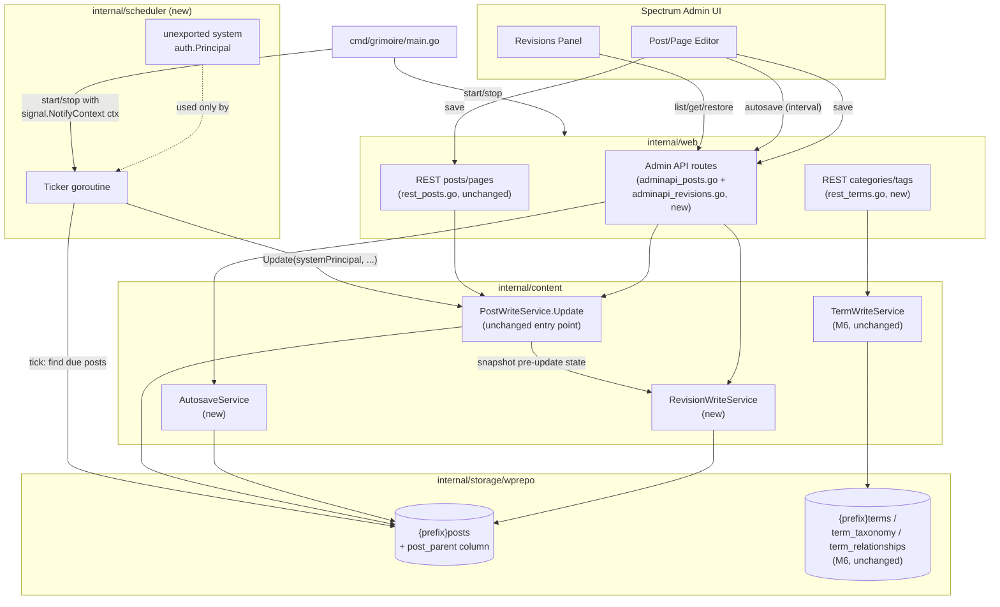
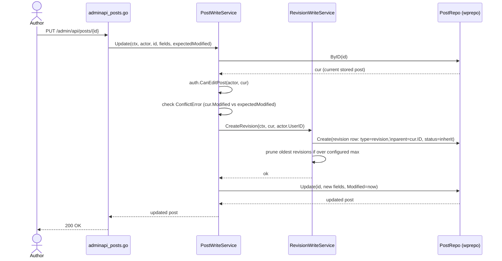
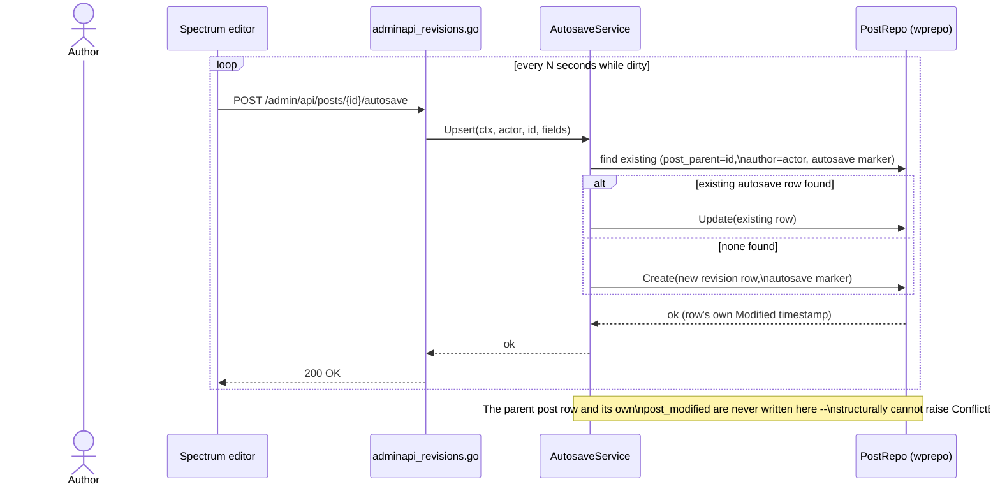

# M7 — Revisions, Autosave, Scheduler & REST Term Parity: Design

## Overview

M7 exposes one existing-but-previously-unused schema element (the
`post_parent` column, physically present since M4's `0003` migration but
not yet surfaced through the domain/repo layer), one new background
runtime component (a publish scheduler), a small set of new admin-API routes
(revisions, autosave), and a new REST resource family (categories, tags).
Every new capability is built as additive wiring over M1-M6 infrastructure:

- Revisions and autosaves are ordinary rows in the existing `{prefix}posts`
  table, read and written by the existing `PostRepo`/`PostWriteService`
  machinery, not a parallel storage system.
- The scheduler reuses `PostWriteService.Update` — the exact same
  authorization + revision-snapshot + persistence path every other post
  update already goes through — rather than a separate publish code path.
- REST categories/tags reuse `content.TermWriteService`, introduced in M6
  for the admin-only term editor, unchanged; only an HTTP layer is new.
- CSRF, session auth, Application Password auth, and HTML sanitization are
  all reused exactly as-is; none are modified by this milestone.

## Architecture



### Sequence: manual save creates a revision



### Sequence: autosave (never touches the parent row)



### Sequence: scheduled publish tick

```mermaid
sequenceDiagram
    participant Ticker as scheduler.Ticker
    participant Repo as PostRepo (wprepo)
    participant PWS as PostWriteService

    loop every configured interval
        Ticker->>Repo: DueScheduled(ctx, now)
        Repo-->>Ticker: []Post{status=future, post_date<=now}
        loop for each due post
            Ticker->>PWS: Update(ctx, systemPrincipal, id,\n{Status: "publish"}, expectedModified: zero)
            alt succeeds
                PWS-->>Ticker: ok (revision snapshot created\nas a side effect, Req 1.1/4.8)
            else fails (e.g. concurrent edit changed status already)
                PWS-->>Ticker: error (logged, skipped)
            end
        end
    end
    Note over Ticker: systemPrincipal is constructed once,\nunexported, held only inside this package;\nno HTTP route can obtain or impersonate it.
```

## New / changed components

### `internal/domain`

```go
// Post gains a parent reference (post_parent), used only by revision and
// autosave rows to point back at the post they belong to. Zero for every
// ordinary post/page.
type Post struct {
    // ... existing fields unchanged ...
    ParentID int64 // post_parent; 0 for non-revision rows
}

// RevisionMeta is the summary shape returned by revision listing (no
// content/title/excerpt body -- Requirement 2.1).
type RevisionMeta struct {
    ID       int64
    ParentID int64
    Author   int64
    Modified time.Time
    Autosave bool
}

// RevisionWriter is the storage port used by RevisionWriteService and
// AutosaveService. Implemented by wprepo.PostRepo (it already owns the
// {prefix}posts table revisions live in -- no new repository type).
type RevisionWriter interface {
    CreateRevision(ctx context.Context, parentID, authorID int64, snapshot Post, autosave bool) (int64, error)
    ListRevisions(ctx context.Context, parentID int64) ([]RevisionMeta, error)
    RevisionByID(ctx context.Context, id int64) (Post, error)
    AutosaveFor(ctx context.Context, parentID, authorID int64) (Post, bool, error)
    UpdateAutosave(ctx context.Context, revisionID int64, snapshot Post) error
    PruneRevisions(ctx context.Context, parentID int64, keep int) error
    DeleteRevisionsOf(ctx context.Context, parentID int64) error // used on post delete, Req 1.6
}

// ScheduledPostFinder is the read port the scheduler polls. Implemented by
// wprepo.PostRepo alongside RevisionWriter.
type ScheduledPostFinder interface {
    DueScheduled(ctx context.Context, asOf time.Time) ([]Post, error)
}
```

### `internal/content` (business logic)

```go
// RevisionWriteService owns revision-snapshot creation and pruning. Called
// internally by PostWriteService.Update -- not exposed as its own public
// "write a post" surface; callers never construct a revision directly.
type RevisionWriteService struct {
    revisions domain.RevisionWriter
    maxPerPost int // Requirement 5.1; 0 disables, negative/unset = unlimited
}

func (s *RevisionWriteService) Snapshot(ctx context.Context, cur domain.Post, actorID int64) error
func (s *RevisionWriteService) List(ctx context.Context, actor auth.Principal, parentID int64) ([]domain.RevisionMeta, error)
func (s *RevisionWriteService) Get(ctx context.Context, actor auth.Principal, parentID, revisionID int64) (domain.Post, error)
func (s *RevisionWriteService) Restore(ctx context.Context, actor auth.Principal, parentID, revisionID int64) (domain.Post, error)

// AutosaveService owns the single-row-per-(post,author) upsert semantics
// and the "is there a newer autosave than the post itself" read used by
// Requirement 3.4's editor notice.
type AutosaveService struct {
    revisions domain.RevisionWriter
    posts     domain.PostWriter
}

func (s *AutosaveService) Save(ctx context.Context, actor auth.Principal, parentID int64, fields AutosaveFields) (domain.Post, error)
func (s *AutosaveService) Newer(ctx context.Context, actor auth.Principal, parentID int64) (domain.Post, bool, error)
```

`PostWriteService.Update` gains exactly one new internal call, inserted
immediately after its existing `ConflictError` check and — critically —
**before** the existing field-merge block that mutates `cur` in place. This
snapshots the freshly-loaded, pre-edit `cur`, not the post-edit values, per
Requirement 1.1's "immediately before the update" wording. The sketch below
mirrors the real `Update`'s actual signature and field-merge lines
(`internal/content/writeservices.go`) rather than eliding them, so the
insertion point is unambiguous:

```go
func (s *PostWriteService) Update(ctx context.Context, actor auth.Principal, p domain.Post, expectedModified time.Time) error {
    cur, err := s.w.ByID(ctx, p.ID)
    // ... existing error handling ...
    // ... existing auth.CanEditPost check ...
    if !expectedModified.IsZero() && !cur.Modified.Equal(expectedModified) {
        return &ConflictError{CurrentModified: cur.Modified}
    }

    if err := s.revisions.Snapshot(ctx, cur, actor.UserID); err != nil { // NEW (Req 1.1)
        return err                                                       // snapshots cur BEFORE
    }                                                                    // any field below mutates it

    cur.Title = p.Title // existing field-merge block, unchanged
    cur.Content = p.Content
    cur.Excerpt = p.Excerpt
    cur.Slug = p.Slug
    cur.CommentStatus = p.CommentStatus
    // ... existing Date/DateGMT and Status handling, unchanged ...
    return s.w.Update(ctx, cur) // existing persistence, unchanged
}
```

`content.TermWriteService` (M6) is unchanged; `internal/web`'s new
`rest_terms.go` is its only new caller.

### `internal/scheduler` (new package)

```go
package scheduler

// Scheduler polls for posts due to publish and flips them, on a ticker.
// It is started and stopped by cmd/grimoire/main.go using the same
// context/lifecycle main.go already uses for its HTTP server goroutine --
// there is no separate scheduler lifecycle to reason about (Requirement 4.3).
type Scheduler struct {
    finder   domain.ScheduledPostFinder
    posts    *content.PostWriteService
    interval time.Duration
    log      *slog.Logger
}

func New(finder domain.ScheduledPostFinder, posts *content.PostWriteService, interval time.Duration, log *slog.Logger) *Scheduler

// Run blocks, ticking every s.interval, until ctx is cancelled. main.go
// calls this in its own goroutine, exactly like srv.ListenAndServe().
func (s *Scheduler) Run(ctx context.Context)

// systemPrincipal is unexported: constructed once inside this package,
// never returned, never accepted as a parameter from outside the package.
// It cannot be obtained via any HTTP route, session, or Application
// Password (Requirement 4.5).
var systemPrincipal = auth.Principal{
    UserID: 0,
    Login:  "grimoire-scheduler",
    Caps:   map[string]bool{"publish_posts": true, "edit_others_posts": true, "edit_posts": true},
}
```

### `internal/storage/wprepo`

- `writers.go`: `PostRepo` gains `CreateRevision`, `ListRevisions`,
  `RevisionByID`, `AutosaveFor`, `UpdateAutosave`, `PruneRevisions`,
  `DeleteRevisionsOf`, and `DueScheduled`, all operating on the same
  `{prefix}posts` table `Create`/`Update`/`ByID` already use, adding
  `post_type = 'revision'` / `post_parent = ?` predicates. No new table, no
  new repository struct.
- The "one autosave row per (post, author)" invariant (Requirement 3.2) is
  enforced by `AutosaveFor` performing a lookup-then-update-or-insert
  keyed on `(post_parent, post_author, post_name LIKE '{id}-autosave')`
  before every autosave write — matching WordPress's own
  `"{id}-autosave-v1"` `post_name` convention, reused verbatim so a
  pre-existing WordPress database's own autosave rows are recognized
  without translation. Normal revisions use `"{id}-revision-v1"`,
  `"{id}-revision-v2"`, etc., also WordPress's own convention.
- **No new migration file.** `post_parent` already exists physically across
  all three vendors via M4's `0003_comments_media_menus` migration
  (`ALTER TABLE {{prefix}}posts ADD COLUMN post_parent <int-type> NOT NULL
  DEFAULT 0`, added for attachment parent-post tracking). M7 only adds the
  domain/repo-level exposure of that pre-existing column (`ParentID` on
  `domain.Post`, general `PostRepo` read/write support); see the
  Migrations section below for the as-built detail.

### `internal/web`

- New `internal/web/adminapi_revisions.go`: registers
  `GET /admin/api/posts/{id}/revisions`,
  `GET /admin/api/posts/{id}/revisions/{revisionId}`,
  `POST /admin/api/posts/{id}/revisions/{revisionId}/restore`,
  `GET /admin/api/posts/{id}/autosave`,
  `POST /admin/api/posts/{id}/autosave`, nested under the same
  `s.requireCapabilityJSON("edit_posts")` group M6 already uses for
  `adminapi_posts.go`, with the write routes further nested under the same
  `s.csrfJSONMiddleware` group M6 already uses for its write routes
  (Requirement 7.1).
- New `internal/web/rest_terms.go`: registers
  `GET/POST /wp-json/wp/v2/categories`,
  `GET/PUT/PATCH/DELETE /wp-json/wp/v2/categories/{id}`, and the same four
  for `/wp-json/wp/v2/tags`, inside `registerREST`'s existing
  `r.Route("/wp/v2", ...)` block (`rest_router.go`), alongside the existing
  `s.registerRESTPosts`/`Media`/`Users`/`AppPasswords`/`Comments` calls.
  Write routes require `manage_categories` (Requirement 6.4); GET routes
  require no authentication, matching the existing public REST reads for
  posts/pages/media.
- `rest_router.go`'s `restRoutes()` discovery map gains entries for the
  eight new category/tag routes, so `GET /wp-json/` and
  `GET /wp-json/wp/v2/` continue to accurately self-describe every
  registered route (Req 1.1/1.2 from M4, unchanged behavior, extended
  data).

### `cmd/grimoire/main.go`

```go
// After the existing srv construction and before the existing
// go func() { srv.ListenAndServe() ... }() goroutine:
sched := scheduler.New(repos.Posts, postWrite, cfg.Scheduler.Interval, logger)
go sched.Run(ctx) // ctx is the same signal.NotifyContext-derived context
                   // already used for graceful HTTP shutdown -- cancelling
                   // it stops both goroutines the same way.
```

No new `signal.NotifyContext`/shutdown wiring is introduced; the scheduler
goroutine observes the exact same `ctx` cancellation the HTTP server
goroutine already does, so `main.go`'s existing shutdown sequence covers it
for free (Requirement 4.3).

## Status codes

| Route | Method | Success | Auth failure | Not found | Notes |
|---|---|---|---|---|---|
| `/admin/api/posts/{id}/revisions` | GET | 200 | 404 | 404 | Req 2.1, 2.5 |
| `/admin/api/posts/{id}/revisions/{revisionId}` | GET | 200 | 404 | 404 | Req 2.2, 2.5 |
| `/admin/api/posts/{id}/revisions/{revisionId}/restore` | POST | 200 | 404 | 404 | Req 2.3, 2.5, CSRF required |
| `/admin/api/posts/{id}/autosave` | GET | 200 | 404 | 404 (no newer autosave = 404 too) | Req 3.4, 3.5 |
| `/admin/api/posts/{id}/autosave` | POST | 200 | 404 | 404 | Req 3.1, 3.5, CSRF required |
| `/wp-json/wp/v2/categories`, `/tags` | GET | 200 | n/a (public) | n/a | Req 6.1 |
| `/wp-json/wp/v2/categories`, `/tags` | POST | 201 | 403 | n/a | Req 6.2, 6.5 |
| `/wp-json/wp/v2/categories/{id}`, `/tags/{id}` | PUT/PATCH | 200 | 403 | 404 | Req 6.3, 6.5, 6.6 |
| `/wp-json/wp/v2/categories/{id}`, `/tags/{id}` | DELETE | 200 | 403 | 404 | Req 6.3, 6.5, 6.6 |

Note the deliberate asymmetry between admin-API routes (404-on-forbidden, an
existence-leak protection for per-object-owned content) and REST term routes
(403-on-forbidden, since terms are global/shared objects with no
per-object ownership to leak) — this mirrors the same distinction M6 already
draws between its post routes (404) and its admin-only term routes (403).

## Migrations

**No new migration.** During implementation of tasks 1.1-1.2 it was
discovered that `post_parent` already exists physically across all three
vendors: M4's `0003_comments_media_menus` migration added it (for
attachment parent-post tracking, see `internal/storage/wprepo/media.go`),
additive with the exact `NOT NULL DEFAULT 0` shape originally sketched
below for a hypothetical `0005_post_parent`:

```sql
-- sqlite (already present via 0003)
ALTER TABLE {{prefix}}posts ADD COLUMN post_parent INTEGER NOT NULL DEFAULT 0;

-- mysql (already present via 0003)
ALTER TABLE {{prefix}}posts ADD COLUMN post_parent BIGINT UNSIGNED NOT NULL DEFAULT 0;

-- postgres (already present via 0003)
ALTER TABLE {{prefix}}posts ADD COLUMN post_parent BIGINT NOT NULL DEFAULT 0;
```

A pre-existing live WordPress database already has this exact column with
this exact default (WordPress has shipped `post_parent` since its earliest
schema), which is why M4 was able to add it as a plain additive column
with no data backfill.

M7's tasks 1.1-1.2 therefore did not add a migration; they only exposed
the already-physically-present column through the domain/repo layer
(`domain.Post.ParentID`, general `PostRepo` read/write support), and
task 1.1's contract test validates that pre-existing column's read/write
behavior rather than a migration-application test. See
`plans/07-revisions-scheduler/tasks.md` tasks 1.1-1.2 for the as-built
detail.

## Concurrency window

Revision snapshotting (Requirement 1.1) happens inside
`PostWriteService.Update`, after the existing `ConflictError` check — so a
losing writer under M6's optimistic concurrency never gets a revision
snapshot created on its behalf (its update is rejected entirely; nothing
was applied to snapshot). This preserves M6's existing concurrency
guarantee unchanged; M7 adds a step to the winning path only.

The scheduler (Requirement 4) calls `PostWriteService.Update` with a zero
`expectedModified`, which M6's existing code already treats as "skip the
conflict check." This is intentional: the scheduler is not a competing
human editor and should never be blocked by a stale-timestamp comparison
against itself. If a human concurrently edits the same post in the same
tick window, ordinary last-write-wins semantics apply exactly as they
already do for any two non-conflict-checked writers today — M7 does not
change or tighten this existing behavior, only reuses it.

## Security Considerations

- **Input validation and sanitization.** Revision and autosave content
  (title/content/excerpt) flows through the exact same fields, the exact
  same length/required-field validation, and the exact same HTML
  sanitizer (`bluemonday`-based, already used in `handlers.go`, `view.go`,
  `comments.go`, `content/media.go`, `content/rest.go`) as an ordinary
  post save. No new sanitization path is introduced, and none is needed —
  a revision is stored content of the same shape and the same trust level
  as the post it snapshots.
- **XSS via revision/autosave content.** Because revision rows are never
  rendered on any public route (Requirement 1.7) and are only ever
  rendered inside the authenticated Spectrum admin editor (which already
  treats post content as untrusted-until-sanitized when displaying it),
  the same content-trust boundary M6 already established for post
  editing applies unchanged. There is no new rendering surface where
  unsanitized revision content could execute as script.
- **SQL injection across all three vendors.** Every new query
  (`CreateRevision`, `ListRevisions`, `RevisionByID`, `AutosaveFor`,
  `UpdateAutosave`, `PruneRevisions`, `DeleteRevisionsOf`,
  `DueScheduled`, and the new categories/tags REST queries) is built with
  the same parameterized-query library (`bun`) and the same per-vendor
  rebind handling every existing `wprepo` query already uses. No new query
  in this milestone concatenates caller-supplied input into SQL text.
- **Authorization and existence-leak prevention.** Revision and autosave
  routes require exactly the same capability as editing the parent post
  and respond `404` (never `403`) for every unauthorized-or-absent case,
  extending M6 Requirement 1.6's convention to the new routes
  (Requirement 2.4-2.5, 3.5). Category/tag REST writes use `403` instead,
  consistent with M6's own admin-only term routes, since terms are shared
  objects with no per-object owner whose existence could be leaked.
- **CSRF coverage.** The two new state-changing admin-API routes
  (autosave POST, revision restore POST) are registered inside the same
  `s.csrfJSONMiddleware` group M6's write routes already use — there is no
  new CSRF mechanism, and no route in this milestone is registered outside
  that group. REST category/tag writes follow the existing REST write
  contract (Application Password only, no session/CSRF path), identical
  to M6's post/page REST writes.
- **The scheduler's internal write path has no CSRF surface at all**,
  because it is not triggered by an inbound HTTP request. Its only
  "credential" is the unexported `systemPrincipal` (Requirement 4.5),
  constructed once inside `internal/scheduler` and never passed across a
  package boundary that an HTTP handler could reach. Reviewers should
  specifically verify that no future change accidentally exports this
  principal or exposes a route that lets a caller supply their own
  `auth.Principal` to `PostWriteService.Update`.
- **Authorization reuse, not bypass.** The scheduler transitions a post
  to `publish` through the same `PostWriteService.Update` every human
  caller uses (Requirement 4.4) rather than writing directly to the
  repository. This is a deliberate security property: any future
  tightening of publish authorization logic inside `PostWriteService`
  automatically applies to scheduler-triggered publishes too, since there
  is only one code path, not two that could drift apart.
- **Secrets handling.** No new secret or credential type is introduced by
  this milestone. The scheduler's system principal is not a secret — it
  is an in-memory capability set with no credential material, unrotatable
  and unusable outside its own process, closer to an internal enum value
  than an authentication token.
- **New attack surface summary.** The net new externally-reachable attack
  surface introduced by M7 is: two admin-API GET routes, two admin-API
  POST routes (both capability + CSRF gated), and eight REST routes for
  categories/tags (four GET, unauthenticated; four write, `manage_categories`
  gated). No new unauthenticated write route is introduced anywhere.

## SEO Considerations

- **Revisions and autosaves are structurally unreachable from any public
  or REST read path**, not merely discouraged by a robots directive. Every
  existing public content-resolution route and every existing
  `/wp-json/wp/v2/posts`/`/pages` read route already filters to
  `post_type IN ("post", "page")` by default (`domain.AdminPostFilter`'s
  `adminTypes()` helper); `post_type = "revision"` rows never match that
  filter. This is a hard guarantee at the query level, so there is no
  revision URL that could ever be crawled, indexed, or produce
  duplicate-content — because no such URL exists in the first place.
  Requirement 1.7 makes this an explicit, testable acceptance criterion
  rather than an implicit side effect.
- **Scheduled publish introduces no canonical-URL instability.** A post's
  ID, slug, and GUID are set once at creation and are never touched by the
  `future` → `publish` transition (Requirement 4.6); a link built against a
  scheduled post before it goes live is the same link that resolves once it
  does. There is no "the URL changes when it becomes public" risk to design
  around.
- **Sitemap regeneration timing is explicitly not applicable.** Grimoire
  has no sitemap or `robots.txt` generation anywhere in its codebase today
  (confirmed by a repository-wide search; this predates M7 and is not
  changed by it). A milestone that introduces sitemap generation would need
  to consider re-generating on every scheduled-publish tick so a newly
  public post appears promptly; M7 explicitly defers that groundwork
  rather than inventing a sitemap feature as a side effect of the
  scheduler, and calls that deferral out here rather than omitting it.
- **Robots directives on revision/autosave content are unnecessary, not
  merely unimplemented.** A `noindex` or `Disallow` directive exists to
  steer crawlers away from URLs that otherwise resolve. Since revision and
  autosave rows have no corresponding public URL at all (previous bullet),
  there is nothing for a robots directive to protect — the correct design
  is "this content has no route," which is strictly stronger than "this
  route says don't index me."

## Testing strategy

- **Unit tests** (`internal/content`): `RevisionWriteService.Snapshot`
  creates a revision with the pre-update snapshot and not the post's new
  values; pruning deletes the correct oldest rows once over the configured
  max; `AutosaveService.Save` upserts rather than duplicating a row for
  repeated calls from the same (post, author); `AutosaveService.Newer`
  returns `false` when the autosave is older than or equal to the post's
  own `Modified`.
- **Unit tests** (`internal/scheduler`): a fake `ScheduledPostFinder` +
  fake `PostWriteService`-shaped dependency verify a tick calls `Update`
  once per due post with the system principal and a zero
  `expectedModified`, and that one failing post does not prevent the
  others in the same tick from being processed (Requirement 4.7).
- **Repository tests** (`internal/storage/wprepo`, run against sqlite,
  mysql, and postgres per the existing multi-vendor test convention):
  `CreateRevision`/`ListRevisions`/`RevisionByID`/`PruneRevisions`/
  `DueScheduled` against real schemas for all three vendors, verifying the
  `post_parent` column round-trips correctly and that `DueScheduled` only
  returns posts whose `post_date` has actually passed.
- **HTTP handler tests** (`internal/web`): every new admin-API and REST
  route, covering success, `404`-not-`403` on unauthorized admin-API
  access (Requirement 2.5, 3.5), `403` on unauthorized REST term writes
  (Requirement 6.5), and CSRF rejection on the two new admin-API POST
  routes when the token is missing/invalid.
- **End-to-end**: schedule a post for one second in the future in a test
  with a short scheduler interval, assert it becomes `publish` without any
  read request being made against it (ruling out an accidental lazy-flip
  dependency); save a post twice and assert exactly one new revision row
  exists with the first save's content; restore a revision and assert both
  the restore itself and the pre-restore snapshot exist afterward
  (Requirement 2.3).

## Traceability

| Requirement | Design section(s) |
|---|---|
| 1 — Automatic revision snapshots on save | Architecture (save sequence), `RevisionWriteService`, `PostWriteService.Update` change, Migrations, Concurrency window |
| 2 — Revision history, diff, and restore | `adminapi_revisions.go`, `RevisionWriteService`, Status codes |
| 3 — Autosave | Architecture (autosave sequence), `AutosaveService`, `RevisionWriter.AutosaveFor`/`UpdateAutosave`, Concurrency window |
| 4 — Scheduled-publish execution | Architecture (scheduler tick sequence), `internal/scheduler`, `main.go` wiring, Security Considerations, SEO Considerations |
| 5 — Revision retention and pruning policy | `RevisionWriteService.maxPerPost`, `PruneRevisions` |
| 6 — REST API write parity: categories and tags | `rest_terms.go`, Status codes |
| 7 — CSRF and authentication contract for new routes | Security Considerations, Status codes |
| 8 — Spectrum admin UI: revision history, restore, and autosave | Architecture (client side of both sequence diagrams); frontend behavior is UI-only and calls the APIs described in Requirements 2 and 3 with no additional server-side design |
