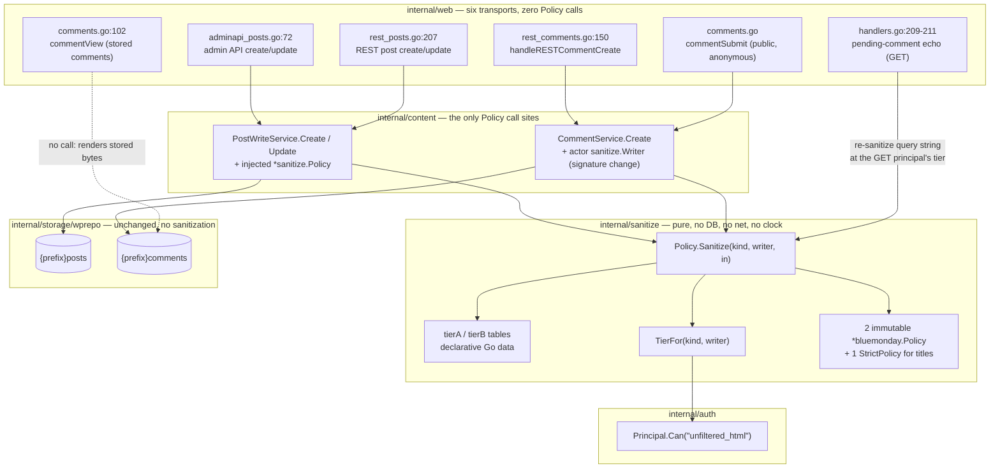
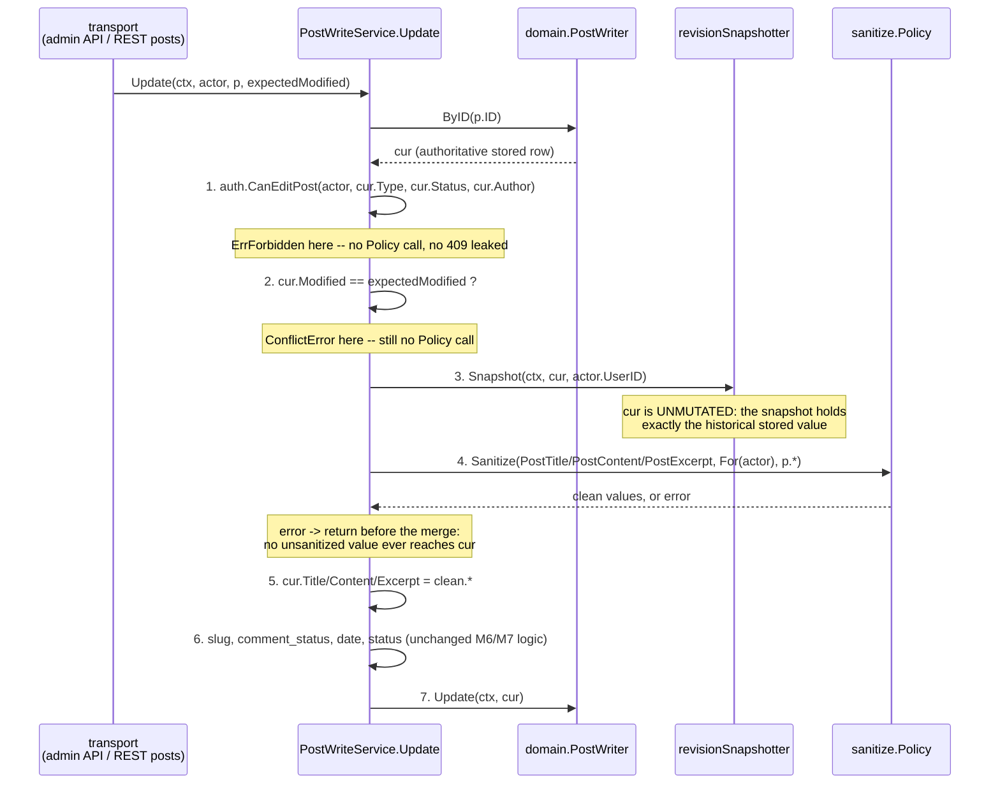

# M10a — Write-Boundary Content Safety: Design

## Overview

Four facts about the code as it stands set this milestone's shape.

**There is no sanitizer, and the tree says so twice.** `internal/web/view.go:22`
and `docs/compatibility.md:371` both recommend `bluemonday`; `go.mod` has 12
direct requirements and none of them parses HTML. The module graph contains no
`golang.org/x/net` entry at all, indirect or otherwise.

**Three write paths already store content verbatim.** `CommentService.Create`
(`internal/content/comments.go:80`) assigns status, stamps the dates and calls
`s.writer.Create(ctx, c)` with `c.Content` exactly as the transport handed it
over. `PostWriteService.Create` (`writeservices.go:88`) defaults
author/type/date, authorizes, and calls `s.w.Create(ctx, p)`.
`PostWriteService.Update` (`writeservices.go:122`) loads the authoritative row,
authorizes against *that* row, checks `expectedModified`, snapshots the pre-edit
state, and only then copies `p.Title`, `p.Content`, `p.Excerpt` onto it. Every
one of those copies is a caller value that nothing has inspected.

**The capability already exists and is checked nowhere.** `unfiltered_html` is
listed for editor (`internal/auth/roles.go:65`) and administrator (`:93`), and
`Principal.Can` (`internal/auth/principal.go:25`) is a one-line map lookup.
`auth.NewPrincipal` already folds explicit capability grants in alongside
role-derived ones, so a custom role carrying `unfiltered_html` resolves without
any new mechanism.

**The comment render path escapes twice and would keep doing so.**
`commentView` (`internal/web/comments.go:102`) applies `html.EscapeString`, and
`render.CommentView.Content` is a `string`, so
`themes/default/templates/partials/comments.tmpl:10`'s `{{.Content}}` escapes it
again. Sanitizing without removing that would leave every allow-listed `<em>`
arriving at the reader as four characters of text.

This design adds **one pure package, `internal/sanitize`**, holding three
filtering tiers built from declarative allow-list tables that mirror WordPress's
`kses` lists; wires it into the three write services (not the six transports);
turns `render.CommentView.Content` into `template.HTML` behind one new
`TRUST BOUNDARY` cast guarded by a comment-only tier-A render backstop; and
rewrites the two places in the tree that assert write paths are unsanitized. No
schema change, no new route, and no render-layer backstop over *post* fields (the
backstop is comment-only; Req 6.9-6.11, Finding 2).

Seven things were found during design that contradict the requirements as
written. They are collected in "Findings" at the end rather than resolved
silently; three of them change what gets built.

## Architecture



Two edges in that diagram carry the milestone's whole argument.

**`Echo --> P` is the only transport that calls the Policy**, and it is the one
place Requirement 4.4's "every transport inherits it without its own call" does
not apply — because the echo is not a write path. It renders an
attacker-supplyable query string into a `template.HTML` field. It is treated at
length in "The pending-comment echo".

**`Render -.-> Comments` is dotted because it is a non-call**, and that
non-call is where this milestone's residual risk lives. After Requirement 6.1
removes `html.EscapeString` from `commentView`, a comment row written before
M10a renders as live HTML. See Finding 2.

## Library selection: `bluemonday`

Requirement 8.3 requires evaluating `bluemonday` first. It passes every
constraint in 8.2, and the evidence below is per-constraint rather than a
verdict. Everything cited was read at tag **v1.0.27** (the current release,
`2024-07-04`), not inferred from the README.

| 8.2 constraint | Verdict | Evidence |
|---|---|---|
| **Allow-list based, never deny-list** | Pass | `NewPolicy()` (`policy.go:250`) returns a policy with `elsAndAttrs` empty; `sanitize.go:271`'s start-tag arm does `aps, ok := p.elsAndAttrs[token.Data]` and on `!ok` drops the element. An element is emitted only because it was named. `StrictPolicy()` is literally `return NewPolicy()` (`policies.go`), i.e. "allow nothing". There is no subtract-from-default path. |
| **Per-element attribute allow-lists** | Pass | `AllowAttrs(names...).OnElements(els...)` populates `elsAndAttrs[el][attr]`; `sanitizeAttrs` (`sanitize.go:458`) consults the element's own map first, then `globalAttrs`, and appends nothing that matched neither. Both scopes are needed here: WordPress's `$allowedposttags` is exactly a per-element map over a shared global tail. |
| **URL-scheme allow-lists** | Pass, with a caveat | `AllowURLSchemes(schemes...)` populates `allowURLSchemes`; `validURL` (`sanitize.go:911`) parses with `net/url` and rejects any non-empty scheme absent from that map. **Caveat:** the check fires only when `RequireParseableURLs(true)` is set, and only for the element/attribute pairs hard-coded in the switch at `sanitize.go:560-597` — `href` on `a`/`area`/`base`/`link`, `cite` on `blockquote`/`del`/`ins`/`q`, `src` on `audio`/`embed`/`iframe`/`img`/`script`/`source`/`track`/`video`. Other scheme-bearing attributes are **not** checked. This drives three tier-B exclusions (see "Divergences"). |
| **Deterministic output** | Pass | The token stream is consumed in document order from `golang.org/x/net/html`'s tokenizer; `sanitizeAttrs` iterates `attrs` (a slice) and appends in input order; CSS declarations are iterated as the slice `douceur` returned. The four `range` statements over maps in `sanitize.go` (lines 343, 476, 820, 1063) all read `elsMatchingAndAttrs`/`elsMatchingAndStyles`, populated **only** by `AllowElementsMatching` and `OnElementsMatching`. This design calls neither, so those maps are empty and no map-iteration order is observable. Recorded as a standing constraint on the tier tables, not as a happy accident. |
| **No network or filesystem access** | Pass | The package imports `bytes`, `fmt`, `io`, `net/url`, `regexp`, `strings`, `golang.org/x/net/html` and `github.com/aymerick/douceur/parser`. `net/url` parses; it does not dial. There is no `net.Dial`, no `os.Open`, no `http.Client`. URL handling is textual, satisfying Requirement 2.8 directly. |
| **Real HTML parser, not regexes** | Pass | `html.NewTokenizer` from `golang.org/x/net/html`, the core Go team's HTML5 tokenizer. Regexes appear only as optional *value* validators for attributes and CSS declarations, inside an allow-list — never as the tag-splitting mechanism. This is the constraint WordPress's own `kses` fails: `wp_kses_split` is a `preg_replace_callback` over `<[^>]*>`-shaped patterns, which is why the probe input `<a href="data:text/html,<b>x">x</a>` comes back from `wp_kses_post` as the mangled `&lt;a href=&quot;data:text/html,<b>x"&gt;x</a>`. |
| **Actively maintained** | Pass, qualified | Latest tag v1.0.27 (2024-07-04); latest commit on `main` 2025-04-04 ("Add support for transparent color value for `*-color` attributes", #214). Low velocity, but responsive: v1.0.16 shipped the CVE-2021-42576 fix. `go.mod` carries `retract [v1.0.0, v1.0.25]`, so the maintainer is actively steering consumers to current. Security policy present (`SECURITY.md`, updated 2024-07). The qualification matters more for its two CSS dependencies than for bluemonday itself — see below. |
| **Footprint acceptable against 12 direct requirements** | Pass | Four new modules. See the next section; the claim in Requirement 8.4 was verified rather than repeated, and it is very slightly wrong. |

### Dependency cost, verified

Requirement 8.4 says the cost is "`golang.org/x/net` plus two CSS packages".
Read from `bluemonday`'s own `go.mod` at v1.0.27:

```
require (
	github.com/aymerick/douceur v0.2.0
	golang.org/x/net v0.26.0
)

require github.com/gorilla/css v1.0.1 // indirect
```

So the shape is right and the arithmetic is one off: it is **four** new modules
in grimoire's graph, not three — `bluemonday` itself, `golang.org/x/net`,
`github.com/aymerick/douceur` (the CSS declaration parser) and
`github.com/gorilla/css` (douceur's own scanner). `golang.org/x/net` is confirmed
absent from grimoire's `go.mod` today, both blocks. `douceur` and `gorilla/css`
are reachable **only** through the tier-B `style` attribute path
(`sanitizeStyles`, `sanitize.go:812`), which is worth recording: if those two
low-activity modules ever become a liability, dropping `style` from tier B makes
them unreachable without removing them from the graph.

### Pinned versions (Requirement 8.6)

```
require (
	github.com/microcosm-cc/bluemonday v1.0.27
	golang.org/x/net v0.59.0
)
```

`golang.org/x/net` is pinned **forward, explicitly, as a direct requirement**
rather than inherited. Minimal version selection would otherwise settle on
bluemonday's `v0.26.0`, and `golang.org/x/net/html` is the actual parser standing
between this system and stored XSS; running it years behind current is not a
defensible default for a security component. Declaring it direct also gives the
tests a supported way to assert Property P2 on a parsed tree rather than by
substring search (see "Testing strategy"). No build-time code generation and no
runtime plugin loading, per 8.6.

### `UGCPolicy` and `StrictPolicy` are not usable as tiers

Both stock policies were considered and both are rejected for tier A and tier B.

`UGCPolicy()` (`policies.go`) is bluemonday's own editorial opinion about
user-generated content. It is neither a superset nor a subset of either
WordPress list: it excludes `class` entirely (WordPress's `$allowedposttags`
grants it globally), excludes `style`, adds `rel="nofollow"` rewriting that
WordPress does not perform, and allows elements WordPress does not. Requirement
2.11's fixed-point claim — grimoire's output survives a WordPress save
unchanged — is falsified by any element or attribute `UGCPolicy` permits that
`kses` strips, and `UGCPolicy` permits several. Using it would make the parity
constraint unprovable.

`StrictPolicy()` is `NewPolicy()` — allow nothing. It is used here for exactly
one thing, the `post_title` field kind, and even there it is not sufficient on
its own (see "`post_title` is plain text").

So **each tier is hand-built with `NewPolicy()`** from the declarative tables
below. That is the answer to the open question in roadmap task 10.A: the library
is adopted for its parser and its allow-list machinery, not for its policies.

## `internal/sanitize`

### Placement

The package is **`internal/sanitize`**, a top-level sibling of
`internal/routing`, and that is the precedent being followed rather than a
coin-flip.

`internal/routing` is the tree's established home for a pure rule package with
no database, no HTTP and no clock, consumed by **both** `internal/content` and
`internal/web`, whose whole job is to be the single place a decision is made so
two callers cannot disagree. The Policy has exactly that shape and exactly that
consumer set: `internal/content` (the three write services) and `internal/web`
(the pending-comment echo). The alternatives and why each is worse:

| Candidate | Rejected because |
|---|---|
| `internal/storage/...` | Forbidden by Requirement 1.3, and correctly: there is nothing vendor-specific about allow-listing HTML, so `internal/storage/storagetest` would assert the same thing three times for no information. |
| inside package `content` | `content` is a services package holding database-dependent constructors. A pure table-driven library inside it cannot be unit-tested without dragging the package's test fixtures along, and `internal/web` importing `content` for a sanitizer blurs a boundary that is currently clean. |
| inside package `auth` | `auth` owns *identity*: who the caller is and what they may do. It does not own what markup means. The Policy consumes `Principal.Can`; inverting that so `auth` owns HTML tables would put a parser in the authentication package. |
| `internal/content/sanitize` (subpackage) | Workable — no import cycle, since `auth` does not import `content` — but it implies the Policy is content-service-private, which it is not: `internal/web` must reach it for the echo. A top-level package states the real scope. |

`internal/sanitize` imports `internal/auth` (for `Principal`) and nothing else
from the tree. `auth` imports `domain` and `php`; neither imports `sanitize`, so
there is no cycle.

### API

```go
// Package sanitize is grimoire's write-boundary content policy: the single place
// that decides what markup may be persisted. It is pure -- no database, no file,
// no network, no clock -- so every behavior here is assertable in a unit test
// with no environment gating (Req 1.2).
package sanitize

// FieldKind is which content field is being sanitized. It is always an explicit
// argument and is never inferred from the input's shape, its length or the
// calling transport (Req 1.7).
type FieldKind int

const (
	PostContent    FieldKind = iota // post_content
	PostExcerpt                     // post_excerpt
	PostTitle                       // post_title
	CommentContent                  // comment_content
)

// Tier is one of the three filtering tiers (Req 2). Tier selection is a pure
// function of (FieldKind, whether the writer holds unfiltered_html); nothing
// else -- notably not authentication status -- is an input (Req 2.5).
type Tier int

const (
	TierA Tier = iota // WordPress $allowedtags: the tight comment list
	TierB             // WordPress $allowedposttags: the broad post list
	TierC             // no filtering at all; output is byte-identical to input
)

// Writer is the Policy's capability input. It carries two bits, and carrying two
// rather than one is Requirement 1.6: a caller with no Principal at all (public
// comment submission, where internal/web/comments.go reads PrincipalFrom and
// proceeds when it is absent) must be distinguishable at the call site from a
// logged-in user holding no capabilities, even though both land in the same tier.
// A zero-value Writer is the anonymous caller, which is the fail-closed default:
// a struct nobody filled in holds no capabilities and therefore never reaches
// TierC.
type Writer struct {
	authenticated bool
	unfiltered    bool
}

// Anonymous returns the Writer for a caller with no Principal.
func Anonymous() Writer { return Writer{} }

// For returns the Writer for a resolved Principal, reading unfiltered_html
// through Principal.Can -- the existing capability mechanism, with no second
// role table and no per-endpoint capability string (Req 1.5). Explicit grants
// resolved by auth.NewPrincipal select TierC exactly as the editor and
// administrator roles do, so a custom role carrying unfiltered_html works with
// no additional resolution step and a role rename changes nothing (Req 2.4).
func For(p auth.Principal) Writer {
	return Writer{authenticated: true, unfiltered: p.Can(CapUnfilteredHTML)}
}

// CapUnfilteredHTML is the capability name, declared here so the tier-selection
// test and the roles table are comparing one string rather than two literals.
const CapUnfilteredHTML = "unfiltered_html"

// Authenticated reports whether a Principal was present. It is NOT an input to
// tier selection (Req 2.5); it exists so a caller and a reviewer can tell the
// two capability-less cases apart, and so a future change that starts
// distinguishing them has to say so out loud.
func (w Writer) Authenticated() bool { return w.authenticated }

// TierFor is tier selection, standing alone so the matrix test of Req 9.3 can
// assert it without sanitizing anything.
func TierFor(k FieldKind, w Writer) Tier {
	if w.unfiltered {
		return TierC
	}
	if k == CommentContent {
		return TierA
	}
	return TierB
}

// Policy holds the compiled tier tables. It is built once and shared by every
// write path; the tables are written during New and never mutated afterwards, so
// Sanitize only reads them and is safe for concurrent use by request goroutines
// (Req 1.9). This is the same immutable-table-shared-by-value discipline
// routing.Structure follows.
type Policy struct {
	tierA  *bluemonday.Policy
	tierB  *bluemonday.Policy
	strict *bluemonday.Policy // titles; see titleText
}

// New compiles the tier tables. It allocates; call it once at startup.
func New() *Policy

// Sanitize returns the value that may be persisted, at the tier TierFor selects.
//
// It fails closed (Req 1.8): on any error the caller must abandon the write. The
// error is never "this content is unacceptable" -- the Policy does not reject
// content, it reports what survived, and the calling path keeps owning
// validation (Req 4.8). The error cases are an unrecognised FieldKind or Tier
// (a programming error that must not silently degrade to TierC) and a title that
// does not converge (see titleText).
func (p *Policy) Sanitize(k FieldKind, w Writer, in string) (string, error)

// SanitizeAt is Sanitize with the tier supplied rather than derived. It exists
// for the tier tables' own tests and the correctness properties, which quantify
// over tiers directly. No write path calls it.
func (p *Policy) SanitizeAt(k FieldKind, t Tier, in string) (string, error)
```

Three points about this shape, each answering a specific criterion.

**Purity versus a stateful `bluemonday.Policy` (Requirement 1.2).**
bluemonday's own documentation is explicit: "Policy creation/editing is not safe
to use in multiple goroutines… it is safe to use the policy in multiple
goroutines". That splits cleanly along `New` / `Sanitize`. `New` is the only
mutator; after it returns, the three `*bluemonday.Policy` values are read-only
tables. `Sanitize` is therefore a pure function of `(k, w, in)` in the sense
Requirement 1.2 needs: same arguments, same output, in any process, with no
database, file, network or clock access, and no observable state carried between
calls. `sanitizeWithBuff` allocates a fresh `bytes.Buffer` per call, so there is
no shared scratch space either. The `*Policy` receiver is a compiled lookup
table, exactly as `routing.Structure` is a compiled permalink grammar, and
neither being a value with fields makes the function impure.

**Fail-closed, concretely (Requirement 1.8).** bluemonday's `Sanitize` has no
error return: `sanitizeWithBuff` returns an empty buffer if the tokenizer errors.
That is fail-closed by construction — an internal failure can emit zero bytes but
never an unsanitized byte — and it is *indistinguishable from "everything was
stripped"*, which is a legitimate outcome the Policy must report rather than
error on. So the `error` return covers only cases where continuing would be
wrong rather than merely empty, and the emptied-field case composes with
Requirement 4.8 instead: the calling service evaluates required-field validation
against the sanitized value, so a field sanitized to empty is rejected exactly as
an empty submission is (see "Emptied fields"). There is no path in which
`Sanitize` returns a non-nil error *and* a value a caller could persist, and
there is no path in which unsanitized bytes are returned for tiers A or B.

**Tier C returns before touching the tables.** `SanitizeAt(k, TierC, in)` is
`return in, nil` for every field kind, including `PostTitle`. It does not call
bluemonday, does not tokenize, does not re-serialize and does not validate UTF-8.
That is Requirement 2.3's byte-identity, and it is why P4 is a fuzz target rather
than a table: the failure mode to guard against is a future refactor that routes
tier C through "the laxest policy" or through a parse-and-print round trip, both
of which look correct on well-formed fixtures and both of which mangle malformed
or non-UTF-8 input.

### The tables are data, not code

The allow-lists are declarative Go values, and the bluemonday policies are built
*from* them:

```go
// tierAElements is WordPress's $allowedtags. The zero-length slice means
// "element allowed, no element-specific attributes"; tier A has no global
// attribute set at all, which is what Req 2.1's "no class attribute on any
// element" amounts to.
var tierAElements = map[string][]string{...}

// tierBElements is WordPress's $allowedposttags, element-specific attributes
// only; tierBGlobalAttrs carries the shared tail.
var tierBElements = map[string][]string{...}
var tierBGlobalAttrs = []string{...}
var tierBStyleProps  = []string{...}
var allowedSchemes   = []string{...}
```

This is load-bearing three times over. Property P3 (tier monotonicity) becomes a
set-containment assertion over `tierAElements` and `tierBElements` directly,
rather than an attempt to infer the lists back out of sanitizer behavior — which
is what makes it checkable at all. The parity-fixture generator reads the same
tables, so the fixtures cannot drift from the policy. And a reviewer can diff the
tables against WordPress's arrays without reading any control flow.

## The tier tables (Requirements 2.1, 2.2, 2.9, 2.10, 2.13)

### Provenance of the enumeration

The lists below are not recalled or reconstructed from documentation. They were
read out of a running WordPress by dumping `$allowedtags`, `$allowedposttags`,
`wp_allowed_protocols()` and `safecss_filter_attr`'s `safe_style_css` default
array from the container this project develops against:

| | |
|---|---|
| Source | `podman exec wp-wordpress php` against `/var/www/html/wp-load.php` |
| Image | `docker.io/library/wordpress:latest` |
| `get_bloginfo('version')` | **7.1** |
| `count($allowedposttags)` | 124 |
| `count($allowedtags)` | 14 |
| `wp_allowed_protocols()` | 22 schemes |
| `safe_style_css` default | 163 properties (incl. 32 SVG presentation attributes new in 7.1) |

**Requirement 2 says "WordPress 6.x"; the verified source is 7.1.** That is
Finding 6. The enumeration below is 7.1's, because it is the version that can be
verified and re-verified, and because a parity fixture whose oracle cannot be
re-run is not a fixture. Every element in 7.1's list that is newer than 6.x
(`dialog`, `search`, `data`, the `command`/`commandfor`/`popovertarget` attributes
on `button`, and the MathML block) is either explicitly excluded below or is
inert markup whose presence makes grimoire *more* permissive than a 6.x site
would be — never less, so the 2.11 fixed point is unaffected in the direction
that matters.

### Tier A — comment content from a writer lacking `unfiltered_html`

WordPress's `$allowedtags`, complete. Fourteen elements, four
attributes, **no global attribute set**, and therefore no `class`, no `id`, no
`style` and no `img` (Requirement 2.1).

| Element | Attributes |
|---|---|
| `a` | `href`, `title` |
| `abbr` | `title` |
| `acronym` | `title` |
| `b` | — |
| `blockquote` | `cite` |
| `cite` | — |
| `code` | — |
| `del` | `datetime` |
| `em` | — |
| `i` | — |
| `q` | `cite` |
| `s` | — |
| `strike` | — |
| `strong` | — |

**Requirement 2.1's own enumeration is incomplete** — it lists `a (with href)`
and gives no attributes for `abbr`, `acronym` or `del`. The real list grants
`title` on `a`, `abbr` and `acronym` and `datetime` on `del`. The binding phrase
in 2.1 is "equivalent to WordPress's tight comment list `$allowedtags`", so the
table above governs and the parenthetical in the requirement is read as
illustrative. Recorded as Finding 5.

### Tier B — post content and post excerpt from a writer lacking `unfiltered_html`

WordPress's `$allowedposttags` **minus a stated exclusion set**. 92 elements.

Every element below also carries the **global attribute tail**, which is
`$allowedposttags`'s shared set and is what makes tier B "deliberately
permissive" per Requirement 2.2:

```
aria-controls  aria-current  aria-describedby  aria-details  aria-expanded
aria-hidden    aria-label    aria-labelledby   aria-live     class
data-*         dir           hidden            id            lang
role           style         tabindex          title         xml:lang
```

Expressed as `AllowAttrs(...the 19 named...).Globally()` plus
`AllowDataAttributes()` for `data-*` plus `AllowStyles(...).Globally()` for
`style` (see "Tier B `style` properties"). `data-*` is policy-wide in bluemonday
rather than per-element, which is exactly right here: `$allowedposttags` grants it
on every element it allows, and an element not in the allow-list is dropped
whole, so the wider scope is unobservable.

**35 elements carry the global tail and nothing else:**

```
abbr acronym address b bdo big br cite code dd dfn dl dt em fieldset i kbd mark
rb rp rt rtc ruby s samp search small strike strong sub sup tt u var wbr
```

**57 elements carry element-specific attributes in addition:**

| Element | Element-specific attributes |
|---|---|
| `a` | `href`, `rel`, `rev`, `name`, `target`, `download` |
| `area` | `alt`, `coords`, `href`, `nohref`, `shape`, `target` |
| `article` | `align` |
| `aside` | `align` |
| `audio` | `autoplay`, `controls`, `loop`, `muted`, `preload`, `src` |
| `blockquote` | `cite` |
| `button` | `command`, `commandfor`, `disabled`, `name`, `type`, `value`, `popovertarget`, `popovertargetaction`, `aria-haspopup` |
| `caption` | `align` |
| `col` | `align`, `char`, `charoff`, `span`, `valign`, `width` |
| `colgroup` | `align`, `char`, `charoff`, `span`, `valign`, `width` |
| `data` | `value` |
| `del` | `datetime` |
| `details` | `align`, `open`, `name` |
| `dialog` | `closedby`, `open`, `popover`, `autofocus` |
| `div` | `align`, `popover` |
| `figcaption` | `align` |
| `figure` | `align` |
| `font` | `color`, `face`, `size` |
| `footer` | `align` |
| `h1` `h2` `h3` `h4` `h5` `h6` | `align` |
| `header` | `align` |
| `hgroup` | `align` |
| `hr` | `align`, `noshade`, `size`, `width` |
| `img` | `alt`, `align`, `border`, `height`, `hspace`, `loading`, `vspace`, `src`, `width` |
| `ins` | `datetime`, `cite` |
| `label` | `for` |
| `legend` | `align` |
| `li` | `align`, `value` |
| `main` | `align` |
| `map` | `name` |
| `menu` | `type` |
| `meter` | `high`, `low`, `max`, `min`, `optimum`, `value` |
| `nav` | `align` |
| `ol` | `start`, `type`, `reversed` |
| `p` | `align` |
| `pre` | `width` |
| `progress` | `max`, `value` |
| `q` | `cite` |
| `section` | `align` |
| `span` | `align` |
| `summary` | `align` |
| `table` | `align`, `bgcolor`, `border`, `cellpadding`, `cellspacing`, `rules`, `summary`, `width` |
| `tbody` | `align`, `char`, `charoff`, `valign` |
| `td` | `abbr`, `align`, `axis`, `bgcolor`, `char`, `charoff`, `colspan`, `headers`, `height`, `nowrap`, `rowspan`, `scope`, `valign`, `width` |
| `tfoot` | `align`, `char`, `charoff`, `valign` |
| `th` | `abbr`, `align`, `axis`, `bgcolor`, `char`, `charoff`, `colspan`, `headers`, `height`, `nowrap`, `rowspan`, `scope`, `valign`, `width` |
| `thead` | `align`, `char`, `charoff`, `valign` |
| `time` | `datetime` |
| `tr` | `align`, `bgcolor`, `char`, `charoff`, `valign` |
| `track` | `default`, `kind`, `label`, `src`, `srclang` |
| `ul` | `type`, `popover` |
| `video` | `autoplay`, `controls`, `height`, `loop`, `muted`, `playsinline`, `preload`, `src`, `width` |

**What tier B excludes, and why.** Requirement 2.2 requires excluding `iframe`,
`form`, `input` and every `on*` handler. All four are excluded **because
`$allowedposttags` already excludes them** — verified: the dumped array contains
no `iframe`, no `form`, no `input` and no attribute beginning `on`. Tier B
inherits the exclusion rather than adding it, which is the stronger position: the
tight bound is WordPress's list, not a hand-maintained blocklist on top of it.

Five further exclusions are grimoire's own, all in the strictening direction:

| Excluded | Reason |
|---|---|
| `object` (element) | Its `data` attribute is an active-content URL sink, and it is **not** in bluemonday's scheme-checked switch (`sanitize.go:560-597`), so `data="javascript:…"` would survive tier B unexamined. WordPress strips the protocol prefix instead; grimoire drops the element. |
| `img[longdesc]` | Same reason: scheme-bearing, not scheme-checked. Verified against WordPress, which emits `longdesc="alert(1)"` for a `javascript:` input rather than dropping it. |
| `video[poster]` | Same reason; same verified WordPress behavior. |
| `img[usemap]` | Scheme-bearing in HTML4, not scheme-checked. A fragment reference is the only legitimate value and `map[name]` remains allowed, so the loss is nil in practice. |
| `title`, `textarea` (elements) | Raw-text / RCDATA elements. Their content is not parsed as markup by the tokenizer, so what survives inside them depends on tokenizer state rather than on the allow-list — the one place bluemonday's token-based (rather than tree-based) approach is hardest to reason about. Neither belongs in post body content. |
| the MathML block: `math` `mtext` `mi` `mn` `mo` `mspace` `ms` `mrow` `mfrac` `msqrt` `mroot` `mstyle` `merror` `mpadded` `mphantom` `msub` `msup` `msubsup` `munder` `mover` `munderover` `mmultiscripts` `mprescripts` `mtable` `mtr` `mtd` `semantics` `annotation` `menclose` (29 elements) | bluemonday consumes a **token stream**, not a parse tree, so it applies no foreign-content namespace rules. MathML is where the HTML parser's insertion modes stop matching naive token filtering (the `<math><mtext><table><mglyph><style>` mutation-XSS family), and a filter that cannot model the tree cannot reason about it. Excluded for M10a and deferrable to a later milestone once there is a reason to want it. Newly added in WordPress 7.x, so excluding it also removes the largest 6.x-vs-7.1 divergence from the surface. |

Each exclusion makes grimoire's output a **subset** of what `kses` accepts, which
is the invariant that makes Requirement 2.11 provable rather than hopeful:

> **Subset invariant.** Tier A's and tier B's allow-lists are subsets of
> `$allowedtags` and `$allowedposttags` respectively. Therefore any value grimoire
> emits at that tier is already inside `kses`'s language, so
> `kses(sanitize(k, t, x)) == sanitize(k, t, x)` holds by construction and P8's
> fixture set is a regression pin rather than the proof. Loosening beyond
> WordPress's lists would invalidate the invariant; tightening never can. Any
> future addition to a tier table must therefore be justified against
> WordPress's array, not against convenience.

### Tier A ⊆ Tier B holds (Requirement 2.6, property P3)

Checked element by element and attribute by attribute against the tables above,
because Requirement 2.6 asks for a containment property of the lists and the
honest answer required verifying it rather than asserting it:

| Tier A grant | Present in tier B as |
|---|---|
| `a[href]` | `a`'s element-specific `href` |
| `a[title]`, `abbr[title]`, `acronym[title]` | the global `title` |
| `b`, `cite`, `code`, `em`, `i`, `s`, `strike`, `strong` | global-tail-only elements |
| `blockquote[cite]` | `blockquote`'s element-specific `cite` |
| `del[datetime]` | `del`'s element-specific `datetime` |
| `q[cite]` | `q`'s element-specific `cite` |

All 14 tier-A elements and all 4 tier-A attribute grants are present in tier B.
**Containment holds**, and it survives the five exclusions above because none of
them touches a tier-A element or attribute. `allow(A) ⊆ allow(B) ⊆ allow(C)` is
therefore assertable directly over `tierAElements` and `tierBElements`.

One carve-out has to be stated rather than glossed. **HTML comments are governed
on a separate axis from elements and attributes**, and tier A is *stricter* than
tier B there:

| Tier | Comment tokens | Why |
|---|---|---|
| A | stripped (bluemonday default; `AllowComments()` not called) | A comment body has no legitimate use for them, and conditional-comment constructs are pure liability. |
| B | **kept** (`AllowComments()`) | Required, not optional. Verified: `wp_kses_post("<!-- wp:paragraph --><p>Hi</p><!-- /wp:paragraph -->")` returns its input unchanged. Gutenberg block delimiters **are** HTML comments; stripping them at tier B would silently destroy the block structure of every post an author saves, and would contradict this milestone's own out-of-scope note that "block comments in tier B/C content are unaffected". |

This does not break Requirement 2.6, whose containment is over elements and
attributes; and it points the same way anyway (A strips, B keeps), so nothing
survives tier A only to be removed at tier B.

### URL schemes (Requirement 2.9)

WordPress's `wp_allowed_protocols()`, complete, 22 schemes:

```
http   https  ftp    ftps   mailto  news   irc    irc6
ircs   gopher nntp   feed   telnet  mms    rtsp   sms
svn    tel    fax    xmpp   webcal  urn
```

Neither `javascript:` nor `data:` appears, which is Requirement 2.9's floor.
Expressed as:

```go
p.AllowURLSchemes(allowedSchemes...)  // the 22 above
p.AllowRelativeURLs(true)             // kses permits "/local/page"; verified
p.RequireParseableURLs(true)           // REQUIRED: validURL is not consulted otherwise
```

`RequireParseableURLs(true)` is not cosmetic. `sanitizeAttrs` gates the whole
scheme check on it (`sanitize.go:549`), so omitting it yields a policy that
allow-lists schemes and never checks one. This is the single most consequential
line in the tier construction and the tests in Requirement 9.2 exist to catch its
removal.

Applied to tier A this covers `a[href]`, `blockquote[cite]` and `q[cite]`; applied
to tier B it covers `a[href]`, `area[href]`, `blockquote[cite]`, `ins[cite]`,
`q[cite]`, `audio[src]`, `img[src]`, `track[src]` and `video[src]`. **Every
scheme-bearing attribute either tier grants is inside bluemonday's checked
switch** — that is what the three attribute exclusions above buy, and it is worth
stating as the acceptance condition for any future table change: an attribute may
be added to a tier only if bluemonday scheme-checks it or it cannot carry a URL.

### Tier B `style` properties (Requirement 2.10)

bluemonday supports CSS filtering, so Requirement 2.10's conditional applies and
the `style` attribute is filtered to a property allow-list rather than passed
through. The mechanism is `AllowStyles(props...).Globally()`, which attaches
`css.GetDefaultHandler(prop)` per property — a value validator, not merely a name
check. A property bluemonday has no handler for falls through to `BaseHandler`,
which `return false`s, so unknown properties are **dropped**, not passed.

The allow-list is the **intersection** of WordPress's `safe_style_css` default
array and the properties bluemonday can validate — 117 properties. The
intersection is the right set for the same reason as the subset invariant: a
property WordPress forbids must not be allowed (parity), and a property
bluemonday cannot validate is dropped anyway (so listing it would be a lie in the
table).

```
align-content align-items align-self background background-attachment
background-blend-mode background-color background-image background-position
background-repeat background-size border border-bottom border-bottom-color
border-bottom-left-radius border-bottom-right-radius border-bottom-style
border-bottom-width border-collapse border-color border-left border-left-color
border-left-style border-left-width border-radius border-right
border-right-color border-right-style border-right-width border-spacing
border-style border-top border-top-color border-top-left-radius
border-top-right-radius border-top-style border-top-width border-width bottom
box-shadow caption-side clear color column-count column-fill column-gap
column-rule column-span column-width columns cursor direction display filter
flex flex-basis flex-direction flex-flow flex-grow flex-shrink flex-wrap float
font font-family font-size font-style font-variant font-weight
grid-auto-columns grid-auto-rows grid-column grid-column-end grid-column-gap
grid-column-start grid-gap grid-row grid-row-end grid-row-gap grid-row-start
grid-template-columns grid-template-rows height justify-content left
letter-spacing line-height list-style-type margin margin-bottom margin-left
margin-right margin-top max-height max-width min-height min-width object-fit
object-position opacity overflow padding padding-bottom padding-left
padding-right padding-top position right text-align text-decoration text-indent
text-transform top vertical-align white-space width writing-mode z-index
```

**14 properties WordPress allows and bluemonday cannot validate**, therefore
dropped and recorded as divergences:

```
aspect-ratio  container-type  gap  justify-items  justify-self
margin-block-start  margin-block-end  margin-inline-start  margin-inline-end
padding-block-start padding-block-end  padding-inline-start padding-inline-end
row-gap
```

Also dropped: WordPress 7.1's 32 SVG presentation attributes (`fill`, `stroke`,
`cx`, `cy`, `r`, `clip-path`, `mask`, …) — no SVG element is in tier B, so they
have nothing to apply to — and `--*` custom properties, which bluemonday's
property map cannot express.

One CSS behavior is worth its own line because it loses legitimate content.
bluemonday's `url()` validator is `^url\(["']?((https|http)[a-z0-9.\\/_:]+["']?)\)$`
(`css/handlers.go:324`): **http and https only, absolute only**. So
`background-image: url(/wp-content/uploads/x.png)` is dropped at tier B although
WordPress keeps it. That is stricter than `wp_allowed_protocols` in a way that a
real post can notice, and it is recorded in `docs/compatibility.md` rather than
left to be discovered.

## Divergences from WordPress `kses` (Requirement 2.12)

Every one of these was produced by running the input through the live WordPress
7.1 container and comparing, not by reading bluemonday's source and guessing. All
of them point the same way — grimoire is stricter — so the subset invariant and
therefore Requirement 2.11 hold throughout. Each goes into
`docs/compatibility.md` per Requirement 7.5, and each becomes a committed parity
fixture per Requirement 9.10.

| # | Input | WordPress `kses` | grimoire | Direction |
|---|---|---|---|---|
| D1 | `<script>alert(1)</script>` | `alert(1)` — tags stripped, text kept | `` — content skipped | stricter |
| D2 | `<style>.x{color:red}</style>` | `.x{color:red}` | `` | stricter |
| D3 | `<a href="javascript:alert(1)">x</a>` | `<a href="alert(1)">x</a>` — protocol prefix stripped, remainder kept as a relative URL | `<a>x</a>` — attribute dropped | stricter |
| D4 | `` | keeps `longdesc="alert(1)"` | attribute not in tier B at all | stricter |
| D5 | `<video poster="javascript:alert(1)" src="v.mp4">` | keeps `poster="alert(1)"` | attribute not in tier B | stricter |
| D6 | `<object data="…">` | `<object></object>` | element not in tier B | stricter |
| D7 | `<A HREF="http://x/" TITLE="t">y</A>` | `<A href="http://x/" title="t">y</A>` — element name case preserved | `<a href="http://x/" title="t">y</a>` — lowercased by the tokenizer | cosmetic; a fixed point either way |
| D8 | `<a>text</a>` (no attributes) | `<a>text</a>` | `text` — bluemonday drops an allowed element that ends with zero attributes unless it is in `setOfElementsAllowedWithoutAttrs`, and `a`, `area`, `img`, `font`, `label`, `map`, `data`, `meter`, `progress`, `track`, `legend`, `main`, `menu`, `search`, `dialog`, `bdo`, `big`, `rb`, `rtc` are **not** in bluemonday's default set | **must be fixed, not documented** — see below |
| D9 | `<a href="/x?a=%41&b">y</a>` | value preserved verbatim | percent-encoding normalized by `url.Parse`/`String` and query keys re-escaped (`sanitize.go:178`) | cosmetic; idempotent |
| D10 | `background-image: url(/rel.png)` | kept | dropped (http/https absolute only) | stricter, user-visible |
| D11 | `style="aspect-ratio:16/9"` and the 13 other properties listed above | kept | dropped | stricter |
| D12 | MathML markup | kept (7.1) | dropped | stricter |
| D13 | `<title>a</title>`, `<textarea>a</textarea>` in post content | kept | dropped | stricter |
| D14 | `<!-- wp:paragraph -->` in comment content | kept | dropped at tier A | stricter |
| D15 | non-UTF-8 bytes at tier A/B | `kses` is byte-oriented and largely passes them | replaced with U+FFFD by the tokenizer | stricter; tier C is byte-identical, which is the case Requirement 2.3 cares about |

**D8 is a defect to fix during construction, not a divergence to record.**
bluemonday's `setOfElementsAllowedWithoutAttrs` (`policy.go:875`) covers most
formatting elements but not the nineteen named above, and an element that emerges
from `sanitizeAttrs` with zero surviving attributes is dropped
(`sanitize.go:292`). Left alone, tier B would silently delete a bare
`<a>text</a>` while keeping `<a href="…">text</a>`, and tier A would delete a bare
`<a>`. So `New` calls `AllowNoAttrs().OnElements(...)` for **every element in the
tier's table**, unconditionally. Stated explicitly because it is invisible in
testing unless a fixture happens to include an attribute-less instance of one of
those nineteen elements, and because it is the kind of thing that reads as
redundant to a future reader and gets deleted.

## `post_title` is plain text (Requirement 3)

Requirement 3 is stricter than WordPress and deliberately so, and design work
turned up that WordPress is stricter here than the requirement's framing assumes.
`kses_init_filters()` in WordPress 7.1 registers:

```php
add_filter( 'title_save_pre', 'wp_filter_kses' );        // the TIGHT $allowedtags list
add_filter( 'content_save_pre',  'wp_filter_post_kses' ); // the broad list
add_filter( 'excerpt_save_pre',  'wp_filter_post_kses' );
```

So `post_title` in WordPress is filtered by the **comment** list, not the post
list. The Resolved-decisions table's "WordPress permits inline markup in
`post_title`" is true but under-specifies which markup. This strengthens rather
than weakens grimoire's choice: plain text is a subset of `$allowedtags`, so the
subset invariant and the 2.11 fixed point hold for titles too.

Also verified, and relevant to Requirement 3.4's "deliberate, narrow data loss":
WordPress does the same thing. `wp_kses_post("5 < 6 & 7 > 2")` returns `5  2` —
`kses` eats `< 6 & 7 >` as a bogus tag. The `<`/`>` loss grimoire accepts for
titles is a loss WordPress already takes for all content.

### `StrictPolicy` alone does not satisfy Requirement 3.3

`bluemonday.StrictPolicy()` removes all markup and **escapes the surviving text**:
the `html.TextToken` arm writes `token.String()`, which is
`html.EscapeString(token.Data)` (`sanitize.go:417-445`). So
`StrictPolicy().Sanitize("5 < 6")` yields `5 &lt; 6`, and Requirement 3.3
explicitly forbids emitting `&lt;` — it would be escaped a second time by
`html/template` at every title emission site and reach the reader as the literal
five characters `&lt;`, which is the defect Requirement 6 removes from comments.

The title path is therefore three composed steps, run to a fixed point:

```go
const titleMaxPasses = 16

// titleText strips all markup from a title, preserving its text (Req 3.2) and
// emitting neither markup delimiters nor HTML entities (Req 3.3).
//
// Each pass runs four steps, in this exact order -- decode BEFORE parse, so that
// markup hidden behind entity encoding is laid bare as real markup and the parser
// then strips it as markup rather than leaving its angle-stripped tag name as text:
//   1. unescapeToFixedPoint -- fully decode HTML entities to a fixed point
//      (repeated stdhtml.UnescapeString, bounded by titleMaxPasses). This peels
//      every layer of nested encoding, so "&amp;lt;b&amp;gt;" becomes "<b>". If
//      entity-decoding alone will not converge, the title fails closed.
//   2. p.strict.Sanitize -- a real parser (StrictPolicy, never a regex per
//      Req 8.7) removes the now-visible markup and its content, leaving
//      HTML-escaped text.
//   3. stdhtml.UnescapeString -- undo the escaping step 2 applied to the
//      surviving text (so "5 &lt; 6" becomes "5 < 6").
//   4. deleteAngles -- remove every residual '<' and '>' rune (Req 3.4's stated
//      loss), making the result safe for an auto-escaped string field with no
//      entity in sight.
//
// WHY decode-then-parse. A single decode AFTER the parse leaves a nested encoding
// like "&amp;lt;b&amp;gt;" converging to the text "b" -- a pre-encoding walk-past
// the parser never saw as a tag. Decoding to a fixed point FIRST means the
// revealed "<b>" is stripped AS markup, so that input converges to the empty
// string instead. That is the intent of Req 3.3 and property P1: the stored title
// carries no markup delimiters and no live entities, and the nested-encoding class
// is killed rather than merely peeled down to its tag name.
//
// The outer loop exists because steps 1-4 are not individually idempotent across
// a title that re-encodes itself; each pass is length-non-increasing and strictly
// shortening whenever it changes anything, so it converges. titleMaxPasses bounds
// both the entity-decode fixed point and the outer loop; a title needing more than
// 16 layers is an attack, not content, so exceeding the bound fails closed
// (Req 1.8) rather than emitting a partially-decoded value.
func unescapeToFixedPoint(s string) (string, bool) {
	for i := 0; i < titleMaxPasses; i++ {
		n := stdhtml.UnescapeString(s)
		if n == s {
			return s, true
		}
		s = n
	}
	return "", false
}

func (p *Policy) titleText(in string) (string, error) {
	cur := in
	for i := 0; i < titleMaxPasses; i++ {
		dec, ok := unescapeToFixedPoint(cur)
		if !ok {
			return "", ErrTitleNotConverging
		}
		next := deleteAngles(stdhtml.UnescapeString(p.strict.Sanitize(dec)))
		if next == cur {
			return next, nil
		}
		cur = next
	}
	return "", ErrTitleNotConverging
}
```

Worked examples, all three of which a test pins:

| Input | Pass 1 (decode-to-fixed-point → parse → unescape → delete) | Pass 2 | Result |
|---|---|---|---|
| `<em>Hello</em>` | `Hello` | stable | `Hello` (Requirement 3.2) |
| `5 &amp; 6` | `5 & 6` | stable | `5 & 6`; `html/template` re-escapes it at every emission site, so the reader sees `5 & 6` |
| `&amp;lt;b&amp;gt;` | decodes to `<b>`, which the parser strips as markup → `` | stable | `` — the nested-encoding class, fully unwrapped; decoding *before* parsing is what reduces it to empty rather than to the text `b` |

The fixed-point loop is what makes Requirement 3.3 and property P5 hold *together*
with P1. Its cost is one additional documented data loss: a title whose literal
text contains an HTML entity sequence loses it, not just its `<` and `>`. That is
a strict superset of Requirement 3.4's stated loss and goes in
`docs/compatibility.md` alongside it. The alternative — a single pass, no loop —
satisfies 3.1–3.4 but is **not idempotent** and so fails P1; that conflict and
the three candidate resolutions are Finding 1.

`render.PostView.Title` stays a `string` (Requirement 3.5). No title emission
site is audited or changed. The middle option Requirement 3.6 rejects — allow-list
some inline elements while the field stays auto-escaped — is not implemented.

## Write-path wiring (Requirement 4)

### Ordering in `PostWriteService.Update`

Requirement 4.3's ordering is load-bearing and trivially reversible, so it is
written out as a sequence rather than described.



Concretely, the diff is one call inserted between the existing
`s.revisions.Snapshot(...)` line and the existing `cur.Title = p.Title` line:

```go
	if err := s.revisions.Snapshot(ctx, cur, actor.UserID); err != nil {
		return err // snapshots cur BEFORE any field below mutates it
	}

	// Req 4.3: sanitize the CALLER's values here -- after authorization, after
	// the optimistic-concurrency check, after the revision snapshot, and before
	// the merge below. Not at the top of Update: sanitizing before the
	// authorization check would spend the Policy on input an unauthorized caller
	// is not entitled to have evaluated, and it would put the only natural place
	// to fuse sanitize-and-merge ahead of the snapshot, which is exactly the
	// reversal this ordering exists to prevent. cur is not touched, which is what
	// leaves the snapshot holding the historical stored value (Req 9.7).
	clean, err := s.sanitizeIncoming(actor, p, cur)
	if err != nil {
		return err // fail closed (Req 1.8): no merge, no write
	}

	cur.Title = clean.Title
	cur.Content = clean.Content
	cur.Excerpt = clean.Excerpt
```

`Create` has no `cur`, so all three fields are sanitized unconditionally,
immediately after `auth.CanCreatePost` and before `s.w.Create`.

`sanitizeIncoming` carries one rule beyond the obvious, and it exists because of
Finding 3:

```go
// sanitizeIncoming sanitizes the caller's title/content/excerpt at the actor's
// tier. A field whose caller value is byte-identical to the stored value is
// passed through unsanitized, because it is not a caller value in any meaningful
// sense: REST's partial update merges the stored record as its base
// (rest_posts.go parseRESTPostWrite), so a PATCH of {"title":"x"} arrives here
// with p.Content == cur.Content. Re-sanitizing it would rewrite pre-M10a or
// imported content in place, which Requirement 5.2 forbids ("no write-back of
// sanitized content over stored rows"). Skipping it introduces nothing: the value
// is already in the row. See design.md Finding 3.
func (s *PostWriteService) sanitizeIncoming(actor auth.Principal, p, cur domain.Post) (domain.Post, error)
```

### Ordering in `CommentService.Create`

```go
func (s *CommentService) Create(ctx context.Context, actor sanitize.Writer, c domain.Comment) (domain.Comment, domain.Post, error) {
	// ... post lookup, publish check, comment-status check: unchanged ...

	// Req 4.1: sanitize before the spam evaluation and before persistence, so
	// the spam filter scores the text that will actually be stored and the
	// "comment.submitted" payload carries the stored value. This is also
	// WordPress's order: pre_comment_content runs in wp_filter_comment, ahead of
	// wp_allow_comment.
	clean, err := s.policy.Sanitize(sanitize.CommentContent, actor, c.Content)
	if err != nil {
		return domain.Comment{}, domain.Post{}, err
	}
	if clean == "" {
		return domain.Comment{}, domain.Post{}, ErrCommentEmpty
	}
	c.Content = clean

	// ... spam verdict, status, dates, writer.Create, DoAction: unchanged ...
}
```

The signature gains `actor sanitize.Writer`. That is the one existing service
signature this milestone changes, and it is what Requirement 1.6 asks for: the two
call sites already read `PrincipalFrom`, and they now say out loud which case
they are in.

```go
// internal/web/comments.go (commentSubmit) and rest_comments.go
// (handleRESTCommentCreate), both sites:
actor := sanitize.Anonymous()
if p, ok := PrincipalFrom(r.Context()); ok {
	c.UserID = p.UserID
	actor = sanitize.For(p)
}
```

An absent principal and a logged-in subscriber are distinguishable here and land
in the same tier (`TierFor` ignores `Authenticated`), which is Requirement 2.5.
Deriving the capability from `c.UserID` instead was rejected: it carries no
capabilities, so answering it would require a database read and destroy
Requirement 1.2.

### Emptied fields (Requirement 4.8)

Requirement 4.8 describes the public comment handler's
`author == "" || email == "" || commentContent == ""` check rejecting a
sanitized-to-empty submission with `400`. That check runs *before* `Create`, so it
cannot see the sanitized value, and the handler cannot look at the sanitized value
without calling the Policy — which Requirement 4.4 forbids. Resolved by moving the
*evaluation* into the service while keeping the *outcome* and the *ownership*
where 4.8 puts them: `CommentService.Create` returns a new sentinel
`content.ErrCommentEmpty`, and both transports map it onto the 400 branch they
already have.

```go
// ErrCommentEmpty is returned by CommentService.Create when the Policy's output
// for the comment content is empty although the submitted value was not -- a body
// consisting entirely of markup tier A strips. The Policy does not reject content
// (Req 4.8); this is the calling path evaluating the existing required-field rule
// against the sanitized value, so such a submission is handled exactly as an
// empty submission is.
var ErrCommentEmpty = errors.New("content: comment content empty after sanitization")
```

`web/comments.go` returns the same
`"Bad Request: name, email, and comment are required"` 400 it returns today;
`rest_comments.go` returns the same `rest_comment_content_invalid` 400 body it
returns today. Byte-identical responses, no new contract.

The post path has the same hazard in one field: a title of `<em></em>`
sanitizes to empty, and both transports require a non-empty title.
`PostWriteService` returns `content.ErrTitleEmpty` for that case, mapped to each
transport's existing missing-title 400. Content and excerpt have no non-empty
requirement in M6 and get none here.

### Every transport inherits the Policy (Requirement 4.4)

| Transport | Reaches the Policy through | Own Policy call |
|---|---|---|
| `internal/web/comments.go` `commentSubmit` | `CommentService.Create` | none |
| `internal/web/rest_comments.go:150` | `CommentService.Create` | none |
| `internal/web/adminapi_posts.go:72` | `PostWriteService.Create`/`Update` | none |
| `internal/web/rest_posts.go:207` | `PostWriteService.Create`/`Update` | none |
| a fourth transport over the same services | the same two services | none required |
| `internal/web/handlers.go:209` pending echo | **its own call** — not a write path; see below | one, unavoidable |

`restNotImplemented` in `rest_media.go` and `rest_users.go` is untouched and still
answers `501` (Requirement 4.7). No read path, listing, REST serializer or template
helper sanitizes (Requirement 4.5). The casts at `internal/web/view.go:37-38` keep
their fields, types and sites; only the comment above them changes
(Requirement 4.6).

### Construction and injection

`cmd/grimoire/main.go` builds **one** `*sanitize.Policy` and hands the same pointer
to everything that needs it:

```go
	// One Policy for the process: allow-listing HTML is not vendor-, transport-
	// or field-specific, so there is exactly one of these (Req 1.1). It is built
	// before the write services because both take it, and before web.NewServer
	// because the pending-comment echo re-sanitizes through the same instance.
	contentPolicy := sanitize.New()

	comments := content.NewCommentService(
		repos.Comments, repos.CommentWriter, repos.CommentMeta, repos.PostWriter,
		content.NewBasicCommentSpamFilter(content.BasicCommentSpamFilterConfig{}),
		contentPolicy,
	)
	postWrite := content.NewPostWriteService(
		repos.PostWriter,
		content.WithRevisionSnapshotter(revisionWrite),
		content.WithContentPolicy(contentPolicy),
	)
	// ... .WithContentPolicy(contentPolicy) on the Server builder ...
```

Two deliberate asymmetries in how it is injected, both driven by fail-closed:

- `NewCommentService` takes it **positionally**. The constructor already has five
  required arguments and every call site is being touched anyway for the `actor`
  parameter, so there is nothing to preserve and a required argument is the
  strongest statement that sanitization is not optional.
- `NewPostWriteService` takes it as a `PostWriteOption`, because it has pre-M7
  call sites and M7 already established `PostWriteOption` as the way to add a
  dependency without breaking them. **But the default is not nil**: the
  constructor installs `sanitize.New()` when no option is supplied, so an unwired
  `PostWriteService` sanitizes rather than silently not sanitizing. A nil-means-
  no-Policy default would make Requirement 1.8 a lie that compiles. `main.go`
  passes the shared instance so production has exactly one, and the task list
  asserts that the same pointer reaches both services and the Server.

## Comment rendering and the pending-comment echo (Requirement 6)

### The double escape comes out

```go
// internal/render/comments.go
type CommentView struct {
	Author      string        // stays a string, auto-escaped (Req 6.5)
	AuthorURL   string        // unchanged
	Date        time.Time
	Content     template.HTML // was string (Req 6.1)
	PendingEcho bool
}
```

`html.EscapeString` leaves `commentView` (`internal/web/comments.go:102`) and is
replaced not by a bare `template.HTML` cast but by a tier-A **render backstop**:
`commentView` becomes a method on `*Server` and runs the stored content through
`sanitize.Policy` at tier A before casting (Req 6.9-6.11; Finding 2). That is the
one place this milestone adds render-path sanitization, and it is comment-only --
the post casts at `view.go:37-38` get no backstop (Req 4.6). The reasoning for the
backstop, and why it does not transfer to post fields, is Finding 2.
`internal/web/comments_public_test.go:104`, which pins
`&amp;lt;b&amp;gt;Hello&amp;lt;/b&amp;gt;`, is inverted, and the replacing
assertion carries a comment naming M10a and the reason, so review reads it as
intended rather than as a test loosened to make a change pass (Requirement 6.3).
`internal/content/rest.go:334` keeps its `html.EscapeString` on the REST
`content.rendered` field, unchanged and deliberately (Requirement 6.8).

### One cast site, not two

Requirement 6.7 says the tree gains a *third* `template.HTML` cast site. Building
it naively gives a fourth: one in `commentView` for stored comments and one in
`renderSingle` for the echo. The echo therefore goes **through `commentView`**
rather than around it:

```go
// internal/web/handlers.go, replacing lines 209-211
if r.URL.Query().Get("comment") == "pending" {
	echo, err := s.pendingEcho(r)
	if err != nil {
		return err // fail closed: no echo rather than an unsanitized one
	}
	pending = echo
}
```

```go
// internal/web/comments.go
//
// TRUST BOUNDARY: CommentView.Content is emitted verbatim as template.HTML,
// bypassing html/template auto-escaping. This is the only comment cast site in
// the tree, and it is safe because the value it casts is sanitized HERE, on the
// render path, by the tier-A RENDER BACKSTOP (Req 6.9-6.11; Finding 2): every
// comment value is run through sanitize.Policy at tier A, UNCONDITIONALLY --
// independent of the rendering request's principal and of the tier the value was
// written at, because provenance is not tracked (Req 5.3). This is a second
// application of the SAME tier-A list, not a second policy and not a laxer pass.
//
// The backstop is what makes the cast safe for EVERY comment row, including:
//   (a) post-M10a rows already sanitized at the writer's tier in
//       content.CommentService.Create -- for these the backstop is a no-op by
//       P1 idempotence (tier-A content is a fixed point of tier A); and
//   (b) rows stored BEFORE M10a, or imported, which never passed the write
//       boundary -- a pre-M10a comment containing <script> renders INERT because
//       the backstop strips it on the way out. The stored row is NOT repaired
//       (nothing is written back, Req 5.2); it simply can no longer reach a
//       reader as live markup. See docs/compatibility.md, "Comment render
//       backstop".
//
// A tier-C writer's comment is still STORED byte-identically, but it is RENDERED
// through tier A like every other comment, so tier C buys no extra markup in a
// rendered comment body. CommentView.Author stays a string and stays
// auto-escaped; the boundary widens to comment CONTENT only (Req 6.5).
//
// commentView is a method on *Server so it can reach the shared *sanitize.Policy.
// A tier-A sanitize of CommentContent cannot error (no title path, no
// unrecognised kind/tier), but if it ever did, the field is set to the empty
// string rather than the raw bytes -- fail closed.
func (s *Server) commentView(c domain.Comment) render.CommentView {
	clean, err := s.policy.Sanitize(sanitize.CommentContent, sanitize.Anonymous(), c.Content)
	if err != nil {
		clean = "" // fail closed: never emit unsanitized bytes
	}
	return render.CommentView{Author: c.Author, AuthorURL: c.AuthorURL, Date: c.Date, Content: template.HTML(clean)}
}
```

`pendingEcho` builds a `domain.Comment` from the query string, sanitizes it at the
GET principal's tier, and calls `s.commentView`, so there is exactly one cast and
exactly one `TRUST BOUNDARY` comment -- and the tier-A backstop above applies to
the echo too (Req 6.10), on top of pendingEcho's own submitter-tier sanitization.

### Where the echo's tier comes from — the reflected-XSS question

This is the one place the milestone could open a hole rather than close one, so
the reasoning is written out in full.

The flow, as it exists:

1. `POST /comment` → `commentSubmit` → `CommentService.Create` (which, as of
   M10a, sanitizes) → redirect `303` to
   `/{slug}?comment=pending&author=…&content=…`, where `content` is
   `url.QueryEscape(comment.Content)` — **the sanitized, stored value**, because
   the redirect is built from the `domain.Comment` `Create` returned.
2. `GET /{slug}?comment=pending&content=…` → `renderSingle` builds a
   `CommentView` from the raw query string.

Step 2 is a *different request* from step 1. Nothing about it is
cryptographically tied to step 1: the query string is attacker-supplyable in a
link, and today's `html.EscapeString` at `handlers.go:211` is the only thing
standing in front of it. Turning `Content` into `template.HTML` without
addressing that would convert a harmless echo into reflected XSS.

Three candidate sources for the tier on the GET, and why two of them are wrong:

| Candidate | Verdict |
|---|---|
| Encode the tier (or the "already sanitized" fact) in the redirect URL | **Unacceptable.** It puts a trust assertion in an attacker-controlled channel. `?tier=C&content=<script>…` would be a one-line bypass. |
| Re-sanitize at tier A unconditionally *as the echo's only tier* | Rejected **as the sole mechanism**: it breaks Requirement 6.6 / P7 for the case they were written for -- a logged-in editor's comment is *stored* at tier C and may legitimately contain markup tier A strips, so an echo filtered only at tier A would disagree with the stored value. (The tier-A backstop in `commentView` still runs unconditionally on top of the per-principal echo tier, per Req 6.10; what is rejected here is making tier A the *only* tier the echo ever sees, which would lose the editor's own view of their own markup.) |
| **Re-sanitize from the query string at the tier the GET's own principal selects for `CommentContent`** | **Chosen.** |

So, precisely:

```go
// pendingEcho renders the just-submitted comment back to its author from the
// query string of the redirect commentSubmit issued.
//
// SAFETY-CRITICAL (Req 6.4). The query string is attacker-supplyable in a link,
// so the echoed value is re-sanitized here -- it is NOT trusted on the grounds
// that commentSubmit sanitized what it put in the Location header. The tier comes
// from this request's own resolved Principal, read through the same
// PrincipalFrom/sanitize.For pair CommentService.Create's callers use. It is the
// only non-forgeable tier input available on a GET; the alternative -- carrying
// the tier in the URL -- would put a capability claim in the attacker's hands.
//
// This is NOT "a tier inferred from the echo path looking anonymous" (Req 6.4):
// an authenticated editor following their own redirect is read as an editor and
// gets tier C, so their echo matches what was stored. See design.md Finding 4 for
// the precondition under which echo/stored agreement (P7) holds and what happens
// when it does not.
func (s *Server) pendingEcho(r *http.Request) (*render.CommentView, error) {
	actor := sanitize.Anonymous()
	if p, ok := PrincipalFrom(r.Context()); ok {
		actor = sanitize.For(p)
	}
	clean, err := s.policy.Sanitize(sanitize.CommentContent, actor, r.URL.Query().Get("content"))
	if err != nil {
		return nil, err
	}
	// s.commentView re-applies the tier-A backstop (Req 6.10) on top of the
	// submitter-tier sanitize above, and is the single cast site.
	v := s.commentView(domain.Comment{
		Author:  r.URL.Query().Get("author"), // stays a string, auto-escaped (Req 6.5)
		Content: clean,
		Date:    time.Now(),
	})
	v.PendingEcho = true
	return &v, nil
}
```

**Why this satisfies Requirement 6.6 / P7, and where it does not.** The echo and
the stored value agree exactly when the GET carries the submitter's principal:

The echoed value is the composition of two sanitizations: `pendingEcho` filters
at the GET principal's tier, then `commentView`'s tier-A backstop (Req 6.10) runs
unconditionally on top. So the rendered echo is `sanitize(A, sanitize(echoTier, x))`.

| Submitter | Stored value | GET principal | Echoed value (echo tier → backstop) | Agree? |
|---|---|---|---|---|
| anonymous | `sanitize(A, x)` | anonymous | `sanitize(A, sanitize(A, x))` | **yes, by P1 idempotence** |
| subscriber / contributor / author | `sanitize(A, x)` | same user | `sanitize(A, sanitize(A, x))` | yes, by P1 |
| editor / administrator | `x` (tier C, byte-identical) | same user | `sanitize(A, sanitize(C, x)) = sanitize(A, x)` | yes **iff `x` is tier-A-valid** (see note) |
| editor, session expired between POST and GET | `x` | anonymous | `sanitize(A, x)` | **no** |
| anybody, forged link opened by a third party | n/a | that third party | `sanitize(A, sanitize(their tier, x))` | n/a |

The first three rows are the flow `commentSubmit`'s own redirect produces, and
they are what Requirement 6.6 is about. Rows 1 and 2 depend on **P1**: the echo is
a *second* (and, with the backstop, *third*) application of tier A to a value
already in tier A's image, so agreement is idempotence. That is the operational
reason P1 is a property of this system and not a stylistic preference.

**The editor row and the backstop.** The design's identity argument
(`sanitize(C, x) = x`) is about `pendingEcho`'s output; the tier-A backstop sits
after it, so what actually renders is `sanitize(A, x)`. For an editor whose stored
tier-C value contains markup tier A strips (e.g. `<script>`), the rendered echo is
therefore `sanitize(A, x) != x` -- it does **not** equal the stored value, and that
non-agreement is correct: the backstop is doing its job (Req 6.10) and the editor's
own browser is protected from a reflected tier-C payload exactly as a third party's
is. Echo/stored agreement for the editor row holds precisely when `x` is already
tier-A-valid, which makes both the tier-C identity cast and the tier-A backstop
no-ops; the Req 9.8 / P7 acceptance tests use tier-A-valid content (`<em>hi</em>`)
for the agreement cases and dangerous content (`<script>`) for the safety cases for
exactly this reason.

The last two rows are cases where agreement does not hold, and in both of them the
safety property holds unconditionally instead: the echoed value is sanitized at
the *requesting* principal's tier, which is never laxer than the tier that
principal would receive for a comment of their own. Making agreement total would
require trusting a tier assertion that arrived in the query string, i.e. it would
require introducing the vulnerability. **P7 is therefore conditional, not total**,
and Requirement 6.6 as written does not say so. That is Finding 4, together with
the two structurally better mechanisms that would make it total and the reason
neither is in this milestone's scope.

Requirement 9.8's two tests are the acceptance gate here, and the asymmetry
between them is the point:
`?comment=pending&content=<script>alert(1)</script>` must render **no** `<script>`
element, and `?comment=pending&content=<em>hi</em>` must render a **real** `<em>`.
A suite asserting only the second would pass an implementation that echoed the
query string verbatim. Because the tier-A backstop also runs on the echo, the
`<script>` case is stripped even for an echo whose own tier would have kept it,
which is the belt-and-braces Req 6.10 asks for.

## Documentation changes (Requirement 7)

### `internal/web/view.go:15-23`

The existing comment asserts the casts are safe only because the database is
trusted, and instructs future write paths to sanitize "(e.g. bluemonday)". Both
halves become false when this milestone lands. Replacement:

```go
// postView maps a domain.Post to its template-facing view.
//
// TRUST BOUNDARY: both post_content and the derived Excerpt are emitted verbatim
// as template.HTML, bypassing html/template auto-escaping. Content is the raw
// post_content; Excerpt is either a manual post_excerpt or an auto-derived
// summary from content.Excerpt (which strips tags/shortcodes/block comments).
//
// As of M10a every value written through grimoire is sanitized at the write
// boundary by internal/sanitize: post_content and post_excerpt at tier B
// (WordPress's $allowedposttags) for a writer lacking unfiltered_html, or
// unfiltered at tier C for a holder, applied in content.PostWriteService.
// post_title is reduced to plain text, which is why PostView.Title is still a
// string and is still auto-escaped.
//
// These two casts therefore carry exactly two kinds of value: sanitized
// post-M10a writes, and content that predates the Policy -- rows imported from a
// WordPress database (sanitized upstream by WordPress) and rows authored through
// M5-M7's write paths, which were unsanitized when they ran. Pre-M10a content is
// NOT retroactively sanitized: there is no backfill, no provenance flag and no
// render-layer backstop, by design. See docs/compatibility.md,
// "Trusted-content boundary", for what that guarantee does and does not cover.
//
// A new write path MUST route its content through internal/sanitize rather than
// adding a call here; the Policy lives above storage and in front of the write
// services precisely so that no transport has an opinion about safety.
```

The `baseURLs` and `featured` paragraphs below it are unchanged.

### `docs/compatibility.md`, "Trusted-content boundary" (line 347)

The existing section's two false statements — that M5–M7 write-path content is
rendered "with no additional HTML sanitization at the render layer today", and
that "adding sanitization (e.g. `bluemonday`) at those sites remains the
recommended hardening path" — are replaced rather than edited around, and the
operator-trust advice built on them goes with them. The replacement section
carries, in this order:

1. **What is sanitized, and where.** The one-sentence guarantee, stated in
   Requirement 5.5's exact terms: *every value written through grimoire from M10a
   onward is sanitized at the writer's tier*. Explicitly **not** "stored content
   is safe".
2. **The three tiers in summary** (Requirement 7.3), so an operator can decide
   which roles to grant without reading this design:

   | Tier | Applies to | Allows | Granted to |
   |---|---|---|---|
   | A | comment content | 14 inline elements, 4 attributes; no `img`, no `class`, no `style` | every writer without `unfiltered_html`, authenticated or not |
   | B | `post_content`, `post_excerpt` | 92 elements incl. `img`, `class`, a 117-property `style` allow-list; no `iframe`/`form`/`input`/`on*` | subscriber, contributor, author |
   | C | any field | everything, byte-identical | `unfiltered_html` holders: editor, administrator, and any custom role or explicit grant carrying it |

   Plus the sentence an operator actually needs: **granting `unfiltered_html`
   grants the ability to store arbitrary HTML, including script.**
3. **`post_title` is plain text** — a stated grimoire divergence with its
   rationale, not a parity gap awaiting a fix (Requirements 3.7, 7.5), including
   the `<`/`>` loss (3.4) and the entity-sequence loss the fixed-point loop adds.
4. **Every `kses` rule the library cannot express** — divergences D1–D15 above,
   each naming the element, attribute or protocol and the direction
   (Requirements 2.12, 7.5). All fifteen are in the stricter direction.
5. **The known limitation** (Requirements 5.5, 5.6, 7.5): pre-M10a and imported
   content is never retroactively sanitized. This milestone closes the inflow; it
   does not drain the pool. Stated together with the one thing that got *worse*
   for comments — see Finding 2 — because an operator reading this section is
   exactly the person who needs to know.
6. **The comment double-escape fix as a user-visible change** (Requirements 6.2,
   7.5): allow-listed markup in comments now renders as markup. A deliberate
   defect fix.
7. **The REST `content.rendered` asymmetry** (Requirements 6.8, 7.5): the public
   page renders allow-listed comment markup while
   `/wp-json/wp/v2/comments`'s `content.rendered` returns it escaped. A scoped
   deferral to roadmap group 10.D, not an inconsistency nobody noticed.
8. **No new REST write route** (Requirement 7.4): `/wp-json/wp/v2/media` and
   `/wp-json/wp/v2/users` writes still answer `501`. 10.B and 10.C did not ship
   alongside this.

The existing paragraph at `docs/compatibility.md:371` naming `bluemonday` as a
recommendation disappears; `bluemonday` is now named as the dependency it is.

### Other documents

| Document | Change | Requirement |
|---|---|---|
| `../wordpress-core-parity-roadmap/tasks.md` group 10.A | ticked, with a note naming what shipped and stating that 10.B–10.G remain open, so the M10 row does not read as complete. Ticked as the work lands, not retroactively. | 7.6 |
| `../README.md` milestone index | gains this milestone's row | 7.6 |
| root `README.md` "Status" | the sentence describing grimoire as having no sanitization is replaced; no claim of REST write parity is added | 7.7 |
| `internal/render/comments.go` | doc comment on `CommentView.Content` naming the Policy as its only sanctioned source | 6.7 |

## Migrations

**None.** The Policy operates on strings in memory above the storage layer
(Requirement 1.3). No column, table, index or option is added, no provenance flag
is recorded (Requirement 5.3), there is no backfill (5.2) and there is no
`grimoire-cli` audit subcommand (5.4). The task list verifies explicitly that no
file appears under `internal/storage/migrations`, mirroring M8's, M9a's and M9b's
checks (Requirements 1.4, 9.11). No cross-vendor contract test is added to
`internal/storage/storagetest`: there is nothing vendor-dependent about
allow-listing HTML (Requirement 1.3).

## Security considerations

- **Stored XSS on the write paths.** Closed for every value written from M10a
  onward, at the writer's tier, by a parser-based allow-list above storage. The
  three write paths in Requirement 4 are the complete set of paths that reach
  `post_content`, `post_excerpt`, `post_title` or comment content today.
- **Stored XSS in pre-M10a rows.** Open, by design (Requirement 5), and for
  comments it gets *worse* than today because the render-layer escape that was
  standing in for sanitization is removed. Finding 2; recorded in
  `docs/compatibility.md` as a risk rather than only as a limitation.
- **Reflected XSS on the pending-comment echo.** Closed by re-sanitizing the
  query string at the requesting principal's tier. The tier is never taken from
  the URL. The failure mode this forecloses is the one this milestone would
  otherwise have introduced.
- **Capability escalation through tier selection.** `TierFor` reads exactly one
  capability through exactly one mechanism (`Principal.Can`), and its only
  non-tier-A/B outcome requires `unfiltered_html`. A zero-value `Writer` is
  anonymous, so a struct nobody initialized cannot reach tier C. An unrecognised
  `FieldKind` or `Tier` is an error, not a default — a `switch` with a permissive
  `default` is the realistic way this would break and it is why `SanitizeAt`
  returns an error at all.
- **`unfiltered_html` is a genuine privilege now.** It was declared and checked
  nowhere; it is now the switch that turns filtering off entirely. Granting it to
  a role is granting stored-script capability. That belongs in
  `docs/compatibility.md` in those words, because an operator who grants editor
  without reading this cannot infer it from the role name.
- **Denial of service through pathological input.** The tokenizer is streaming
  and allocates proportionally to input; the CSS parser runs per `style`
  attribute; the title loop is bounded at 16 passes and each pass is
  length-non-increasing. There is no backtracking regex on the tag-splitting path
  because there is no regex on the tag-splitting path — which is a property
  WordPress's own `kses` does not have.
- **No network, no filesystem, no clock.** Asserted structurally: `internal/sanitize`
  imports `html/template`-free, `net`-free, `os`-free and `time`-free, and a test
  enforces the import set so a future convenience import has to be argued for.
  URL handling is textual (Requirement 2.8).
- **Supply chain.** Four new modules, one of which (`golang.org/x/net`) is a Go
  team repository pinned forward rather than inherited, and two of which
  (`douceur`, `gorilla/css`) are low-activity and reachable only through the
  tier-B `style` path. Versions are pinned in `go.mod`/`go.sum`; no code
  generation and no runtime loading (Requirement 8.6).
- **What is deliberately not defended.** No render-layer backstop over *post*
  content or excerpt (Requirement 4.6), so a second, laxer policy cannot drift
  from this one and imported post content is not silently rewritten. Comment
  content is the single exception: it carries a tier-A render backstop
  (Requirements 6.9-6.11, Finding 2), which is not a second *policy* but a second
  application of the same tier-A list and so cannot drift. No provenance column
  (Requirement 5.3), which would be a schema change and unreliable for imported
  rows; the comment backstop deliberately needs none, because it applies tier A
  unconditionally and is a no-op on every row except pre-M10a grimoire-authored
  comments.

## Testing strategy

All of it is database-free, network-free and ungated (Requirement 9.12): the Policy
is pure, so nothing here needs M9a/M9b's `GRIMOIRE_TEST_WP_DSN` harness. Strict TDD
throughout — a failing test precedes each behavior, and the task list is ordered so
that is visible (Requirements 1.10, 9.1).

1. **Tier tables, `internal/sanitize`** — table-driven, no database
   (Requirement 9.2). For each tier and field kind: one case per allow-listed
   element and one per allow-listed attribute, plus rejection cases for
   `<script>`, `<style>`, `<iframe>`, `<form>`, `<input>`, an `on*` handler, a
   `javascript:` URL and a `data:` URL. Plus the cases that only exist because of
   what construction turned up: a bare `<a>text</a>` surviving tier B (D8), a
   Gutenberg block delimiter surviving tier B and not tier A, `style` with an
   allowed and a forbidden property in the same declaration block, and
   `RequireParseableURLs` present (asserted indirectly — remove it and every
   `javascript:` case fails).
2. **Tier-selection matrix, `internal/sanitize`** (Requirement 9.3) — anonymous,
   subscriber, contributor, author, editor, administrator × four field kinds,
   principals built through the real `auth.CapabilitiesForRoles`/`auth.NewPrincipal`
   so a change to `roles.go` surfaces here. Includes a **custom role granted
   `unfiltered_html`** selecting tier C, and asserts that **subscriber,
   contributor and author commenting all select tier A** — the cell an earlier
   draft of the spec got wrong and the one a regression would most plausibly
   reintroduce. Also asserts `Anonymous()` and `For(auth.Principal{})` select the
   same tier while remaining distinguishable via `Authenticated()`.
3. **Write-service tests, `internal/content`** (Requirements 9.4, 9.6, 9.7) —
   assertions made on **what reached the writer port** through a fake
   `domain.PostWriter`/`CommentWriter`, so a refactor that moved sanitization out
   of the write service fails them. Includes the tier-C byte-identity case for an
   editor and an administrator using input tier B demonstrably alters
   (Requirement 9.6); the update-ordering case asserting the revision snapshot
   holds the pre-edit **stored** value while the post-update row holds the
   sanitized new value (Requirement 9.7); the emptied-comment and emptied-title
   sentinels; and the unchanged-field pass-through of Finding 3, asserted as "a
   PATCH that does not touch content leaves a stored `<script>` byte-identical".
4. **Transport tests, `internal/web`** (Requirement 9.5) — admin API, REST posts
   and REST comments each asserted end-to-end, so a transport that bypassed the
   write service and wrote directly could not pass. Plus the two pending-echo tests
   of Requirement 9.8 and the inverted `comments_public_test.go:104` assertion of
   Requirement 6.3.
5. **Correctness properties** — mechanisms below. No property-testing dependency
   is added (Requirement 9.9's constraint).
6. **Parity fixtures** — format and provenance below (Requirement 9.10).
7. **No migration** — the task list asserts no file under
   `internal/storage/migrations` (Requirements 1.4, 9.11).
8. `gofmt`, `go vet`, `go build ./...`, `go test ./...` green at the end of every
   task (Requirements 1.10, 9.13).

### Mechanism per property (Requirement 9.9)

`testing/quick` for generated structured input, Go native fuzzing for generated
byte strings. The repository has no `Fuzz` target today; these are its first four.

| # | Property | Mechanism | Notes |
|---|---|---|---|
| P1 | Idempotence | `testing/quick` over a custom generator, **excluding `PostTitle`** | `quick`'s default `string` generator produces random runes that almost never form markup, so `type markupish string` implements `quick.Generator` and assembles inputs from a fragment corpus: allow-listed and disallowed tags, nested and unclosed tags, mixed-case attribute names, `on*` handlers, hostile URL schemes, doubled encodings, stray `<`, unbalanced quotes, entity sequences. `quick.Config{MaxCount: 1000, Rand: rand.New(rand.NewSource(1))}` — a **fixed seed**, so a CI failure is reproducible and the test is itself deterministic. The `PostTitle` exclusion is Finding 1; titles get the convergence assertion below instead. |
| P2 | Allow-list closure | `testing/quick` (same generator) **+ `FuzzTierClosure`** | Asserted on the **parsed tree**, not by substring search: the output is re-tokenized with `golang.org/x/net/html` and every element, every attribute and every URL-bearing attribute's scheme is checked against the tier's own table. This is why `golang.org/x/net` is a direct requirement. Substring search would pass an implementation that emitted `<scr<script>ipt>`. |
| P3 | Tier monotonicity | plain unit test over the **tables**, plus `testing/quick` for the survival clause | `allow(A) ⊆ allow(B)` is set containment over `tierAElements`/`tierBElements` and needs no generated input; it is the assertion the "Tier A ⊆ Tier B holds" section above was written to make possible. The second clause — every element surviving tier A also survives tier B — is generated. The comment-token carve-out is asserted separately and explicitly. |
| P4 | Tier-C bypass is identity | **`FuzzTierCIdentity`** | Native fuzzing, because the requirement is byte-identity "including for malformed and non-UTF-8 input" and `testing/quick` cannot generate invalid UTF-8 in a `string` (its rune generator produces valid code points). The fuzz target takes `[]byte`, asserts `SanitizeAt(k, TierC, string(b)) == string(b)` for all four field kinds, and its committed seed corpus includes `\xff\xfe`, a lone `\xc3`, a truncated surrogate encoding, `<b` with no `>`, `<<<`, a 64-level nested `<div>` chain, and a `\x00` byte. A companion table test asserts tier C does not route through bluemonday at all, since identity is trivially satisfiable today and the property exists to guard a future refactor. |
| P5 | Titles carry no markup delimiters | **`FuzzTitleText`** + `testing/quick` | Asserts no `<`, no `>`, **no entity sequence** (checked by asserting the output is a fixed point of `UnescapeString`, which is a stronger and simpler test than pattern-matching entity syntax), and convergence: `titleText` reaches a fixed point, and `titleText(titleText(x)) == titleText(x)` — the narrowed form of P1 for titles. |
| P6 | Determinism and purity | plain unit tests + `-race` | Three separate assertions, because they fail differently. (a) 1000 sequential invocations on one input in one process produce one distinct output — catches map-iteration-order dependence, which is the realistic failure and is invisible in a single-shot test. (b) 64 goroutines × 100 invocations over one shared `*Policy` under `-race`, outputs compared against the sequential result — Requirement 1.9. (c) an import-set test asserting `internal/sanitize` imports nothing from `net`, `os`, `time` or `database/sql`, which is how "no clock read" is enforced rather than hoped for. |
| P7 | Echo/stored agreement | `internal/web` test, **stated as conditional** | Submit a comment through `commentSubmit`, parse the `Location` header, replay it as a GET **on the same session**, and assert the rendered echo is byte-identical to the stored row's content. Run for an anonymous submitter (tier A, agreement via P1) and a logged-in editor (tier C, agreement via identity). The two non-agreeing rows of the table in "Where the echo's tier comes from" are asserted as *safety* rather than agreement: an editor's tier-C value replayed anonymously is tier-A-filtered, and the test asserts that explicitly so the conditionality is pinned rather than discovered. Finding 4. |
| P8 | WordPress fixed point | committed fixture set | Below. |

### Fuzz corpus location

```
internal/sanitize/testdata/fuzz/FuzzTierCIdentity/*
internal/sanitize/testdata/fuzz/FuzzTierClosure/*
internal/sanitize/testdata/fuzz/FuzzTitleText/*
```

Seed corpus files are committed. `go test ./...` runs seed corpus entries only —
`-fuzz` is not passed — so CI stays deterministic and fast (Requirement 9.13)
while `go test -fuzz=FuzzTierCIdentity ./internal/sanitize` remains available for
deliberate campaigns. Any crasher a campaign finds is committed to the corpus as
the regression test, which is the mechanism's whole point.

### Parity fixtures (Requirement 9.10)

```
internal/sanitize/testdata/parity/fixtures.json    # the fixture set
internal/sanitize/testdata/parity/provenance.json  # how and from what it was captured
scripts/capture-kses-fixtures.php                  # committed, re-runnable, NOT run by the test suite
```

Each fixture records three captured values, because P8 needs a fixed-point oracle
and divergence enumeration needs an input-output oracle, and those are not the
same thing:

```json
{
  "id": "tierB-block-delimiters",
  "kind": "post_content",
  "tier": "B",
  "input": "<!-- wp:paragraph --><p>Hi</p><!-- /wp:paragraph -->",
  "wordpress_of_input": "<!-- wp:paragraph --><p>Hi</p><!-- /wp:paragraph -->",
  "grimoire": "<!-- wp:paragraph --><p>Hi</p><!-- /wp:paragraph -->",
  "wordpress_of_grimoire": "<!-- wp:paragraph --><p>Hi</p><!-- /wp:paragraph -->",
  "divergence": "none"
}
```

The test makes two assertions per fixture, both offline:

- `sanitize(kind, tier, input) == grimoire` — a regression pin, so a table change
  shows up as a fixture diff in review rather than as silent behavior drift.
- `wordpress_of_grimoire == grimoire` — **this is P8**:
  `kses(sanitize(k, t, x)) == sanitize(k, t, x)`. Requirement 2.11's claim,
  checkable without PHP, a database or a network, because the oracle's answer was
  captured once.

`wordpress_of_input` is not asserted against anything; it exists so the
divergence enumeration (Requirement 2.12) is *derived* from the fixture set rather
than maintained beside it. Every fixture where `wordpress_of_input != grimoire`
must carry a non-`"none"` `divergence` string, and a test asserts that invariant —
so a newly introduced divergence cannot be added to the fixtures without being
named. Requirement 9.10's "every fixture where grimoire's output differs SHALL be
enumerated rather than deleted" becomes a mechanical check.

Capture, per Requirement 9.12's constraint that committed tests stay database-free
and network-free: `scripts/capture-kses-fixtures.php` runs **once, by hand**,
against the podman WordPress stack (`wp-wordpress`, `wp-mysql`, table prefix
`accuweaver`), reading the input list from the same `testdata/parity/inputs.txt`
the fixtures are keyed on, and emitting `fixtures.json`. It calls the `kses`
entry points directly rather than the `*_save_pre` filters:

| Tier | Oracle call |
|---|---|
| A | `wp_kses($in, $allowedtags)` |
| B | `wp_kses_post($in)` |
| C | identity — no call |

Deliberately **not** `wp_filter_kses`/`wp_filter_post_kses`: those wrap
`addslashes(...stripslashes(...))` for WordPress's `$_POST` handling, which shows
up in the output as spurious backslashes (verified: `wp_filter_kses` returns
`<a href=\"http://x/\">` where `wp_kses` returns `<a href="http://x/">`). Capturing
through the filter would bake a WordPress request-handling artifact into
grimoire's parity oracle.

`provenance.json` records what Requirement 9.10 means by "with their provenance
recorded":

```json
{
  "wordpress_version": "7.1",
  "image": "docker.io/library/wordpress:latest",
  "container": "wp-wordpress",
  "captured_at": "…",
  "capture_script": "scripts/capture-kses-fixtures.php",
  "script_sha256": "…",
  "oracle": { "A": "wp_kses($in, $allowedtags)", "B": "wp_kses_post($in)", "C": "identity" },
  "allowedtags_count": 14,
  "allowedposttags_count": 124,
  "allowed_protocols_count": 22
}
```

The three counts are there so a re-capture against a different WordPress version
is visible as a diff in the provenance file, not just as a churn of fixture
strings. **The oracle is version-pinned and will go stale**: a WordPress upgrade
can change `$allowedposttags`, and when it does the fixtures need re-capturing and
the tier tables need re-diffing. That is an accepted cost of having a checkable
parity claim at all, and the provenance file is the mechanism that makes the
staleness noticeable rather than the reason to skip it.

Initial fixture set: the 15 divergences D1–D15, the seven behaviors verified
during design (block delimiters, uppercase element names, relative URLs,
`tel:` URLs, `class` at tier A vs B, `srcset` dropped at tier B, `5 < 6 & 7 > 2`),
one fixture per tier-A element, and a sample of tier-B elements weighted toward the
ones carrying scheme-bearing or `style` attributes.

## Findings

Seven things in `requirements.md` are wrong, incomplete or unimplementable as
written. They are here rather than quietly reinterpreted above. Findings 1, 2 and
3 change what gets built; 4 changes what a property can claim; 5, 6 and 7 are
corrections.

### Finding 1 — P1 and Requirements 3.2/3.3 are jointly unsatisfiable in one pass

**The conflict.** Requirement 3.2 requires markup removal to *preserve text*,
which means HTML-decoding it. Requirement 3.3 forbids emitting entities, so the
output is decoded text with `<`/`>` deleted. But "decode" is not idempotent on
text that still looks encoded, and the next pass will decode one layer further:

```
in = "&amp;lt;b&amp;gt;"
pass 1 -> "&lt;b&gt;"   (one decode; no raw angles to delete)
pass 2 -> "b"           (decodes again, then deletes the angles)
```

The chosen resolution also fixes the *ordering within a pass*: decoding entities
to a fixed point **before** parsing, rather than parsing first and decoding once
after. With decode-before-parse the same input converges to the empty string, not
to `b`, because the `<b>` that decoding reveals is seen by the parser as a tag and
stripped as markup -- the pre-encoding walk-past is killed outright rather than
left as its angle-stripped tag name:

```
in = "&amp;lt;b&amp;gt;"
pass 1 -> decode to fixed point -> "<b>" ; parse strips the tag -> "" ; stable -> ""
```

So a single-pass title function satisfies 3.1–3.4 and **fails P1**
(`f(f(x)) != f(x)`), which Requirement 9.9 requires to be executable for every
property and which P1's own rationale names as "the classic symptom of a filter
that can be walked past by pre-encoding" — precisely this input class.

**Three resolutions considered.**

| Option | 3.2 | 3.3 | P1 | Extra data loss |
|---|---|---|---|---|
| Emit bluemonday's escaped output unchanged (`5 &lt; 6`) | yes | **no** | yes | none |
| Single pass: strip, decode once, delete angles | yes | yes | **no** | none beyond 3.4 |
| **Decode to a fixed point, then parse, iterate (chosen)** | yes | yes | yes | a literal entity sequence in a title's text is lost, not just `<`/`>` |

**Taken:** the fixed-point loop with decode-before-parse ordering, bounded at 16
passes, failing closed beyond it.
It satisfies every criterion in Requirement 3 and P5 and P1 simultaneously; the
additional loss is a strict superset of the loss 3.4 already accepts and is
recorded in `docs/compatibility.md` alongside it; and it *kills the
pre-encoding-walkpast class outright for titles*, which is the outcome P1 exists to
produce. P1 is nonetheless narrowed in the test suite to exclude `PostTitle`, with
titles asserted through the stronger convergence property instead, because
quantifying P1 over "all field kinds and all tiers" and then relying on a loop to
rescue one of them reads as a coincidence rather than a design.

### Finding 2 — Requirement 6.1 creates a stored-XSS exposure that Requirement 5 leaves open

**SAFETY-RELEVANT. This finding warranted a requirements change, and got one:**
the comment-only tier-A render backstop was adopted during review and recorded as
Requirements 6.9-6.11, with Requirement 4.6's no-render-backstop rule narrowed to
post fields. The analysis below is kept as the record of why.**

Requirement 5.1 says pre-M10a content "SHALL continue to render verbatim through
the existing `template.HTML` casts". For posts that is exact: the casts at
`view.go:37-38` already exist and already render stored bytes verbatim, so nothing
changes.

**For comments there is no existing cast.** The existing behavior is
`html.EscapeString` in `commentView`, and that escape is currently the only thing
neutralizing a stored script in a comment row. Removing it (Req 6.1) with **no**
backstop would mean:

> a comment row stored before M10a, containing `<script>`, renders as **live
> markup** after this milestone where it rendered as **inert text** before it.

For comments, dropping the escape without a replacement would not merely fail to
drain the pool — it would remove the lid. Requirement 5.6's "closes the inflow;
does not drain the pool" understates the comment case, and Requirement 5.7's
framing of the remaining casts as "carrying pre-M10a and imported content" does not
say that one of those casts is new and was previously safe. This is why the
milestone does **not** leave the exposure open (see "What the design does about
it", below).

**How narrow is it, honestly.** Three things bound it:

- Rendering requires approval: `renderSingle` lists `Statuses: []string{"1"}`, so a
  malicious comment must have been approved by a moderator, or auto-approved by
  M4's spam filter returning `approve`.
- Comment rows imported from a WordPress database were `kses`-filtered upstream by
  WordPress on the way in, so an imported site is not affected.
- The exposure is therefore confined to comments **approved in a grimoire-only
  M4–M9 deployment**.

**What the design does about it:** closes it with a comment-only **tier-A render
backstop**, resolved during review by the M10a owner and recorded as Requirements
6.9-6.11. `commentView` runs every comment value through `sanitize.Policy` at
tier A on the render path, unconditionally, so a pre-M10a comment containing
`<script>` renders **inert** rather than as live markup. This is not a reversal of
Requirement 4.6's no-render-backstop rule but a *narrowing* of it: 4.6 applies to
*post* fields, where a render backstop would be a second, laxer pass over trusted
imported content (the reasoning in 4.6 and Finding 3's write-back argument). It
does **not** transfer to comments, and 6.11 records why:

- WordPress filters comment content with the **same** tight `$allowedtags` list
  tier A mirrors, so the backstop applies the list WordPress already applied, not
  a different one.
- Imported WordPress comments are therefore already tier-A-shaped and pass through
  **unchanged**.
- Post-M10a comments were already tier-A-sanitized on write, so by P1 idempotence
  the render-time pass is a **no-op** for them.
- The only rows the backstop alters are **pre-M10a grimoire-authored** comments —
  exactly the exposure above.

So the backstop has no effect on any population except the one that carries the
risk, which is what makes it implementable without provenance (Req 5.3): it does
not need to know *when* a row was written, because applying tier A to an
already-tier-A value changes nothing. The stored row is still **not repaired** —
Requirement 5.2's no-write-back and 5.4's no-audit-command rules stay in force; the
backstop makes both unnecessary rather than relaxing either (the row simply can no
longer reach a reader as live markup). The exposure is recorded in three places as
*closed*: the new `TRUST BOUNDARY` comment on `commentView` describes the backstop,
`docs/compatibility.md`'s "Comment render backstop" section states the no-op-for-
imported-and-post-M10a argument, and this finding is the record of why the backstop
exists and why it is comment-only.

**The rejected alternatives**, for the record: a one-off operator backfill
(forbidden by Req 5.2) and keeping `html.EscapeString` (which would re-introduce
the double-escape defect Req 6.2 removes). The render backstop is strictly better
than both — it neutralizes the stored script on every read without rewriting a
single stored byte and without keeping the double escape.

### Finding 3 — Requirement 4.3's "caller-supplied" is not observable in `Update`, and re-sanitizing breaks Requirement 5.2

Requirement 4.3 scopes sanitization to the **caller-supplied** field values.
`PostWriteService.Update` cannot see which fields the caller supplied: it receives
a fully-populated `domain.Post`, and `internal/web/rest_posts.go`'s
`parseRESTPostWrite` deliberately **merges the stored record as its base** so that
a sparse `PATCH {"title":"x"}` does not wipe content. So on that request
`p.Content == cur.Content`, and a naive implementation sanitizes the *stored* value
and writes the result back.

For a post written after M10a that is a no-op by P1. For a pre-M10a or imported
post edited by a writer lacking `unfiltered_html` — a contributor or author editing
their own post — it silently rewrites stored content, which Requirement 5.2
forbids in terms ("no write-back of sanitized content over stored rows") and
Requirement 5.1 forbids in intent.

**Taken:** `sanitizeIncoming` skips any field whose caller value is byte-identical
to the stored value. The safety argument is that such a write introduces nothing —
the bytes are already in the row — so the rule cannot admit new unsanitized
content, and every value that *changes* the row is sanitized. Stated as a rule
rather than an optimization because it reads like a bypass otherwise, and asserted
directly by a test ("a PATCH that does not touch content leaves a stored
`<script>` byte-identical").

**Rejected:** threading a field mask (or pointer fields) from the transports into
`PostWriteService.Update` so it can distinguish omitted from supplied. It is more
correct architecturally and it is the right eventual shape, but it changes the
signature of the service both write transports share, ripples into the admin API's
deliberate full-replacement contract, and is a larger change than the milestone it
would be landing inside. Recorded as the follow-up.

### Finding 4 — P7 is conditional, not total

Requirement 6.6 and property P7 assert, for all inputs, that the echoed value
equals the stored value because both are the Policy's output "for the same field
kind and the same submitter-selected tier". The echo is a **separate GET request**
whose only non-forgeable tier input is its own principal. Agreement therefore holds
under the precondition *the echoing request carries the submitter's principal* —
true for the redirect `commentSubmit` itself issues, false for a session that
expired in between and false for a link opened by a third party.

Making it unconditional would require the echo to learn the submitter's tier from
somewhere other than the request's own authentication, and the only available
channel is the attacker-controlled query string. **Total agreement and the absence
of reflected XSS are mutually exclusive given this mechanism.** The design takes
safety: the value is always re-sanitized at the requesting principal's tier, which
is never laxer than that principal's own writing tier, and P7 is asserted as
conditional with the non-agreeing cases pinned explicitly as safety assertions.

Two mechanisms would make P7 total, neither in scope:

- **Server-side flash.** Store the pending comment against the session (or a
  short-lived signed cookie) and drop `author`/`content` from the redirect
  entirely. Removes the reflected surface completely and makes agreement trivial.
  This is the correct fix. Requirement 6.4 specifies hardening the existing echo
  rather than replacing the mechanism, and replacing it touches the redirect
  contract, the theme partial and M4's tests.
- **Echo by comment ID.** Redirect with `?comment=pending&c={id}`, load the row and
  render it through the stored-comment path. Agreement becomes byte-identity by
  construction with no second sanitization at all, at the cost of a held-comment
  disclosure surface (guessing IDs) that would need its own gate.

Both are recorded as the follow-up; the query-string hardening is what ships.

### Finding 5 — Requirement 2.1's tier-A enumeration is incomplete

2.1 lists `a` "(with `href`)" and gives no attributes for `abbr`, `acronym` or
`del`. WordPress 7.1's `$allowedtags` grants `title` on `a`, `abbr` and `acronym`
and `datetime` on `del`. The design follows 2.1's binding clause — "equivalent to
WordPress's tight comment list `$allowedtags`" — and treats the parenthetical as
illustrative. The complete list is in "Tier A" above. No behavior is in question;
the requirement's summary is just short by four attribute grants, and a reader
checking the implementation against 2.1 alone would report four false positives.

### Finding 6 — the available WordPress is 7.1, not 6.x

Requirement 2.2 and the deliverable brief both say "WordPress 6.x". The stack this
project develops against runs **7.1**, which is what the enumeration and the parity
oracle are captured from, because an oracle that cannot be re-run is not an oracle.
7.1 adds `dialog`, `search`, `data`, the `command`/`commandfor`/`popovertarget`
attributes on `button`, a 29-element MathML block, 32 SVG presentation attributes
in `safe_style_css`, and `--*` custom-property support. All of those either are
excluded from tier B here or are inert markup that makes grimoire *more* permissive
than a 6.x site, never less — so the subset invariant, and therefore
Requirement 2.11, hold against 6.x as well. Anyone wanting 6.x parity specifically
re-runs the capture script against a 6.x image and diffs `provenance.json`; the
three array counts recorded there exist for exactly that.

### Finding 7 — WordPress filters `post_title` with the *tight* list

The Resolved-decisions table frames the plain-text title as a divergence from
WordPress, "which permits inline markup in `post_title`". True, but
`kses_init_filters()` registers `add_filter('title_save_pre', 'wp_filter_kses')` —
the **tight** `$allowedtags` list, not `$allowedposttags`. So WordPress permits 14
inline elements in a title, not 124. This strengthens Requirement 3 rather than
weakening it (plain text is a subset of a 14-element list, so the fixed point still
holds) and it should be stated accurately in `docs/compatibility.md`, where an
operator reading "grimoire diverges from WordPress on titles" deserves to know the
gap is 14 elements wide and not 124.

Two related verifications, recorded because they were checked rather than assumed:
`kses_init()` installs the whole filter set only `if ( ! current_user_can(
'unfiltered_html' ) )`, so Requirements 2.3 and 2.5 are **correct** that WordPress
exempts holders from `kses` entirely — the `current_user_can('unfiltered_html')`
branch inside `kses_init_filters` is unreachable vestigial code. And
`wp_kses_post("5 < 6 & 7 > 2")` returns `5  2`, so the `<`/`>` data loss
Requirement 3.4 accepts for titles is loss WordPress already takes for all content.

## Traceability

| Requirement | Components |
|---|---|
| 1 — one Policy, above storage, no schema change | `internal/sanitize` (new package): `Policy`, `New`, `Sanitize`, `SanitizeAt`, `TierFor`, `FieldKind`, `Tier`, `Writer`/`Anonymous`/`For`; `auth.Principal.Can` (unchanged); `cmd/grimoire/main.go` single-instance construction; no file under `internal/storage/migrations` |
| 2 — three tiers mirroring `kses` | `tierAElements`, `tierBElements`, `tierBGlobalAttrs`, `tierBStyleProps`, `allowedSchemes`; `bluemonday.NewPolicy` construction incl. `AllowNoAttrs`, `AllowDataAttributes`, `AllowComments` (tier B only), `RequireParseableURLs(true)`, `AllowRelativeURLs(true)`, `AllowStyles(...).Globally()`; the subset invariant; divergences D1–D15 |
| 3 — `post_title` plain text | `Policy.titleText` (bluemonday `StrictPolicy` → `html.UnescapeString` → `deleteAngles`, iterated to a fixed point), `ErrTitleNotConverging`; `render.PostView.Title` unchanged; Finding 1 |
| 4 — write paths covered | `content.CommentService.Create` (+ `actor sanitize.Writer`, + `ErrCommentEmpty`), `content.PostWriteService.Create`, `content.PostWriteService.Update` (+ `sanitizeIncoming`, + `ErrTitleEmpty`), `content.WithContentPolicy`; `web.commentSubmit` and `web.handleRESTCommentCreate` building the `Writer`; `adminapi_posts.go`/`rest_posts.go` unchanged except error mapping; `rest_media.go`/`rest_users.go` untouched; Finding 3 |
| 5 — no retroactive sanitization | absence of a migration, a backfill, a provenance column and a `grimoire-cli` scan; `docs/compatibility.md` known-limitation section; Finding 2 |
| 6 — comment double escape | `render.CommentView.Content` → `template.HTML`; `web.commentView` (`html.EscapeString` removed, `TRUST BOUNDARY` comment added, single cast site); `web.pendingEcho` (new, re-sanitizes the query string at the GET principal's tier); `comments_public_test.go:104` inverted; `content/rest.go:334` unchanged; Finding 4 |
| 7 — corrected documentation | `internal/web/view.go:15-23` rewritten; `docs/compatibility.md` "Trusted-content boundary" rewritten (tiers, divergences, title divergence, known limitation, double-escape fix, REST asymmetry, no new REST write route); `internal/render/comments.go` doc comment; `../wordpress-core-parity-roadmap/tasks.md` 10.A; `../README.md`; root `README.md` "Status" |
| 8 — library constraints | `bluemonday v1.0.27` + `golang.org/x/net v0.59.0` pinned in `go.mod`/`go.sum`; the per-constraint evidence table; the four-module cost; `UGCPolicy`/`StrictPolicy` rejected as tiers; no regex- or deny-list-based filter at any tier or field kind |
| 9 — coverage | `internal/sanitize` table tests, tier-selection matrix, import-set test; `internal/content` write-service tests (writer-port assertions, tier-C byte identity, update ordering, emptied fields, unchanged-field pass-through); `internal/web` transport and pending-echo tests; `testing/quick` generator `markupish` (P1, P2, P3, P5, P6); `FuzzTierCIdentity`, `FuzzTierClosure`, `FuzzTitleText` with committed corpora under `internal/sanitize/testdata/fuzz/`; `internal/sanitize/testdata/parity/{fixtures,provenance}.json` + `scripts/capture-kses-fixtures.php` (P8); no migration; no database, network or env gating anywhere |
