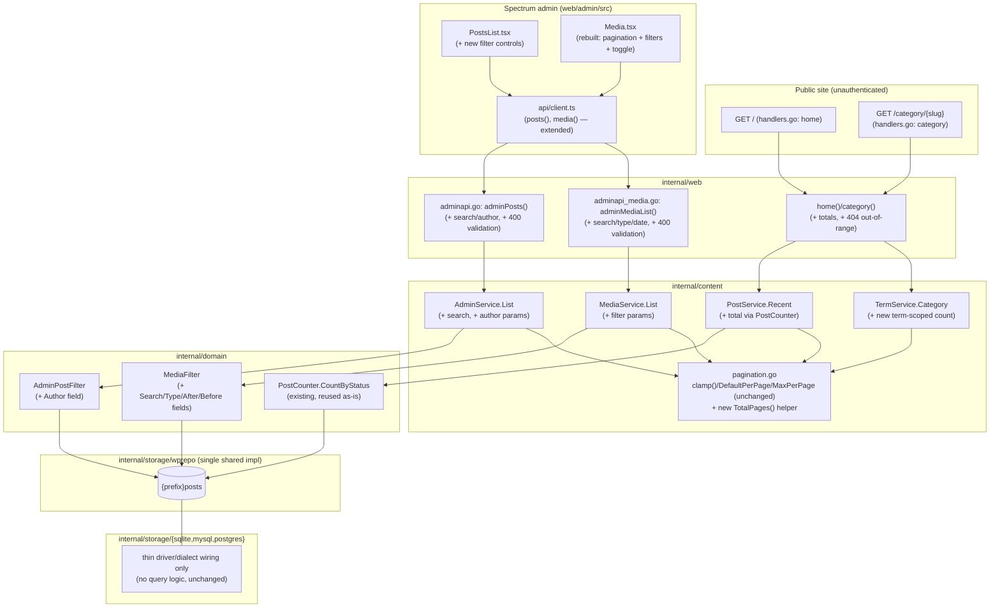
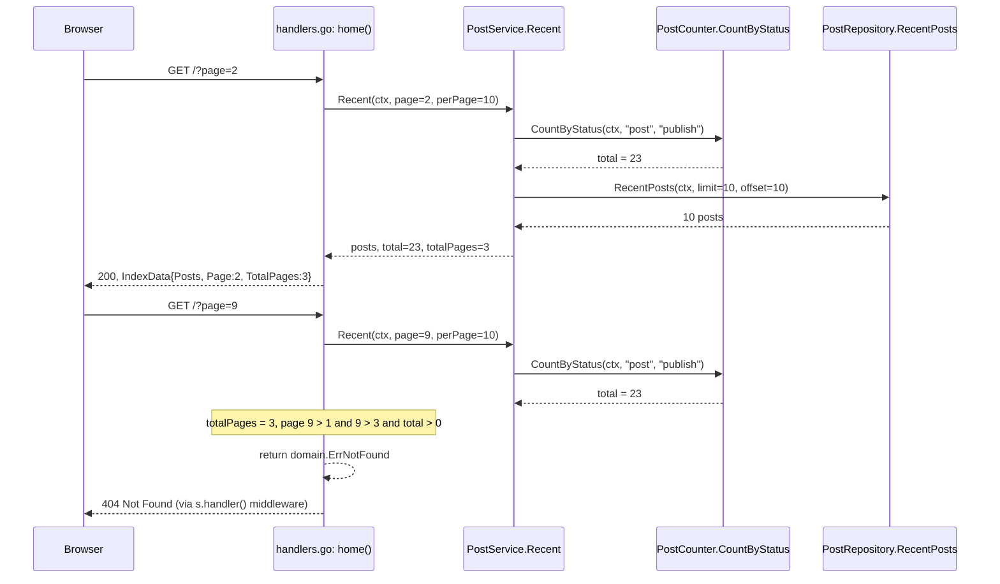
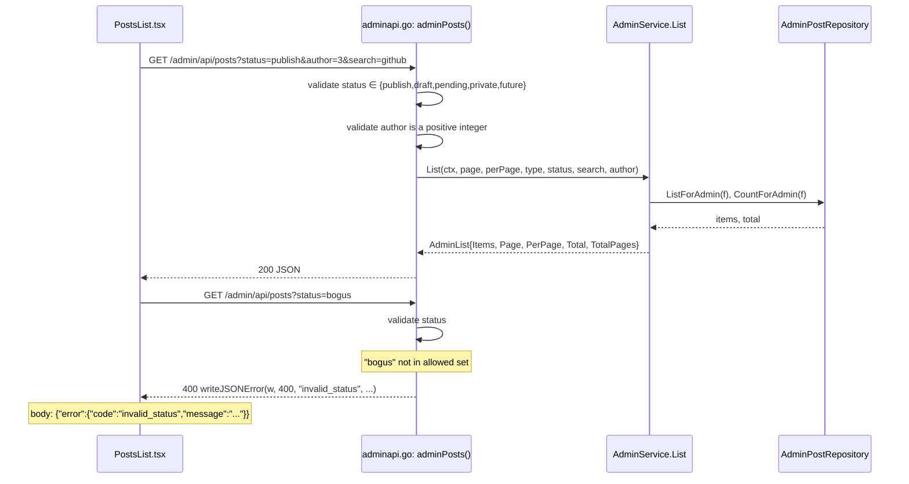
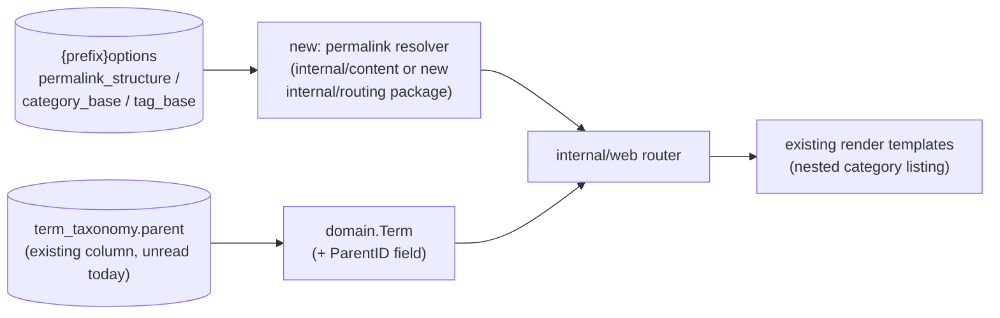
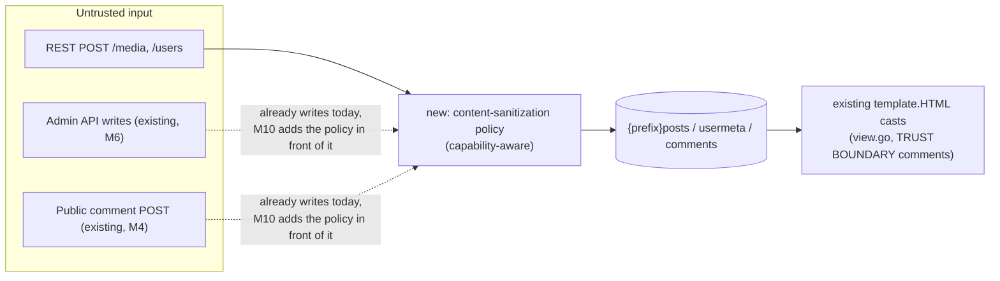

# WordPress Core Parity Roadmap: Design

## Overview

This roadmap closes the gaps `docs/compatibility.md` and
`docs/wordpress-compatibility-tour.md` document today, in UI-parity-first
order. It is built entirely as additive wiring over M1–M7's existing
architecture:

- **M8 (fully specified here)** adds pagination totals to two existing
  public read paths, adds filter fields to two existing domain filter
  structs, and replaces two under-built React views' rendering — all
  implemented once in the existing shared `internal/storage/wprepo`
  repository layer, with **no new database column and no new migration**.
  One new count capability (`domain.PostCounter.CountByStatus`) already
  exists and is reused as-is for the home page total; only the
  category-scoped count is genuinely new.
- **M9 (roadmap depth)** teaches the router to honor WordPress's own
  `permalink_structure`/`category_base`/`tag_base` options and to expose the
  `term_taxonomy.parent` column that already exists in every WordPress
  database but has never been read by grimoire.
- **M10 (roadmap depth)** introduces grimoire's first real HTML
  sanitization at the write boundary — today there is none — before
  enabling the two REST write routes (`/media`, `/users`) that currently
  always respond `501`, then improves `content.rendered` fidelity.

### Milestone-numbering reconciliation

`plans/07-revisions-scheduler`'s summary row in `plans/README.md` reads
"REST media/user writes explicitly deferred to M8." That was written before
this roadmap existed. Per the approved UI-parity-first ordering, **this
roadmap's M8 is Content Browsing Parity**, and REST media/user writes are
reassigned to **M10** (Requirements 16–17). This is a deliberate
renumbering, not an unresolved contradiction: the M07 README row is
superseded by this spec's own milestone-index entry, which is added as part
of this change (see "plans/README.md update" below).

## Architecture

Every new capability sits inside a box that already exists in M1–M7. No new
package is introduced for M8; `internal/content`, `internal/web`,
`internal/domain`, and `internal/storage/wprepo` all gain fields/methods on
existing types, not new subsystems.

### Sequence: public home page, in-range vs. out-of-range page

### Sequence: admin content list, valid filter vs. invalid filter

## Milestone boundaries

| Milestone | Scope | Spec depth |
|---|---|---|
| M8 — Content Browsing Parity | Public home/category pagination totals; admin post search/status/author filters + validation; media search/type/date/parent filters + grid/list toggle + pagination; shared pagination contract | Fully specified; `tasks.md` is implementation-ready |
| M9 — Routing & Taxonomy Parity | `permalink_structure`/`category_base`/`tag_base` options; core permalink tokens + canonical redirects; tag/date/author archives; nested categories via `term_taxonomy.parent` | Roadmap-level; needs its own spec before implementation |
| M10 — REST Write & Content Safety Parity | Write-boundary content sanitization policy; REST media/user writes; `content.rendered` fidelity (Gutenberg delimiters, responsive images) | Roadmap-level; needs its own spec before implementation, and Requirement 15 (safety policy) must land before Requirements 16–17 (writes) |

M8 has no data or code dependency on M9/M10 and can ship independently. M9
depends only on M1–M7 (reading `{prefix}options` and `term_taxonomy.parent`,
both already-modeled tables/columns). M10's Requirements 16–17 depend on
Requirement 15 landing first — the roadmap enforces that ordering explicitly
so no new write route is ever enabled before its content passes through the
new sanitization policy.

## M8 — New/changed components

### `internal/domain` (`repository.go`)

- `AdminPostFilter`: add `Author int64` (zero = unfiltered). `Search string`
  already exists (line 52) and is already implemented and exercised at the
  repository layer — `applyAdminSearch(q, f.Search)` is already called by
  both `ListForAdmin` and `CountForAdmin` in
  `internal/storage/wprepo/adminreads.go`. No repository-layer change is
  needed for `Search`; M8 only wires the `search` query parameter through
  `AdminService.List`, the `adminPosts` handler, and `PostsList.tsx`.
- `AdminPostRepository`: add a new method,
  `Authors(ctx context.Context) ([]domain.AuthorOption, error)`, returning
  the distinct `(id, display_name)` pairs of users who have authored at
  least one post/page (`SELECT DISTINCT u.id, u.display_name FROM {prefix}posts p JOIN {prefix}users u ON u.id = p.post_author`,
  scoped the same way `ListForAdmin`/`CountForAdmin` already scope by
  `post_type`). A new `domain.AuthorOption{ID int64; Name string}` struct is
  added alongside it. This is intentionally narrower than
  `domain.UserRepository.List` (all registered users): it exists purely to
  populate the author filter's options, so it must not leak accounts that
  have never authored content to any caller holding only `edit_posts`.
- `MediaFilter`: add `Search string`, `Type string` (one of
  `image`/`video`/`audio`/`document`, or empty), `After`/`Before time.Time`
  (zero value = unbounded). `ParentID` already exists and is unchanged.
- No change to `PostRepository` or `MediaRepository` method *signatures*
  beyond threading the extended filter structs through already-existing
  `ListForAdmin`/`CountForAdmin`/`List`/`Count` methods. `AdminPostRepository`
  gains the one new `Authors` method described above.
- New: a term-scoped published-post count. Added as a new method on
  `TermRepository` (or a new small `TermPostCounter` interface, decided
  during M8's own implementation task 1, see `tasks.md`) —
  `CountByTermSlug(ctx, taxonomy, slug string) (int, error)`. This performs a
  live `COUNT(*)` join against `post_status = 'publish'`, mirroring
  `CountForAdmin`'s existing pattern, rather than reading the
  WordPress-maintained `term_taxonomy.count` cache column: that column is
  kept up to date by `postterms.go` for taxonomy-assignment changes, but its
  staleness guarantees under every `post_status` transition are not
  verified anywhere in this codebase, so M8 computes the count directly
  instead of trusting a cache it does not itself maintain.

### `internal/content`

- `PostService`: gains a `pc domain.PostCounter` dependency (constructor
  signature changes from `NewPostService(p)` to
  `NewPostService(p, pc)`); `Recent` returns total/total-pages alongside
  posts (return type change — see `tasks.md` for the exact shape, a small
  new `Page` result struct: `type Page struct { Total int; TotalPages int }`).
- `TermService`: gains the new term-scoped counter; `Category` returns the
  same `Page` shape.
- `AdminService.List`: signature changes from
  `List(ctx, page, perPage int, typ, status string)` to
  `List(ctx, page, perPage int, filter domain.AdminPostFilter)`, decided
  here (not deferred — see `tasks.md` Task 4.1 for the exact call-site
  diff): rather than growing to six positional parameters, `typ`/`status`
  become `filter.Types`/`.Statuses` (unchanged shape) and the two new
  values become `filter.Search`/`.Author`, mirroring the
  `MediaService.List(ctx, filter domain.MediaFilter)` precedent already in
  this codebase (`internal/content/media.go`). `page`/`perPage` stay
  explicit top-level parameters — `List` still computes
  `limit, offset := clamp(page, perPage)` internally and sets
  `filter.Limit`/`.Offset` from that result before calling
  `ListForAdmin`/`CountForAdmin`, exactly as it does today, so no clamping
  behavior moves to the caller. Also gains an
  `Authors(ctx) ([]domain.AuthorOption, error)` passthrough to
  `AdminPostRepository.Authors`, used by the new `/admin/api/authors`
  endpoint.
- `MediaService.List` (`internal/content/media.go`, already exists — this
  is an extension, not a new file): already accepts a `domain.MediaFilter`;
  M8 only widens the filter struct itself (see above) and the
  `internal/storage/wprepo/media.go` `listQuery` function that currently
  applies only `f.ParentID`/`f.Limit`/`f.Offset` gains `f.Search`/`f.Type`/
  `f.After`/`f.Before` clauses. `adminMediaList` already calls
  `MediaService.List` today; no new service is introduced.
- `pagination.go`: `clamp`/`DefaultPerPage`/`MaxPerPage` are reused
  unchanged; the milestone adds exactly one new exported helper,
  `TotalPages(total, perPage int) int`, computing the same
  ceiling-division formula (`(total + perPage - 1) / perPage`)
  `AdminService.List` already computes inline in `adminread.go`, and which
  already yields `0` when `total == 0` (integer division of `0` is `0`,
  no clamping). That existing inline computation is refactored
  (behavior-preserving) to call the new shared helper, so `PostService`,
  `TermService`, `AdminService`, and `MediaService` all share one
  implementation instead of each duplicating the formula, and all agree on
  the zero-result contract in Requirement 8.1.

### `internal/web`

- `handlers.go` (`home`, `category`): after fetching posts, compute
  `totalPages` via the new shared `pagination.TotalPages` helper; when
  `page > 1 && total > 0 && page > totalPages`, return `domain.ErrNotFound`
  (wrapped or bare) instead of rendering. This flows through the existing
  `s.handler()` middleware (`internal/web/middleware.go`), which already
  maps `errors.Is(err, domain.ErrNotFound)` to a plain-text `404 Not Found`
  for public routes — no new error type or 404 helper is introduced. Pass
  `total`/`page`/`totalPages` into `render.IndexData`/`render.CategoryData`.
- `render/view.go` (`IndexData`, `CategoryData`): add `Page`, `TotalPages`,
  `Total int` fields (naming mirrors `AdminList` for consistency across the
  whole codebase, per Requirement 8).
- Public templates (`themes/default/templates/index.tmpl` and
  `category.tmpl`, loaded by `render.Load` from
  `filepath.Join(themesDir, theme, "templates")` — confirmed the actual
  path; `internal/render/templates/` does not exist): add a previous/next
  pagination control, shown only when applicable.
- `adminapi.go` (`adminPosts`): read `search` (string, optional) and
  `author` (optional numeric string) from the query string; validate
  `status` against the fixed allowed set and `author` as a positive integer
  before calling `AdminService.List`; on validation failure, respond `400`
  via the existing `writeJSONError(w, status, code, message)` helper
  (`internal/web/adminapi.go:264`), which already produces the shared
  `{"error":{"code":"...","message":"..."}}` envelope used elsewhere in
  this file.
- New: `adminapi.go` (`adminAuthors`): `GET /admin/api/authors`, gated by
  the existing `edit_posts` capability (same gate as `adminPosts`), calls
  `AdminService.Authors` and returns `{"authors":[{"id":...,"name":"..."}]}`.
- `adminapi_media.go` (`adminMediaList`): read `search`, `type`,
  `after`/`before` from the query string; validate `type` against the fixed
  allowed set and `parentId` (when present) as a non-negative integer;
  on validation failure, respond `400` via `writeJSONError`. Also remove
  the existing `totalPages < 1 → 1` clamp (lines 82–84 today) so a
  zero-result response reports `TotalPages: 0`, matching
  `AdminService.List`'s existing natural behavior and Requirement 8.1's
  unified contract. No test today asserts the zero-result value, so this
  is a safe, non-breaking correction; a new test is added to lock it in.

### `web/admin/src`

- `api/client.ts`: `media()` forwards `parentId` (already accepted by the
  backend but currently dropped by the client) plus `search`/`type`/
  `after`/`before`. `posts()` gains `search`/`author` params alongside its
  existing `type`/`status`. New `authors()` call to
  `GET /admin/api/authors`.
- `views/PostsList.tsx`: add status/search/author controls — Spectrum
  `Picker` for status, `SearchField` for search, and a Spectrum `Picker` (or
  `ComboBox` if the author list grows large enough to want type-ahead
  filtering) for author, populated from the new `api.authors()` call rather
  than any numeric-ID input or an all-users listing — synced to the URL
  query string next to the existing `page` param; changing a filter resets
  to page 1 (mirrors `goToPage`'s existing `setParams` pattern).
- `views/Media.tsx`: rebuilt from its current "always render both `Grid`
  and `TableView` for every item, no pagination, no filters" state into:
  page/filter state synced to the URL (same pattern as `PostsList.tsx`),
  a fetch that passes `page`/`perPage`/filters to `api.media(...)`,
  pagination controls matching `PostsList.tsx`'s existing
  previous/next/page-count/total presentation, a view-mode toggle
  (Spectrum `ActionButtonGroup`/`ToggleButton` pair) that renders **either**
  `Grid` **or** `TableView` for the current page's items (never both), and
  persistence of the chosen view mode via the URL query string (consistent
  with how page/filters are already persisted) so it survives a reload.
- A small shared component (e.g. `PaginationBar`) is a **candidate** for
  extraction once both `PostsList.tsx` and `Media.tsx` need the same
  previous/next/page-count presentation; `tasks.md` treats this as an
  explicit refactor task once both views work, rather than speculatively
  building shared UI before there are two call sites to generalize from
  (avoids over-engineering ahead of need).

## M8 — Status codes

| Route | Method | Success | Invalid filter | Out of range | Notes |
|---|---|---|---|---|---|
| `/` | GET | 200 | n/a | 404 (out-of-range page only, never on a zero-post site) | Req 1.1, 1.5, 1.6 |
| `/category/{slug}` | GET | 200 | n/a | 404 (unknown slug or out-of-range page); zero-post existing category renders empty, not 404 | Req 2.1, 2.4, 2.5, 2.6 |
| `/admin/api/posts` | GET | 200 | 400 (bad `status`/`author`) | n/a (page beyond total simply returns an empty `items` array with correct `Total`/`TotalPages`, matching existing `AdminService.List`/`PostsList.tsx` behavior — admin lists are not 404'd) | Req 3, 4.1–4.2 |
| `/admin/api/media` | GET | 200 | 400 (bad `type`/`parentId`) | n/a (same as above) | Req 5, 4.3–4.4, 7 |

Public routes 404 out-of-range (Requirement 1.5, 2.4) because there is no
authenticated user to page through an intentionally-empty admin queue; admin
list routes never 404 for an out-of-range page because that would break the
existing admin UX of jumping to a remembered page number after content
changes underneath it — this asymmetry mirrors the equivalent
existing-vs-new-route distinction M7's design already draws for a different
reason (404-not-403 vs. 403), and is called out explicitly here so it is
not read as an inconsistency.

## M8 — Migration safety

**No new migration.** Every new filter and count queries a column that
already exists and is already read/written elsewhere in `wprepo`:

| New capability | Column(s) used | Already used elsewhere in `wprepo`? |
|---|---|---|
| Home/category total counts | `post_status`, `post_type` (+ `term_relationships`/`term_taxonomy` for category) | Yes — `adminreads.go`'s `CountByStatus`; `postterms.go`'s taxonomy joins |
| Admin author filter | `post_author` | Yes — already selected/inserted by `repo.go` |
| Admin search filter | `post_title`, `post_content` | Yes — already selected by `repo.go`/`adminreads.go` |
| Media search filter | `post_title` (attachments are posts of type `attachment`) and `postmeta.meta_value` for the `_wp_attached_file` filename (Req 5.1's title-*or*-filename match) | Yes — both columns are already selected/`JOIN`ed by `media.go`'s existing `listQuery`; no new join or column is added, only a new `WHERE` predicate over columns already in scope |
| Media type filter | `post_mime_type` | Yes — already inserted by `media.go` |
| Media date filter | `post_date` | Yes — already selected/inserted throughout `wprepo` |
| Media parent filter | `post_parent` | Yes — already inserted by `media.go`; already read by the existing (currently client-unwired) `parentId` handler param |

Because every column already exists, M8 requires zero `ALTER TABLE`
statements and zero data backfill, and is safe to run against an existing
imported WordPress database exactly as M1–M7 already are — the primary
scenario (run an existing site safely) is preserved by construction, not by
a new safety mechanism.

**Filtered-totals contract.** `media.go`'s `listQuery` (used by `List`) and
`Count` currently diverge: `listQuery` applies only `ParentID`, and `Count`
applies only `ParentID` too, so today they already agree by omission — but
naively adding `Search`/`Type`/`After`/`Before` to `listQuery` alone (without
also adding them to `Count`) would make `Total`/`TotalPages` silently ignore
those filters, so a filtered page could report a `Total` larger than its own
filtered result set. M8 fixes this by extracting a single predicate-building
helper (e.g. `applyMediaFilter(q *bun.SelectQuery, f domain.MediaFilter)
*bun.SelectQuery`, mirroring the existing `applyAdminSearch` pattern already
used for `AdminPostFilter` in `adminreads.go`) and calling it from both
`listQuery` and `Count`, so `Total`/`TotalPages` are computed over exactly
the same `WHERE` predicate as the returned items. `Total`/`TotalPages`
SHALL always reflect the filtered result set, never the unfiltered
collection — see `tasks.md` Task 6 for the exact predicate and test plan.

## M9 — Routing & Taxonomy Parity (roadmap-level design)

- **Options-driven routing.** `domain.OptionsService` (M-existing) already
  reads arbitrary `{prefix}options` rows; M9 adds the three specific keys
  (`permalink_structure`, `category_base`, `tag_base`) to whatever bootstrap
  path already loads site options, and a new resolver component decides,
  once per request, which path shape to match/redirect. Exact package
  placement (`internal/content` vs. a new `internal/routing`) is left to
  M9's own design, since it depends on how large the resolver logic ends up
  being once written — deciding this now, before any code exists, would be
  guessing.
- **Nested categories.** `domain.Term` gains a parent reference sourced
  from the already-existing, already-populated `term_taxonomy.parent`
  column. Whether a parent category's archive includes descendant
  categories' posts (as WordPress's default theme behavior does) is called
  out in Requirement 13.3 as a decision M9's own design must make and record
  explicitly — this roadmap does not prejudge it, to avoid asserting
  behavior that has not yet been verified against a real nested-category
  WordPress export.
- **Canonical redirects.** Reuses the existing `net/http` `Redirect`
  facility already used elsewhere in `internal/web`; no new redirect
  mechanism is introduced.
- **Tag/date/author archive rendering.** `themes/default/templates/archive.tmpl`
  already exists and is already wired into `render/engine.go`'s
  `contentTemplates` list and fallback chains (`"category": {"category",
  "archive", "index"}`, `"archive": {"archive", "index"}`), but nothing in
  the codebase renders with kind `"archive"` today. M9's tag/date/author
  archive routes are the first callers of this existing render kind — no
  new template is required, only new handler paths that select it.

## M10 — REST Write & Content Safety Parity (roadmap-level design)

- **Today, no HTML sanitizer exists anywhere in the codebase.**
  `internal/web/view.go` casts `post_content`/`Excerpt` to `template.HTML`
  verbatim, with a comment identifying `bluemonday` as the recommended
  future library — it is not imported, not a dependency, and not invoked.
  `docs/compatibility.md`'s "Trusted-content boundary" section states this
  explicitly: "Content submitted through these [M5-M7 write] paths is
  rendered ... with no additional HTML sanitization at the render layer
  today." M10 Requirement 15 is where this sanitizer is **first
  introduced**, not a reuse of something already wired up.
- **Existing write paths are in scope for the new policy too.** The admin
  UI's post/page CRUD (M6) and public comment submission (M4) already write
  untrusted-shaped input today with no sanitization; M10's policy sits in
  front of REST media/user writes *and* these existing paths, since a
  policy that only covers the two newest routes would leave the
  already-largest write surface (arbitrary post/page content) unprotected.
  This is reflected in Requirement 15.1, which lists `post_content`,
  `post_title`, `post_excerpt`, and comment content explicitly, not only
  the new REST fields.
- **Imported content stays trusted.** Content read from an imported
  WordPress database via M1's existing read paths is never passed through
  the new write-side policy (there is no write happening on a read path);
  Requirement 15.3 states this explicitly so M10 is never mistaken for a
  requirement to re-sanitize (and potentially corrupt) already-trusted
  historical content.
- **REST media/user writes reuse existing write services.**
  `domain.MediaWriter.Create`/`.SetParent` (M4) and `domain.UserRepository`
  (M2) already exist; M10 adds an HTTP layer over them
  (`internal/web/rest_media.go`, `rest_users.go`, both of which today only
  register `restNotImplemented` 501 handlers) and, for users, a new
  profile-field update method alongside the existing `Create`/`UpdatePass`.
- **`content.rendered` fidelity** is a REST-response-only rendering change
  (stripping `<!-- wp:* -->` delimiters, adding `srcset`/`sizes`/
  `loading`/`decoding` attributes when applicable) — `post_content` itself
  is never rewritten and the public HTML templates are untouched, so this
  part of M10 carries no migration risk at all, only a REST serialization
  change.

## Prioritized gap matrix

Ordered by milestone, then roughly by user-facing impact within a
milestone. "Source" cites the exact doc section the gap is drawn from.

| # | Gap | Milestone | Rationale | Depends on | Source |
|---|---|---|---|---|---|
| 1 | Public home has no pagination totals; page beyond the end silently renders empty instead of 404 | M8 | Every visitor hits the home page; this is the single most-visible browsing gap | `PostCounter` (existing) | Current-code finding; `render.IndexData` inspection |
| 2 | Public category archive has the same pagination gap | M8 | Second-most-visible public browsing path | Gap 1's pagination shape (reused) | Current-code finding |
| 3 | Admin content list has no status/search/author filter UI, despite the backend partially supporting `type`/`status` already | M8 | Editors managing more than a page of content need this daily; `docs/wordpress-compatibility-tour.md`'s "Posts list/editor" section shows WordPress's real `?post_status=publish` filter has no grimoire equivalent today | none within M8 | Tour doc "Posts list/editor" section; current-code finding |
| 4 | Admin filters silently return zero rows on an invalid value instead of erroring | M8 | Directly caused by adding filters (Gap 3/5) — must ship alongside them, not after | Gaps 3, 5 | Current-code finding (`adminPosts`/`adminMediaList` have no input validation today) |
| 5 | Media library has no search/type/date/parent filtering at all, and the one filter the backend already accepts (`parentId`) is dropped by the frontend client | M8 | Tour doc's "Media library" section explicitly documents that "grimoire's admin media page has no free-text search, and its `parentId` query parameter is accepted by the backend API but is not read by the admin page" | none within M8 | Tour doc "Media library" section; current-code finding |
| 6 | Media library renders a full grid and a full table simultaneously for the same items, with no pagination at all | M8 | Directly blocks Gap 5 from being usable at real-world library sizes (tour doc: "well over a thousand attachments in this database") | none within M8 | Current-code finding (`Media.tsx` full read) |
| 7 | Public post permalinks are flat `/{slug}` only; WordPress's configurable date-based structures are unsupported | M9 | Affects link compatibility for any site not using WordPress's default "plain" permalinks | `{prefix}options` read (existing) | Tour doc "Single published post" section: "grimoire's public router only supports flat `/{slug}` routes... does not implement WordPress's configurable, date-based post permalink structures" |
| 8 | No parent/child category relationship; WordPress's nested category URLs (`/category/technology/github/`) have no grimoire equivalent | M9 | Tour doc calls this out with a concrete real example from the comparison database | `term_taxonomy.parent` read (net-new) | Tour doc "Category archive" section |
| 9 | No tag/date/author archive routes | M9 | Rounds out core WordPress archive browsing once category archives support the same pagination/nesting model | Gaps 1-2's pagination shape; Gap 8's term model | Compatibility doc's core-route inventory (categories present, tags/dates/authors absent) |
| 10 | No HTML sanitization anywhere in the codebase at the write boundary | M10 | Prerequisite for safely enabling any new write route; compatibility doc explicitly flags this as the recommended next hardening step | none | `docs/compatibility.md` "Trusted-content boundary" section |
| 11 | REST `/media` and `/users` writes always respond `501` | M10 | Blocks REST-based media/user management tooling that already exists for real WordPress sites | Gap 10 (must land first) | `internal/web/rest_media.go`/`rest_users.go` (`restNotImplemented`); compatibility doc's M5 REST surface description |
| 12 | `content.rendered` retains raw Gutenberg block-comment delimiters and omits responsive-image (`srcset`/`sizes`/`loading`/`decoding`) markup | M10 | Lowest immediate user impact (cosmetic/consumer-parsing concern, not a blocked workflow) among the tracked gaps, hence last | none | Tour doc "Representative REST response" section (lines 176-181), which documents both differences precisely |

## Exclusions (apply to every milestone)

- Arbitrary third-party plugins and themes: no plugin PHP execution exists
  or is planned; any gap whose root cause is "a specific plugin's behavior"
  is out of scope by construction.
- Custom post types and custom taxonomies beyond `post`/`page`/`category`/
  `post_tag`: none of M8/M9/M10 introduce new type/taxonomy modeling.
  M9's nested-category work is explicitly scoped to `category`
  (Requirement 13.4).
  M9's rewrite-rule work is explicitly scoped to the core token set in
  Requirement 11.1, not arbitrary plugin-registered rewrite rules
  (Requirement 11.4, 14.1).
- Full Gutenberg block-editor rendering: M10 strips block-comment
  delimiters and improves image markup (Requirement 18) but does not render
  arbitrary core/plugin block visual output (Requirement 18.4).
- Pixel-identical UI: every UI requirement in this roadmap is judged by
  behavioral parity with the WordPress workflow plus a side-by-side visual
  review at desktop and mobile widths (Requirement 9.4), never by matching
  WordPress's own CSS/theme output. Adobe React Spectrum remains the admin
  visual language throughout.

## Security Considerations

- **M8 introduces no new write route and no new authentication/authorization
  path.** Every M8 change is to read/list endpoints already gated by M1–M7's
  existing public/admin auth boundaries (public routes are already
  unauthenticated-by-design for published content only; admin routes
  already require the same session/capability checks they do today). No
  requirement in this milestone changes who can read what — only how much
  of what they could already read is returned per page, and which subset
  they can narrow it to.
- **New 400 validation reduces attack surface, not adds it.** Rejecting an
  unrecognized `status`/`type`/non-numeric `author`/`parentId` before it
  reaches a query (Requirement 4) is strictly safer than today's silent
  empty-result behavior, and every new filter value is passed through the
  same parameterized-query (`bun`) mechanism every existing `wprepo` query
  already uses — no requirement in this milestone concatenates
  caller-supplied input into SQL text.
- **M8's search filters (`search` on posts and media) use a parameterized
  `LIKE`/`ILIKE`-style match**, not a caller-supplied SQL fragment; the
  search term is bound as a query parameter identically to how `bun`
  already binds every other filter value in `wprepo`.
- **M9's permalink-token resolution must not become a path-traversal or
  open-redirect vector.** The resolver only ever matches against
  already-known slugs/IDs/dates read from the database (Requirement 11.1);
  it never redirects to a caller-supplied URL, and any unmatched request
  still 404s (Requirement 11.3) exactly as today. M9's own design must
  re-state this constraint explicitly before implementation.
- **M10 is, by definition, a security-sensitive milestone**, since it is
  the first place grimoire enables new write routes for previously-501
  resources and the first place it introduces HTML sanitization. Per
  Requirement 15/19.3, the sanitization policy must be designed, built, and
  reviewed *before* Requirements 16–17's write routes are enabled — this
  roadmap does not allow implementation to reorder that dependency. M10's
  own design must additionally specify: which HTML elements/attributes the
  policy allows per capability tier, how it interacts with the existing
  `TRUST BOUNDARY` comments in `view.go`, and a capability-matrix test (per
  Requirement 19.2) for every newly-enabled write route.
- **No secret or credential handling changes anywhere in this roadmap.**
  M8/M9 touch no auth/credential code at all; M10 reuses M2/M2.1's existing
  bcrypt/`$wp$`-hash handling unchanged (Requirement 17.2) rather than
  introducing a second password scheme.

## SEO Considerations

- **M8's pagination changes make published-content discovery more
  complete, not less** — a visitor or crawler that previously could not
  navigate past whatever the first page returned (there was no "page 2"
  link to follow) can now reach every published post via link-following
  alone, without needing to guess `?page=` values.
- **M8's 404-on-out-of-range-page behavior (Requirements 1.5, 2.4) matches
  WordPress's own behavior** for the same case, so a crawler that already
  knows how to treat WordPress's pagination boundaries (stop following
  `?page=` links once one 404s) behaves identically against grimoire.
- **M9's permalink-structure support is the most SEO-relevant milestone in
  this roadmap.** A site migrated from WordPress with an existing
  non-default `permalink_structure` currently gets flat `/{slug}` URLs from
  grimoire that do not match its previously-indexed WordPress URLs; M9's
  canonical-redirect requirement (11.2) exists specifically so that
  previously-indexed URLs 301 to the new canonical path rather than 404ing
  or serving duplicate content at two paths — this is a direct, load-bearing
  SEO requirement, not an incidental one.
- **M9's nested-category URLs are also SEO-relevant**: WordPress's own
  canonical URL for a child category is the nested path
  (`/category/technology/github/`, per the tour doc); until M9 ships,
  grimoire's flat `/category/github/` is a different URL than the one a
  search engine may have already indexed from the WordPress original.
- **M10's `content.rendered` changes affect REST consumers, not
  crawlers of the public HTML pages** — the public-facing HTML templates
  already emit whatever markup `internal/render` produces today, and M10's
  delimiter-stripping/responsive-image work targets `content.rendered`
  fidelity for REST API consumers (Requirement 18), not a change to the
  public page templates. No SEO regression risk is introduced by M10, and
  no SEO benefit is claimed beyond REST-consumer correctness.

## Testing strategy

- **Cross-vendor repository contract tests**
  (`internal/storage/storagetest`): extend `admin_contract.go` with cases
  for the new `AdminPostFilter.Author` field, the new
  `AdminPostRepository.Authors` method, and the new term-scoped post-count
  method; extend `media_contract.go` with cases for
  `MediaFilter.Search`/`Type`/`After`/`Before`, each run against SQLite,
  MySQL, and Postgres via the existing `NewReposFunc` pattern — no new test
  harness is introduced, only new cases in the existing per-feature
  contract files.
- **Go unit tests** (`internal/content`): `PostService.Recent` and
  `TermService.Category` return correct `total`/`totalPages` for a set of
  fake posts, including the `total == 0 → totalPages == 0` case;
  `AdminService.List` builds the expected `AdminPostFilter` from its new
  parameters; `AdminService.Authors` passes through the repository result.
- **Go handler tests** (`internal/web`): `home`/`category` return `404` for
  an out-of-range page, `200` with correct pagination metadata (including
  `TotalPages: 0`) for a zero-result in-range page, and `200` with correct
  pagination metadata for a populated in-range page; `adminPosts`/
  `adminMediaList`/`adminAuthors` return `400` (via `writeJSONError`) for
  each invalid-filter case in Requirement 4.1–4.4, return `200` (not `400`)
  for each missing/empty-filter case in Requirement 4.5, and return `200`
  with `TotalPages: 0` for a zero-result filtered query.
- **React interaction tests** (`web/admin/src`): changing a filter control
  in `PostsList.tsx`/`Media.tsx` triggers a re-fetch with the expected query
  params and resets to page 1; the view-mode toggle in `Media.tsx` renders
  exactly one of `Grid`/`TableView` at a time; URL query-string state
  round-trips (loading a URL with filters pre-populates the controls).
- **Accessibility checks**: keyboard operability and labeling for every new
  filter control and the grid/list toggle, consistent with the existing
  Spectrum-component accessibility baseline already relied on elsewhere in
  the admin.
- **Manual/desktop-mobile visual review** (Requirement 9.4): side-by-side
  comparison of the public pages and the admin content/media views against
  current `main`, at a common desktop width and a common mobile width,
  confirming behavioral parity with the WordPress workflow being matched.
- **M9/M10 testing** (roadmap-level; concretized in their own future
  specs): M9 adds fixture-based tests against at least one imported
  real-WordPress-database fixture, mirroring the existing
  `plans/02.1-wp-hash-real-db` validation approach, to check permalink and
  nested-category behavior against real data shapes; M10 adds a
  capability-matrix test (allowed vs. forbidden caller) and a
  content-safety test proving sanitization is applied for every newly
  enabled write route (Requirement 19.2).

## Traceability

| Design section | Requirements covered |
|---|---|
| Architecture (components diagram) | Req 1, 2, 3, 5, 6, 7, 8 |
| Public home/category sequence | Req 1.1–1.6, 2.1–2.6 |
| Admin filter sequence | Req 3.1–3.7, 4.1–4.5 |
| Milestone boundaries | Req 10–19 (M9/M10 roadmap-level scope only) |
| `internal/domain` component notes | Req 3.2, 3.3, 3.7 (`Author`/`Search`/`Authors`), 5.1–5.4 (`MediaFilter`), 8.2–8.3 |
| `internal/content` component notes | Req 1.1–1.2 (`PostService`), 2.1–2.2 (`TermService`), 3.1–3.7, 7.1 (`AdminService`), 5.1–5.4, 6.1–6.3, 7.1 (`MediaService`), 8.1 (`TotalPages` helper) |
| `internal/web` component notes | Req 1.5–1.6, 2.4–2.6 (handlers/templates), 4.1–4.5 (validation/envelope), 3.7 (`adminAuthors`), 8.1 (zero-result contract) |
| `web/admin/src` component notes | Req 3.5–3.6, 3.7 (author UI), 5.1–5.4, 6.1–6.4, 7.2–7.3, 9.3 |
| M8 status codes table | Req 1.5–1.6, 2.4–2.6, 4.1–4.5 |
| M8 migration safety table | Req 8.3 |
| M9 roadmap-level design | Req 10.1–10.3, 11.1–11.4, 12.1–12.4, 13.1–13.4, 14.1–14.3 |
| M10 roadmap-level design | Req 15.1–15.4, 16.1–16.3, 17.1–17.3, 18.1–18.4, 19.1–19.3 |
| Prioritized gap matrix | Gaps 1–2 → Req 1, 2; Gap 3 → Req 3; Gap 4 → Req 4; Gaps 5–6 → Req 5, 6, 7; Gap 7 → Req 10, 11; Gap 8 → Req 13; Gap 9 → Req 12; Gap 10 → Req 15; Gap 11 → Req 16, 17; Gap 12 → Req 18 |
| Exclusions | Req 11.4, 13.4, 14.1, 18.4, 9.4 |
| Security Considerations | Req 4 (validation), 15, 16, 17, 19.2–19.3, 3.7 (author-list privacy scoping) |
| SEO Considerations | Req 1.5, 2.4, 11.2, 13's nested-category paths |
| Testing strategy | Req 9.1–9.4 |
